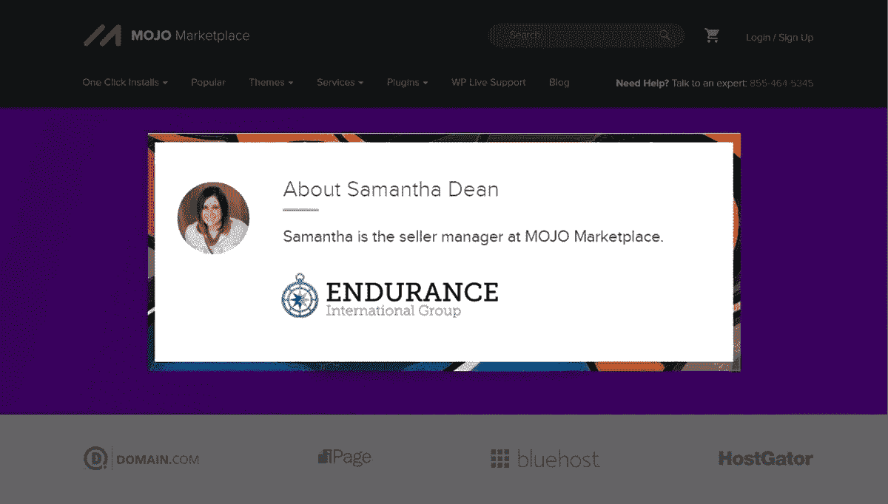

# 萨曼莎访谈

> 原文：<https://medium.com/visualmodo/samantha-interview-e3a180fedb7d?source=collection_archive---------0----------------------->

## 耐力国际集团的销售经理

在今天的 Visualmodo 博客采访中，我们采访了耐力国际集团(MOJO Marketplace)的销售经理 Samantha，她负责管理所有 MOJO marketplace 销售人员/开发人员社区，一旦她进入运营和组织部分，她就拥有了惊人的知识，我们将在这次采访中探讨这一点。

# 萨曼莎采访:耐力的销售经理

## 你是谁？你是做什么的？

我叫[萨曼莎](https://blog.mojomarketplace.com/responsive-wordpress-theme-designed-for-travelers/)，是耐力国际集团的销售经理。

## 耐力赛是怎么开始的？

2016 年，我被[耐力](https://www.endurance.com/)招募来处理他们的卖家关系，到目前为止，这是一次伟大的旅程。

## 如何成为一名销售经理？

我在建立客户-业务关系方面有丰富的经验，并且非常喜欢我的工作。

## 给开发者支持让他们卖产品是什么感觉？

看着销售者在他们的领域成长并供养他们的家庭总是值得的。

## 你最大的挑战是什么？

跟上科技行业的步伐可能很有挑战性，因为有很多移动部件。

## 你对刚起步的设计师/开发者有什么建议？

找到一个合适的位置，然后脱颖而出。有很多好的数码产品，为了让你成功，你需要一个与众不同的优质产品。

## 你在数码产品市场学到了什么？

我知道了市场对很多人来说是多么有价值。我们感动了世界各地的人们，这太令人激动了。我很幸运能够和所有出色的销售人员一起工作和学习。他们制造真正帮助人们的创新产品。

## 你在空闲时间喜欢做什么？

我喜欢和我可爱的家人在户外度过时光。

–

# 结论

自 2012 年以来，我们一直是 MOJO and Endurance group 的成员，总之，我们了解到有人联系真的很重要，Samantha 从一开始就是她的救命恩人。立即帮助所有的卖家，给我们正确的方向并保持一切，这样我们就正确地完成了我们的工作，并帮助客户创建令人惊叹的网站和数字和平艺术。所有的 [Visualmodo](https://visualmodo.com/blog/) WordPress 主题团队想对 Samatha 的辛勤工作表示深深的感谢。