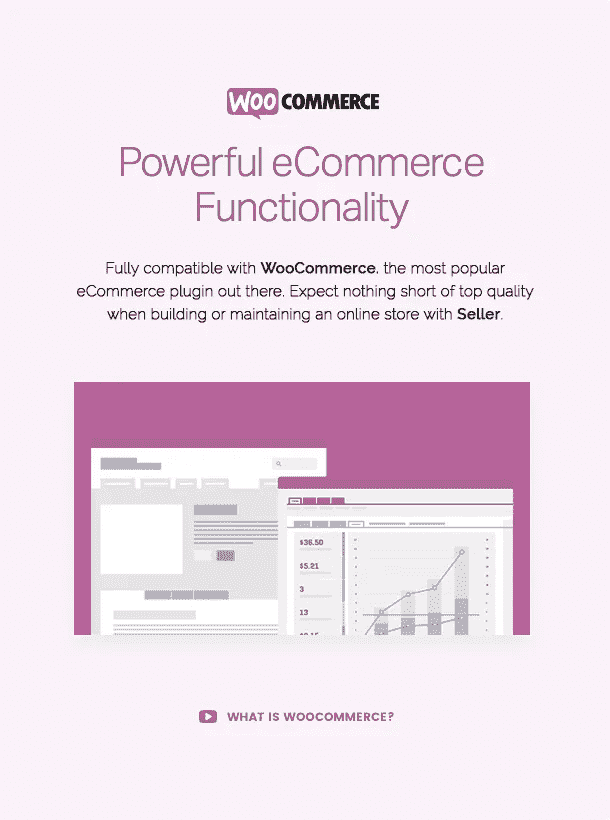

# 卖家-电子商务 WordPress 主题

> 原文：<https://medium.com/visualmodo/seller-ecommerce-wordpress-theme-2a420723a9db?source=collection_archive---------9----------------------->

网上商店的创意解决方案

当今最好的电子商务主题。卖家主题经过优化，可与 WooCommerce、WP E-commerce、Jigoshop 等各种电子商务插件配合使用，具有完美的像素设计和广泛的功能，可创建您自己的专业、独特和成功的电子商店。卖家 WordPress 的主题是高度可定制的，可以用来销售各种产品。

WooCommerce 电子商务插件 —优雅地出售任何东西。用最好的商店插件 WooCommerce 把你的网站变成一个强大的商店。**卖家**电子商务 WordPress 主题支持这个插件，并通过完全可定制的控制面板和性能优化使它变得更好。

**你的网上商店/店铺的真正主题！卖家**已经准备好成为一个**电子商务**平台，内置了 WooCommerce 插件，目前已经授权了全球约 30%的在线商店！！但是我们会更上一层楼！！目前在**卖家**中，我们增加了 3 个不同的商店登录页面，并刷新了整体感觉和布局，但我们计划不断发布新的小众演示和全新的风格——定期尝试访问，我们非常欢迎您！**卖家**也为你的**购物车/账户和结账网页**设计了自己的高级定制风格，让你的商店看起来惊艳又人性化！一旦你的商店采用了我们的主题商店框架，确保你所有的商店客户都会喜欢购买你的产品/服务。

**多栏产品网格** —选择最佳和最合适的方式来展示您的产品！在我们的页面元素中可以设置多个栏目来组织你的商品。

# 使用方便

*   不需要编码知识
*   可更新的 Visual Composer(不需要额外的许可证，您可以节省 34 美元)
*   非常容易的页面构建每拖放
*   灵活易用的页面选项
*   增强的直观组合和画廊管理
*   非常详细的在线文档
*   创建令人惊叹的网站，无需接触一行代码

# 自定义

*   完全可定制
*   强大的主题选项
*   设计和内容元素的颜色不限
*   谷歌字体&用字体管理器创建你自己的网络字体
*   短码的 250 多种可组合样式设置
*   在 Visual Composer 中轻松定制内容样式，无需编码
*   响应可见性选项

# 最佳化

*   高性能，超快，最高页面速度和 yslow 评级
*   搜索引擎优化/搜索引擎优化，与搜索引擎优化插件兼容
*   在线商店的 WooCommerce 完整设计集成
*   WPML 针对翻译和多语言网站进行了优化
*   针对联系人表单 7 进行了优化
*   RTL 准备好了
*   儿童主题就绪
*   兼容 20 个最流行的 wordpress 插件
*   完全跨浏览器兼容性
*   社交网络，社交分享
*   电子商务 WordPress 主题

# [卖家 WordPress 主题](https://visualmodo.com/theme/seller-ecommerce-wordpress-theme/)

来自 https://visualmodo.com/[的](https://visualmodo.com/)