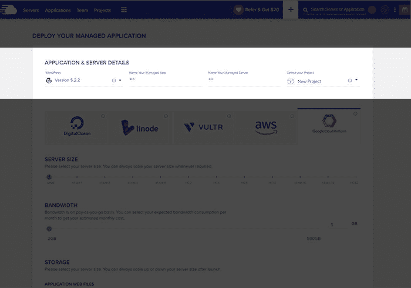

# 通过谷歌云在 10 分钟内设置好您的网站

> 原文：<https://medium.com/visualmodo/setup-your-website-in-10-minutes-over-google-cloud-f2431c5e6573?source=collection_archive---------0----------------------->

自从 2008 年推出谷歌云以来，这家搜索巨头一直致力于主导云托管行业。随着时间的推移，GCP 建立了强大的客户组合；Spotify、汇丰银行、家得宝、Snapchat、HTC、百思买、Cocacola、Feedly、索尼音乐和育碧。对于开发新手来说，使用 Google 托管总是一个挑战。在本文中，我们将简化 Google 云平台的设置过程。

# 使用谷歌云平台的挑战(设置)

配置和管理 Google Compute Engine 服务器需要对各种堆栈和管理云服务器的专业知识有专家级的理解。此外，补丁安装、操作系统升级、防火墙配置和备份也是系统管理员和/或服务器所有者的日常操作任务。

# 环境的设置非常耗时

在 GCE 的平台上设置服务器是一项繁琐的任务。在部署 web 应用程序之前，需要在服务器上安装操作系统。之后，需要设置 Apache、MySQL 和 PHP (LAMP)环境，这是一个耗时的过程。对于一个非技术人员来说，让服务器准备好运行的过程确实令人沮丧。

## 在 Google Cloud 设置上管理网络安全

维护服务器安全是一项重要的服务器管理任务，可以防止网络攻击。这通常意味着部署防火墙和 IDS。像其他服务器组件一样，这两个安全组件都需要持续监控和更新。请记住，忽视服务器安全性会让企业付出很高的代价，因为黑客会寻找漏洞来访问应用程序核心。

## 连接文件传输协议

在启动和设置服务器之后，为了从本地机器发送和接收文件到云服务器，设置文件传输协议是很重要的。服务器的 IP 地址需要是静态的，以避免每次服务器重启后重新配置。

## 动态 IP 的问题

默认情况下，大多数云服务器都有一个由提供商分配的动态 IP 地址。在这种情况下，如果服务器因任何原因崩溃，IP 会在重启时更改。这对需要重置 IP 的已部署和已连接的应用程序有影响。

很容易想象在服务器重启的情况下，服务器和应用程序之间的数据交换会因为不匹配的 IP 地址而停止，这会给业务带来多大的损失。

## 服务器管理

云服务器需要持续的监控和一个有服务器管理和维护经验的系统管理员。因此，即使对于经验丰富的开发人员来说，在没有专用资源的情况下管理服务器也会变得非常困难。

服务器监控密切关注流量峰值、登录尝试和其他可能阻碍服务器进程的活动。

# 为什么要在 Cloudways 托管的 Google Cloud 上托管 Web 应用程序？

理解了使用 Google Compute Engine 的好处，让我们理解在最终用户和基础设施之间添加一个平台的必要性。除非最终用户熟悉服务器管理，否则服务器维护和安全修补等任务可能会成为日常业务运营中的拦路虎。

因此，这就是托管云托管平台(平台即服务)PaaS 派上用场的地方。最终用户注册了 PaaS，现在可以专注于涉及业务运营的任务。

怎么会？

PaaS 解决方案提供商有多种方式来剥离与服务器相关的工作，因为他们有经验和理解来简化这一工作。只需点击几下，就可以在指定的服务器上部署一个 web 应用程序，否则这将通过手动安装来完成。

# 性能优化

由于几个创新的特性，Cloudways 为所有 PHP 应用程序提供了一个非常优化的平台。优化从实际托管 web 应用程序的堆栈开始。这个堆栈由服务器(Apache & NGINX)和缓存(Varnish、Redis 和 Memcached)组合而成，它们共同提供了卓越的页面加载速度。

# 顶级支持

当他们需要帮助时，Cloudways 用户可以通过 stellar Cloudways 支持团队的不懈努力来解决问题。可以通过根据双方同意的 SLA 解决的支持票证联系该团队。如果您需要更多的实际支持，可以选择高级支持插件。

# 自由迁移

一旦您升级了您的帐户，您就可以免费将您的应用程序迁移到 Cloudways 平台。

# 专用 IP

所有的 Cloudways 托管服务器都有一个专用的 IP。因此，即使服务器重新启动，IP 也不会改变，因此不需要重新配置应用程序来确保正常运行。我简化了谷歌云的设置。

# 强大的插件

Cloudways 提供了一系列附加组件来扩展平台功能。这些由 Cloudways 开发团队开发的插件可以在平台上顺利运行。

先说两个比较流行的:SMTP 插件和弹性邮件插件。弹性电子邮件附件增加了对事务性电子邮件交付和管理的支持。SMTP 插件简化了为事务性电子邮件传递配置外部 SMTP 服务的过程。

DNS Made Easy 是另一个流行的插件，它简化了 Cloudways 平台上的 DNS 管理。有了这个插件，用户可以配置他们的域名，甚至有一个 DNS 故障转移来处理域名解析冲突。

# 实时服务器性能监控

监控服务器性能是任何托管托管平台的一个重要方面。在 Cloudways，您可以查看 15 个服务器性能指标，包括空闲 CPU、空闲内存和磁盘使用情况。时间框架通常从一小时到六个月不等。用户可以查看统计数据和详细图表，以提取有关服务器性能统计数据的相关信息。

# Google 云设置的安全性

安全性是 Cloudays 运营的核心。每个 cloudways 服务器都有过滤恶意流量的防火墙。类似地，Cloudways 团队不断修补操作系统和应用程序，以便安全漏洞不会影响用户的服务器和应用程序。

为了给服务器和用户之间的所有通信提供端到端的加密，Cloudways 提供了免费的 SSL 证书(由 Let's Encrypt 提供支持)。为了加强帐户安全性，默认为 2FA，以便只有管理员用户和设备可以访问该帐户。事实上，Coudways 平台会跟踪所有登录尝试，并将所有可疑尝试通知账户所有者。

# 在 GCE 上启动带有所需应用程序的服务器

在 Cloudways 平台上，用您选择的应用程序启动一个托管 GCE 服务器只是一个点击的问题。

第一步是注册 Cloudways，剩下的就不言自明了。

帐户启动并准备就绪后，单击服务器启动按钮。这将带您进入服务器和应用程序启动屏幕，您可以在其中选择应用程序和 GCE 服务器规格。最后，选择距离目标受众最近的数据中心。之后，该平台将接管服务器供应和应用安装流程。

# 关于谷歌云设置的最终想法

使用 Cloudways 作为托管的 GCE 服务器管理平台极大地简化了业务流程。GCE 提供了大量需要大量技术知识的功能。因此，设置和管理服务器的专业知识。

总之，Cloudways 消除了初始服务器设置的所有痛苦，并简化了应用程序安装过程。以便企业可以开始利用 GCE 的优势，而不必担心服务器管理的技术复杂性。一旦服务器和应用程序启动并运行。Cloudways 负责所有的服务器管理问题(包括服务器安全)。以便企业可以继续专注于经营他们的业务。