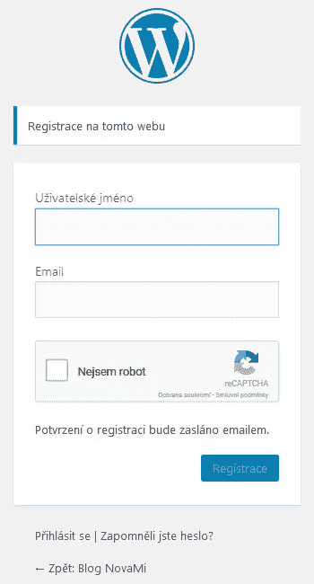
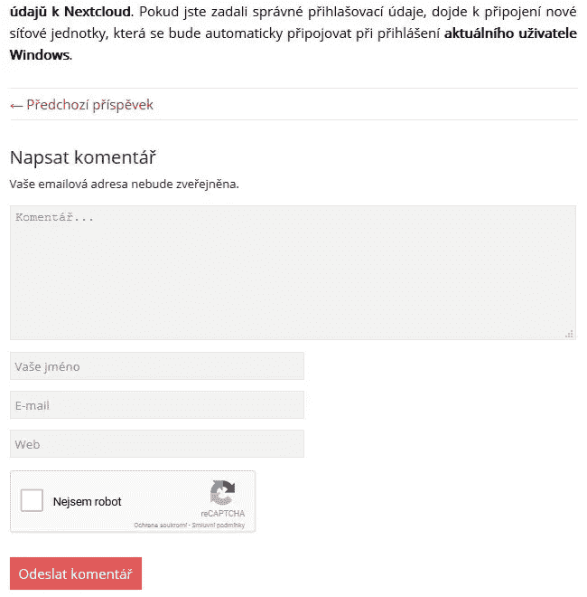

# 简单的 Google ReCAPTCHA 免费 WordPress 插件

> 原文：<https://medium.com/visualmodo/simple-google-recaptcha-free-wordpress-plugin-4e5291409255?source=collection_archive---------1----------------------->

简单的谷歌免费插件。

简单的谷歌 reCAPTCHA 将保护你的 WordPress！不再有针对用户账户的垃圾评论和暴力攻击。非常轻量级的插件——只需下载几千字节！

## reCAPTCHA 保护什么？

*   评论表格
*   新密码表单
*   登记表
*   登录表单
*   重置密码表单
*   BuddyPress 和 WooCommerce 支持

reCaptcha 验证将只要求未注册用户！

# 装置

1.  将简单的 Google reCAPTCHA 文件上传到“/WP-content/Plugins/Simple-Google-reCAPTCHA”目录，或者直接通过 WordPress 插件页面安装简单的 Google reCAPTCHA。
2.  通过 WordPress 插件页面激活简单的 Google reCAPTCHA。
3.  使用菜单 Settings => reCAPTCHA 配置简单的 Google reCAPTCHA。

下载[https://wordpress.org/plugins/simple-google-recaptcha/](https://wordpress.org/plugins/simple-google-recaptcha/)来源[https://visualmodo.com/](https://visualmodo.com/)