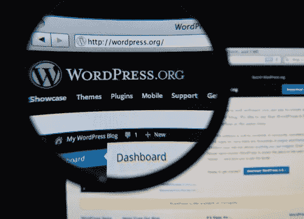
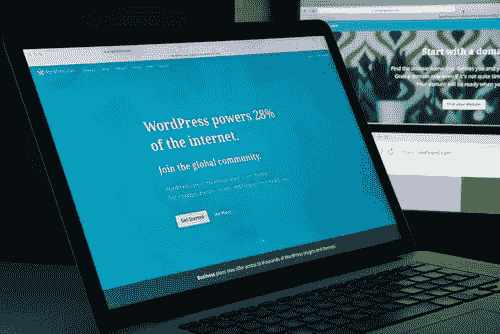

# 简单的搜索引擎优化策略

> 原文：<https://medium.com/visualmodo/simple-seo-strategies-63627e1361b9?source=collection_archive---------0----------------------->

这可以让你的 WordPress 站点脱颖而出

整个万维网上有 1950 万个网站运行在内容管理系统——WordPress 上。在你用 CMS 建立了你的网站之后，你要面对很多竞争。好像这还不够，一些基于 WordPress 的网站想在搜索引擎的搜索结果首页获得一个令人垂涎的位置，以获得他们需要的访问者流量。那么，如何让你的 WordPress 网站脱颖而出，尤其是考虑到 75%的互联网用户从来不会冒险超过搜索结果的第一页？这里有一些简单的搜索引擎优化策略供你考虑:

# 简单的搜索引擎优化策略

# 为你的网站使用 SEO 友好的 WordPress 主题。

一开始，为你的网站使用美观的 WordPress 主题可能很有诱惑力。不幸的是，一些设计 WordPress 主题的人可能根本没有考虑 SEO。

因此，除了为你的网站选择一个吸引眼球的主题，你还应该确保创建它的人也考虑过 SEO。一个简单的方法来知道一个 [WordPress](https://visualmodo.com/blog/) 主题是否是 SEO 友好的，而不需要查看它的源代码，就是看它的加载时间是否太慢。如果是的话，你可能需要为它使用一个快速加载的 WordPress 主题。

# 让你的 WordPress 网站的每个永久链接都可读。

WordPress 网站上的每篇文章都有一个永久链接，访问者可以在浏览器的地址栏中看到。然而，你的网站的一些永久链接可能包含字母、数字和特殊字符的字符串，如果你想让访问者和搜索引擎立即回忆起你的网站上的特定内容，这些字符串是完全没有用的。

值得庆幸的是，WordPress 支持永久链接的定制，这样你网站上某个帖子的名字就会出现在它的 URL 中。您可以选择帖子名称或任何其他 permalink 自定义选项，这些选项允许您将发布内容的月份和年份甚至整个日期作为其可读 URL 的一部分。

# 在你的 WordPress 网站上安装 SEO 插件。

你的 WordPress 网站可能已经包含了一个[导航](https://visualmodo.com/)栏，如果访问者想找到你几个月前发表的某个帖子，他们可以去那里。然而，你也希望搜索引擎在用户输入特定的关键词后显示你的 WordPress 网站的相关条目。搜索引擎要做到这一点，它必须索引你的网站。

最好把你网站的导航栏想象成一本书的目录，这对搜索引擎来说没什么用处。如果你以前不得不查阅一本书的索引部分来寻找包含特定单词(或一组单词)的页面，这正是搜索引擎如何索引你的网站。WordPress 相当于一本书的索引部分，是一个站点地图，其中你的站点上的每个页面和内容都以树状的层次顺序排列。

要为你的 WordPress 网站创建一个站点地图，你需要安装一个 SEO 插件。该应用程序会立即生成一个 XML 或可扩展标记语言网站地图，并将其添加到你的网站上。但是除此之外，在你的 WordPress 网站上安装一个 SEO 插件也可以解决搜索引擎优化的所有其他技术问题，这样你就不必手动完成这些工作，因为手动完成会耗费你太多的时间。

# 在每个帖子中包含社交媒体分享按钮。

当访问者在你的 WordPress 网站上阅读一篇文章时，他们不仅仅是完成它，然后继续他们的日常工作。如果他们觉得它足够有趣，他们会想办法在他们的社交媒体账户(如果他们有多个账户的话)上分享给他们的在线朋友和联系人。虽然你网站的访问者可以复制他们感兴趣的帖子的永久链接，但并不是每个社交媒体平台都提供相应的粘贴功能(Instagram 就是一个明显的例子)。

因此，你应该在你发布的每篇文章中添加社交媒体分享按钮，而不是让你网站的访问者很难分享它的内容。你可以选择哪些社交媒体平台应该在你的网站上有一个分享按钮——尽管你会希望领先的平台默认出现在那里。

# 结论

随着数以百万计的网站使用 WordPress，在使用上述 CMS 设置创建了你的网站之后，想要脱颖而出已经是一件困难的事情了。除此之外，还必须在搜索引擎的搜索结果首页争夺一席之地。值得庆幸的是，上面列出的简单 SEO 策略可以让你的 WordPress 网站在搜索引擎的十大搜索结果中占据一席之地，并吸引访客流量，只要你忠实地应用它们，它就能保持活力。但是如果你发现自己很难做到这些策略中的任何一个，雇佣一个数字营销机构，比如 [SearchUp](https://www.searchup.co.uk/) 或其他一些机构来改造你的 WordPress 驱动的网站，直到它变得对 SEO 友好，这一点也不丢人。你的 WordPress SEO 进展如何？