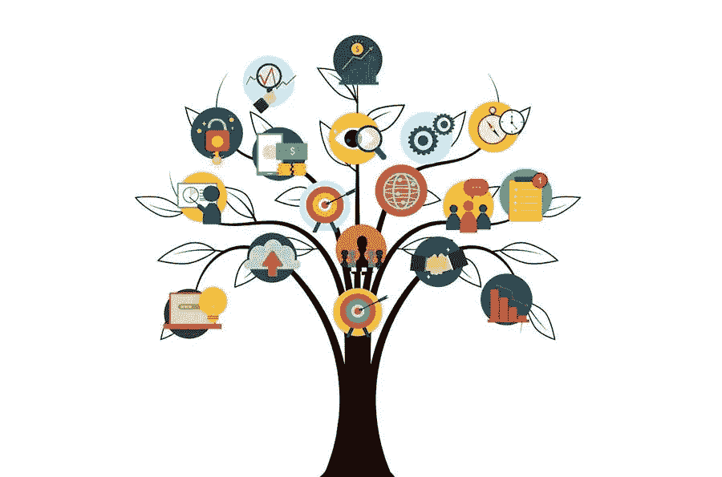

# 成功品牌建设过程的简单步骤

> 原文：<https://medium.com/visualmodo/simple-steps-for-a-successful-brand-building-process-e0f66f7b3bb6?source=collection_archive---------0----------------------->

如果你还在犹豫要不要建立一个品牌，或者要不要获得成功和知名度，那么这个指南肯定是一个*必读的*。品牌建设过程对成功至关重要。这是关于公司的认可以及客户忠诚度、业务可用性和其他评估项目成功的方面。下面是我们的终极指南，用外行的术语解释了建立一个值得信赖的品牌的 6 个简单步骤。

# 品牌建设指南:成功的 6 个步骤

整个过程可以分成至少 **6 个阶段**，有许多任务和子任务要做。让我们分别观察每个阶段，并描述所有细节，以创建一个成功的品牌建设流程。

# 品牌建设流程第一步。确定你的核心受众

创造任何产品/服务时，你也要考虑谁会买，为什么会买。确定 ***你的固定受众*** 至关重要，因为所有进一步的行动和品牌的整体成功都取决于客户角色构建的正确程度。这就是为什么在创建人物角色时，您需要:

1.  研究产品/服务，了解谁是你的客户；
2.  收集和处理分析，以发现谁、何时、何地购买或搜索你的产品/服务；
3.  跟踪竞争情况，建立有效的营销策略；
4.  选择特定的人口统计数据作为目标；
5.  考虑到心理学；
6.  继续前进之前评估你的决定；
7.  为*“通过视觉了解你的客户”*创建心理档案，这有助于建立[业务/营销战略](https://visualmodo.com/how-to-build-quality-links-not-quantity/)并更有效地计划活动。

# 第二步。定义任务

这就是贯穿整个设计、USP 以及与品牌相关的所有内容。是的，每一个细节都会反映你公司的使命、目标和文化。这就是为什么你必须清楚地了解你为什么在市场上，你提供什么产品，你给客户带来什么价值。然后你会证明这一点。因此，创建一个你奋斗目标的大致轮廓。

# 品牌建设流程第三步。检查竞争情况

检查主要竞争对手，研究他们的产品。这会让你了解市场上已经出现的产品，以及如何与之竞争。这是一种展示你优于他人的优势来强调它们的方式。因此，您始终需要:

*   保持领先竞争者的水平；
*   研究他们的 USPs
*   突出你的群体组织；
*   说服你的消费者是什么让你的产品/服务最好和/或值得购买。

# 第四步。创建您的 USP

总会有竞争对手提供相似的产品/服务，而且他们都有自己的特点。这就是为什么在品牌建设过程中做两件事至关重要:

1.  强调品牌的独特之处；
2.  专注于让你的提议更有价值的东西。

这有助于你创建一个 USP，让你与众不同。在所有渠道中，在徽标、每个图像等方面反映价值主张。

# 第五步。实际一点

达到这个阶段，是时候发挥创造力，把整个想法放到视觉上了。这是创造出来的:

*   您的品牌视觉元素，包括但不限于标志、横幅、海报、传单等。使用在线图形编辑器 rello 非常容易且非常有效，它提供了大量可视内容，可以满足任何品味和目的。
*   设定整体品牌基调，从杂乱中切入，用于与品牌相关的每一个细节。
*   到处展示品牌。

# 品牌建设流程第 6 步。描绘你的品牌并保持耐心

思考推广品牌的策略。你不应该只关注在线或线下营销，使用这两种方式让世界了解你的品牌。请注意，这是一个漫长的过程。

所以，耐心点，继续走下去。这是值得的，因为据近 60%的顾客报告，他们宁愿回到他们知道的品牌购买新产品，而不是尝试新的零售商。因此，在赢得客户忠诚度、建立值得信赖的品牌的过程中，要学会忍耐。

# 关键音符

如果你的目标是获得信誉，赢得声誉，获得更多新客户，并留住客户，那么建立一个品牌是至关重要的。在本指南中，我们分享了 *6 种简单而有效的方法*来打造值得信赖的品牌。因此，记住你在每个品牌建设阶段对客户的感受是至关重要的——这是成功的最快途径。