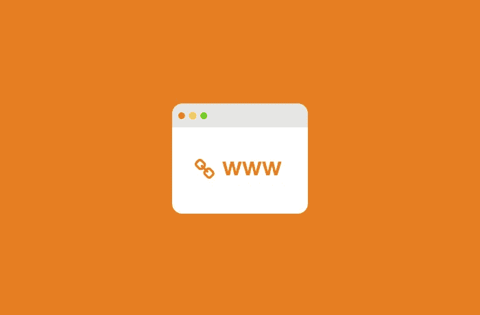

# 网站 URL 解释

> 原文：<https://medium.com/visualmodo/site-url-explained-6a5f27feb60b?source=collection_archive---------0----------------------->

本文讨论了统一资源定位器(URL)，解释了它们是什么，它们是如何构造的，以及它对您的站点的重要性。

人们在互联网上使用很多缩略语。在众多网站中，我们几乎可以保证你已经看到了“网址”。这可能会让你疑惑，“什么是网站 URL？”。
在本帖中，我们将从“什么是网站 URL？”这个问题的基本答案开始。然后，我们将分解 URL 的[结构](https://visualmodo.com/blog/)中最重要的部分，以及这些部分如何连接到你的 WordPress 站点。

# 什么是网站 URL？

URL 是统一资源定位符的缩写，是互联网上特定网站、页面或文件的位置。

例如，如果你在你的网络浏览器中输入`https://themeisle.com/blog/what-is-a-website-url/`，你的网络浏览器将带你到这篇文章。但是如果你只是进入，`https://themeisle.com/`你会被带到 Themeisle 主页。

许多人除了记住那些通向他们最喜欢的网站的网址之外，从来不怎么考虑网址。然而，如果你有自己的网站或者计划建立一个，多了解一些 URL 的工作原理是个好主意。

每个 URL 都是由多个部分组成的，你的 URL 的构建方式会对你的网站的安全性和搜索引擎优化(SEO)产生各种各样的影响。考虑到这一点，让我们更仔细地看看一个基本的网站 URL 包含了什么。

# 解释的 URL

在接下来的几节中，我们将为普通用户介绍 URL 的三个最重要的部分。结合起来，他们应该回答这个问题:“什么是网站网址？”

# 结构

考虑以下 URL:

`[https://themeisle.com/blog/fix-broken-links-in-wordpress/](https://themeisle.com/blog/fix-broken-links-in-wordpress/)`

这篇演讲最容易被忽略的部分是第一部分。你可能已经习惯于在每个 URL 的开头看到 HTTP://和 https://了，以至于你不再去想它。然而，这个元素 URL 的“协议”——比你想象的更重要。

该协议告诉您的浏览器如何与网站的服务器通信，以便发送和检索信息。换句话说，它首先使 URL 能够工作。传统上，大多数网站都使用[超文本传输协议(HTTP)](https://en.wikipedia.org/wiki/Hypertext_Transfer_Protocol) ，你仍然会在网上看到这个版本。

然而，最近有一个趋势是广泛采用安全超文本传输协议(HTTPS) 。虽然这种协议本质上与 HTTP 做同样的事情，但它是一种更安全的选择，可以加密在浏览器和服务器之间来回发送的数据。这就是为什么大多数浏览器给它一个绿色的安全挂锁:

幸运的是，如果你是 WordPress 用户，确保你自己的网站在 HTTPS 上运行是很简单的。有关更多信息，请查看我们的 HTTPS 实施指南。你所需要的是免费的加密证书，和真正简单的 SSL 插件(也是免费的)。

# 域名

让我们暂时回到完整的网址:

`[https://themeisle.com/blog/fix-broken-links-in-wordpress/](https://themeisle.com/blog/fix-broken-links-in-wordpress/)`

接下来的部分是网址中最容易识别的元素，即“域名”。在这种情况下，它是 themeisle.com(我们的网站！).域名是一个特定网站的标识符，如果没有其他东西加在它的末尾，它通常会把你直接带到主页。

当然，域名实际上是由两个较小的部分组成的。有问题的网站名称，然后是顶级[域名](https://visualmodo.com/wordpress-themes/) (TLD)。后一个术语是指。com，。组织，。域名末尾的网络指示符(以及其他)。

当你建立一个新网站时，花些时间仔细考虑你将使用的域名是值得的。它应该是独一无二的，引人注目的，但同时又清晰易记。如果你需要帮助，为你的 WordPress 站点设计一个强域名，你可以使用一个生成器，比如[域名轮](http://domainwheel.com/)来获得灵感，看看有什么可用的:

你对 TLD 的选择也很重要。对于许多网站来说。com 是最好的选择。这是 TLD 互联网用户最熟悉和最期待的，这意味着他们最容易记住。然而，你也可以从[选择一个更适合你的利基或领域的 TLD](https://iwantmyname.com/blog/how-to-pick-the-right-domain-extension) 中受益。实际上有数百个 TLD 选项(其中许多是特定地区或特定行业的)，所以如果你想在简单的. com 之外冒险，有很多选择

# 方式

如果你只是想访问我们网站的首页，你需要的只是协议和域名:[https://themeisle.com。](https://themeisle.com.)但是网站上的每个页面或文件都有自己的网址。再一次，它看起来是这样的:

`[https://themeisle.com/blog/fix-broken-links-in-wordpress/](https://themeisle.com/blog/fix-broken-links-in-wordpress/)`

TLD 之后的部分被称为“路径”。这是因为它将浏览器导向网站上的特定页面。在这种情况下，它首先指向我们的博客，然后指向一个特定的帖子:如何在 WordPress 中自动找到并修复断开的链接。最后一部分有时也被称为 URL“slug”。

作为一个 WordPress 用户，你实际上可以控制你的 URL 的路径。WordPress 允许你修改你的永久链接，或者每个页面和文章的链接。您可以前往“设置”>“永久链接”,在仪表板中找到此选项:

你在这里所做的选择将会影响你的内容在潜在访问者面前的“可点击性”,以及你的网站的整体 SEO。要了解更多，我们建议看一下我们关于改变你的 WordPress 站点永久链接和选择最佳结构的完整指南。

# 最后的话

像你网站的大多数元素一样，它的 URL 比乍看起来更复杂。正因为如此，熟悉 URL 结构的基础知识是明智之举。只有这样，你才会知道如何为你的网站做出最好的选择。

什么是网站[网址](https://visualmodo.com/)？概括来说，这是三个基本要素:

1.  协议— HTTP 或 HTTPS。
2.  标识站点的域名(包括 TLD)。
3.  指向特定网页的路径。

>我们是否回答了“什么是网站 URL？”，还是有什么要补充的？在下面的评论区分享你的想法吧！