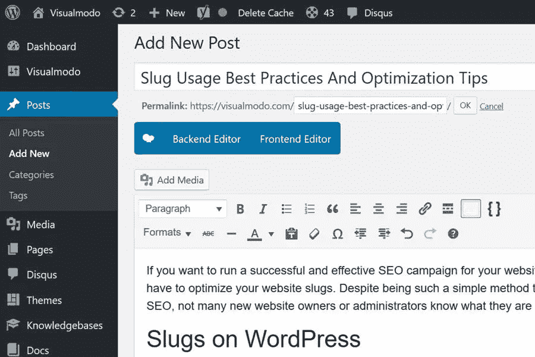

# 段塞使用最佳实践和优化技巧

> 原文：<https://medium.com/visualmodo/slug-usage-best-practices-and-optimization-tips-31aee30d45a7?source=collection_archive---------0----------------------->

在这篇文章中，您将了解什么是 slugs 的最佳实践和优化技巧。如果你想为你的网站或博客运行一个成功有效的 SEO 活动，你将不可避免地优化你的网站 slugs。尽管是这样一个简单的方法来优化你的网站的搜索引擎优化，没有多少新的网站所有者或管理员知道他们是什么以及如何使用他们。

# WordPress 上的 Slugs

在 WordPress 中，slug 是你的 URL 的一部分，当你写一篇新文章时，你可以编辑它。请注意，这只适用于正确的永久链接设置。在 WordPress 中编辑你的 slug 看起来像这样:

像日期或类别名称这样有时包含在 URL 中的东西，并不是 slug 的一部分。如果你在你的 URL 中添加了更多的变量，那么 slug 仍然是页面 URL 中可编辑的部分，就像这样:在 URL 的末尾有一个额外的值。在这种情况下，使用了额外的变量，这样即使 URL 不相同，slugs 也可以相同。

# SEO x Slugs

为你的页面或帖子写一篇好的文章可以积极地影响你的搜索引擎优化。它允许您执行以下操作:

# Slug 关键字

slug 的主要 SEO 好处是，你可以更改单词，以确保它包含你真正想要排名的单词。这是谷歌用来确定页面内容的指标之一。

# 友好的 URL

网址也是人们在搜索结果中看到的东西之一。想象一个结果页面:你会看到关于某个主题的许多不同的 URL，对吗？所以你需要确保你的结构符合人们期望看到的。例如，我们在 WordPress SEO 上的主要文章有一个非常切题的 visualmodo.com/wordpress-seo,网址。人们更有可能点击那个，而不是 visualmodo.com/?P=613458,，尽管那是 WordPress 默认创建的 slug。

# 段塞优化

在为你的文章或页面构建合适的 slug 时，你需要考虑哪些事情？让我们来看看优化 slug 的四个步骤:

# 一个小小的改变会带来很大的不同

优化你的 slugs 使其对搜索引擎更友好可能看起来太简单而没有任何实际用途。然而，它的简单性是它成为在 SERPs 中对你的网站进行排名的有效工具的关键原因之一。它的格式对于人和计算机来说都很容易阅读，并且它直接对应于你的网页和内容。

现在你知道了 slugs 是什么，它们是如何使用的，以及一些基本的最佳实践，你就拥有了为你的网站或博客优化 slugs 所需的所有工具。有时，赢得搜索引擎优化竞赛归结为非常小的利润，这意味着每个角度都值得探索。

# 添加关键字

这可能是显而易见的，但是请注意:你的关键词应该在 URL 中。它必须立即明确你的页面是关于什么的。如果你的关键词不在 slug 中，Yoast 插件中的 [SEO 分析](https://visualmodo.com/top-seo-strategies-for-2019/)会显示这条消息:

默认生成的 slug 可能包含像“a”、“The”和“and”这样的虚词以及类似的词。在某些情况下，你可能需要在 slug 中使用它们来阐明你的页面是关于什么的，但是通常情况下，你可以省略它们。我们已经在我们的 WordPress SEO 文章中写了更多关于这些词的内容

# 段塞优化的重点

不要只是过滤掉不必要的虚词，而是真的过滤掉所有你不需要的词。在这篇文章中，WordPress 自动创建了 URL“slug-usage-best-practices-and-optimization-tips”(基于 WordPress 中的 permalink 设置)。那挺长的，我就手动简化成“鼻涕虫”了。不过，要确保子弹仍然有意义。

这里有一件事要记住。一个链接结构只能使用一次，所以应该用于正确的页面。例如，这篇文章的结构是“slug”，这是非常具体的。现在，我们不打算再写一篇以“鼻涕虫”为主题的文章了。这篇内容丰富的文章是我们网站上关于这个 URL 的信息的中心点。但是如果这只是一个附加的帖子，我们打算以后再写主要的文章，我们就有问题了。你会明白为什么:因为鼻涕虫“鼻涕虫”已经被拿走了。所以，一定要考虑网页在你网站上的级别或位置。

# 保持简单

您页面的 URL 会出现在 Google 搜索结果中。不总是，有时它显示面包屑。如果你想重复使用文章更新的 URL，不要包含太多的信息。在你的 URL 中添加日期等信息时要小心，因为这些会立刻泄露内容最初发布的时间。

举个例子:图片中可以看到标题提到的 2018 年的一篇文章，但是网址没有。这便于更新，因此该文章在 2019 年及以后仍然有效！保持简洁的另一个原因是:紧跟在域名之后的一小段文字，允许谷歌在移动搜索结果页面显示关键词。

一个警告:在发布你的文章之前，最好采取这些步骤。如果你在发表文章后想到了一个更好的结构，你可能会很想改变它。太简单了，对吧？但是要注意:这样做意味着改变 URL，为了避免 404 错误，你需要重定向。