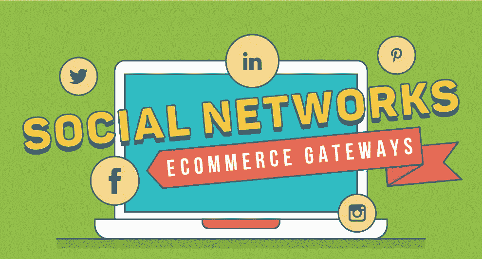

# 社交商务:广告业的最大趋势

> 原文：<https://medium.com/visualmodo/social-commerce-the-biggest-trend-in-advertising-23545cd7cc3c?source=collection_archive---------0----------------------->

这一切都始于互联网被商业化并提供给每个人使用的时候。公司利用这个机会向世界各地的人们提供他们的产品和服务。20 世纪的最后十年是电子商务诞生的时刻，也是现在社交商务的时刻。

# 社交商务

# 广告业的最大趋势

今天的主题是社交商务，它是最新的广告方式之一，是电子商务的一部分。为了跟上数字技术的最新趋势，越来越多的公司开始使用社交网络作为广告空间的手段。

**社交商务是如何运作的？**

这真的很简单。公司“炫耀”他们的品牌，每天使用社交网络的数百万人将会看到他们的广告。最好的事情是，人们将与他人分享经验，使他们成为潜在客户。[购物](https://visualmodo.com/)像亚马逊这样的平台利用社交商务为商品做广告，并提供网站上列出的各种[亚马逊折扣](https://www.16best.net/amazon/)，这样做可以增加最终会看到广告的潜在人数。

**社交商务有多重要？**

很大一部分顾客(87%)表示，社交媒体帮助他们决定购买什么，而 25%的顾客在选择服装时会在社交网络上寻求建议。高达 90%的追随者表示，他们试图通过社交媒体接触品牌。在美国，59%的客户认为通过社交媒体的[客户](https://visualmodo.com/)服务更容易获得答案和解决问题。

2017 年，社交网络广告总收入为令人震惊的 410 亿美元。

**拥有最多脸书粉丝的产品品牌。**

–可口可乐 107 米
–红牛 49 米
–耐克足球 44 米
–匡威全明星 44 米
–奥利奥 43 米

**Instagram 最受关注的品牌。**

–耐克 77 米
–Zara 25.2 米
–H&米 24.9 米
–阿迪达斯 19.4 米
–永远 14.5 米

请查看 16best.net 的家伙们制作的精彩信息图，找出更多关于社交商务增长的有趣事实。

查看[https://visual modo . com/social-commerce-biggest-trend-advertising/](https://visualmodo.com/social-commerce-biggest-trend-advertising/)