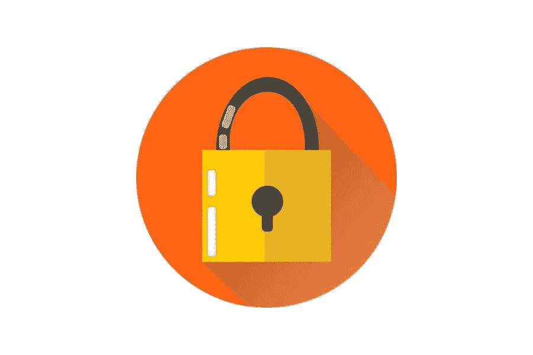

# 社交内容锁 WordPress 插件

> 原文：<https://medium.com/visualmodo/social-content-locker-wordpress-plugins-9ee78902dd8e?source=collection_archive---------0----------------------->

这个想法是你的博客文章中最有价值的内容将被锁在一组社交按钮后面。你的读者必须在脸书、Twitter 或 LinkedIn 上分享你的帖子，才能访问隐藏的内容。你可以通过使用 WordPress 插件轻松做到这一点。这些插件被称为社会内容锁插件。在本帖中，我们将分享顶级社交内容锁 WordPress 插件。

使用储物柜有很多好处。所以，你可能已经在你网站的每个页面和每个帖子下有了社交分享按钮和潜在客户生成弹出窗口。然而，访问者习惯于忽略它，因为没有真正的动机与他们互动。内容柜就像一块铅磁铁，提供必要的推动来鼓励你的观众采取行动。

# OnePress Social Locker:内容锁 WordPress 插件

9000+以上的激活，4.5 星的评分，这个插件相当有名。它提供了许多样式形式和效果，您可以在您的网站上用动画效果显示锁。

这个插件将帮助你增加喜欢、分享和追随者的数量，并从社交网络吸引更多的流量。此外，使用 Social Locker，您可以锁定内容中的任何内容，并在访问者[共享您的页面](https://visualmodo.com/improve-your-seo-with-social-media/)后自动解锁。

# 内容锁:内容锁插件

内容锁拥有许多功能，这使它成为一个伟大的和易于使用的插件。因此，一些功能跟踪每个储物柜的性能，通过 CSV 导出电子邮件，显示您的条款和政策，等等。

这个插件为 MailChimp 和 Mailerlite 快速收集访问者的电子邮件做好了准备。因此，它支持 Twitter 或脸书。到目前为止，它已在 10K 安装，并仍在计数。

# 社会储物柜保险费

吸引大量用户的最佳方式之一是使用社交储物柜来保护您的优质内容。用户只能在简单的社交分享后才能查看你的内容。这是为高质量内容付出的小小代价，大多数用户会非常乐意以这种方式支持你的网站。

在我看来，最好的插件是 WordPress Premium 的 Social Locker。由于您的内容吸引的社交分享数量有可能大幅增长，因此非常值得投资。

# OptinMonster

OptinMonster 最近推出了一个内容锁选择加入表单选项。OptinMonster content locker 使您能够阻止特定的帖子，以换取电子邮件地址。已经在您的电子邮件列表中的用户将能够照常查看内容。

要利用 OptionMonster 的 content locker 选择加入表格，您需要注册 Plus 或更高级别的计划。因此，这将花费你每月 19 美元(或更多的专业或增长计划)。这些许可包括访问无限制的选择加入表单、分割测试、页面级目标等等。最后，你需要的一切，以产生线索，将观众转化为订户和客户。