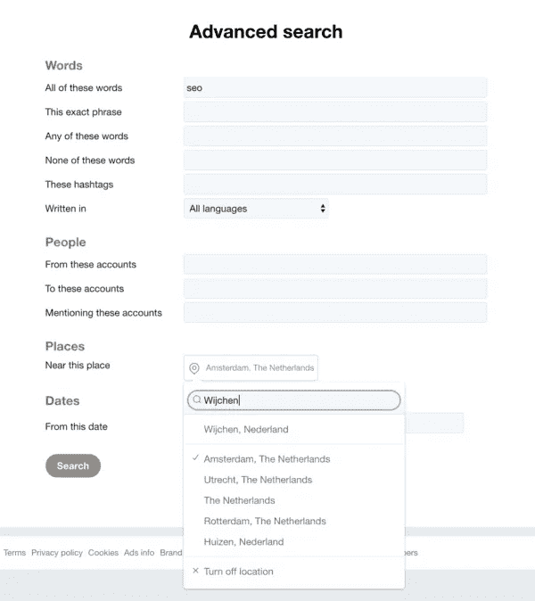
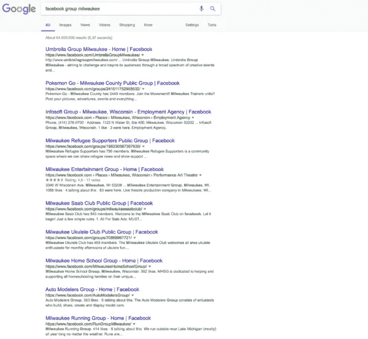

# 社交媒体和小企业

> 原文：<https://medium.com/visualmodo/social-media-and-small-business-81ff975decbe?source=collection_archive---------5----------------------->

你是一个拥有本地目标受众的小企业主。当然，你当地的观众需要找到你的商店或办公室，你想利用社交媒体来达到这个目的。但是，在过多的平台中，您根本不知道从哪里开始。所以你在脸书上发布了一些东西，偶尔试着发一条微博，但是什么也没发生。对于小企业主来说，社交媒体每次都像是一场斗争。也许最后一个词总结了这一切:你可能只是把你的*额外的*时间花在了社交媒体上。然而，在社交媒体上投资*实际的、可问责的时间*可能会得到更多回报。

有意识地投入时间意味着你需要先弄清楚一些事情。让我们来帮你。

# 应该用什么平台？

你需要找到你的目标受众使用的社交平台。否则，你将无法联系到合适的人。(至少)有两种方法可以找出这些平台是什么:

*   **询问客户他们使用什么社交媒体。那可能是 Twitter 或 Snapchat，但也可能是 Yelp 或 Meetup.com，这取决于你的业务类型。简单地问问你的客户，看看你会得到什么样的回应。如果你一周有几百个客户，这可能不是最好的做法。**
*   **简单的开始使用某个社交平台。看看会发生什么。比起其他选择，我更喜欢这个选择。尝试每件事，记录结果，几个月后停止做那些对你的生意没有用的事情。第二天不要放弃，而是给自己定一个目标，看看自己能否实现。**

[阅读更多:“社交媒体战略:从哪里开始？”](https://yoast.com/social-media-strategy-where-to-begin/)

# 影响小型企业社交媒体的因素

当你作为一个小企业主考虑社交媒体计划时，有很多事情要记住。您的结果将取决于您选择的平台，但以下三个因素也肯定会发挥作用。

# 给它时间

控制你的期望:你的社交追随者不会在一夜之间增加。不要指望人们在创建个人资料后就关注你。你需要投入我们说过的时间。创建个人资料不是投资时间，应该在几分钟内完成。实际*时间*投资紧接着开始。

# 创建相关内容

你需要确保你的信息/提及/促销/文章值得分享。换句话说，总的来说，你的内容必须是相关的，有价值的。在 Yoast，我们试图每周发表五篇文章，但前提是我们有值得发表的东西。我们宁愿跳过一天，也不愿在社交媒体上发布一些可能适得其反的东西，因为缺乏相关性。

对相关性的需求会阻碍某些企业使用社交媒体。人们常说:

“但是我没有什么值得分享的。”

那是胡说八道。如果你擅长你所做的，你会有值得分享的项目、证明、图片和引用。不需要每天写新的博客，只需要找到你引以为豪的东西并分享出来。如果你真的想开一个博客， [Marieke 有一些给你灵感的建议](https://yoast.com/5-tips-get-inspiration-blog/)。对于那些想深入博客的人，总有我们的[博客终极指南](https://yoast.com/ultimate-guide-blogging/)。

# 不要放弃

影响小型企业社交媒体的第三个因素是*决心*。为了正常工作，小型企业的社交媒体必须是一个持续的发布和参与过程。说“我尝试过社交媒体，但它不是我的菜”并不能显示出决心。你可能试过 Snapchat，它不是你的那杯茶。那很好。但也许脸书是。也许在脸书上发帖不适合你，但加入脸书团体可能适合你。我认为 bullsh*t 的声明是“社交媒体不是你的东西。”你可能只是没有找到合适的媒介或平台。

# 小型企业对社交媒体的使用

让我来看看一些社交平台，给你一些如何使用它们的建议。这不是你自己的[社交媒体战略](https://yoast.com/social-media-strategy-where-to-begin/)的蓝图:实际使用将取决于你的业务类型和你愿意在社交媒体上投资的时间。以下是一些想法:

# 推特

Twitter 是发送信息和与当地社区互动的绝佳方式。这里有两件事很有用:

*   **标签**。标签可以让你把你的推文和一个单独的主题联系起来，而不需要添加大量的介绍。它被用来在推特上发布电视节目，如 [#GoT](https://twitter.com/hashtag/GoT) 或城市，如 [#Seattle](https://twitter.com/hashtag/Seattle) 。尤其是在推文中加入你所在城镇的名字会让你得到当地的关注。我们可以确认这甚至适用于我们所在的小镇。
*   **高级搜索**。如果你正在寻找一种方式参与相关的本地对话，你应该[试试 Twitter 上的高级搜索选项](https://twitter.com/search-advanced)。它允许你搜索任何你喜欢的主题，在你想要的区域*。见下面截图。*

# 脸谱网

首先，你的公司已经在脸书了吗？我推荐添加为[本地商家或者地方](https://www.facebook.com/pages/create/)。脸书月活跃用户 19.4 亿，日活跃用户平均 12.8 亿(来源:[脸书](https://newsroom.fb.com/company-info/))。脸书很大。仅此一点就足以让你有理由将你的业务扩展到脸书。将你的公司加入脸书并不难。对于小企业主来说，这是一个相对较小的努力。

向您的好友推广您的页面，获得赞，并共享更新和照片。请注意，对于销售帖子(“购买我们的产品！”)，如果你稍微提升一下你的职位，你就有更大的成功机会。可以为指定的受众进行增强，其中*位置*是过滤器之一。

对于你的社交媒体努力来说，脸书是一个有吸引力的选择的另一个原因是脸书集团。脸书团体可以涵盖一切。快速搜索关于密尔沃基的脸书团体可以发现有多少种类:

口袋妖怪 Go、难民支持者、萨博、尤克里里、汽车模型师、跑步——只要你说得出主题，脸书就有一群适合你的。通常，也有当地商务人士的网络小组。只需搜索并找到符合您需求的小组。介绍你自己和你的企业，并参与讨论。这是向当地观众推销你自己和你的公司的一种简单、省时的方式。

# 照片墙

你有值得分享的产品图片或照片吗？在这种情况下，Instagram 可能是你的社交平台。Instagram 使用标签，很像 Twitter。我使用 hashtag 应用程序，如 [Hashme](http://www.hashtagsapp.com/) 或 [Tag o'Matic](https://www.instagram.com/tagomatic/?hl=en) 来找到与我的内容相匹配的内容。在添加本地内容时，Instagram 上的标签非常有用。一个例子:

#西雅图#西雅图生活#西雅图艺术#西雅图艺术家#西雅图爱情#西雅图市中心#太空针#太空针#太空针#华盛顿#太空针西雅图#华盛顿州#西雅图瓦#西雅图地平线#西雅图中心

我用最后一个应用程序花了 30 秒找到 15 个相关的本地标签。顺便说一下，Instagram 允许你在一篇文章中使用多达 30 个标签。利用这些优势吧！

当然，还有更多小型企业的社交媒体平台。但我现在不想给你太多选择。我想提到的一点是，像 [Yelp](https://www.yelp.com/) 和[猫途鹰](https://www.tripadvisor.com/)这样的评论网站也是社交网站。如果你的业务在这些网站上被提及，他们不应该被忘记。一定要注意你的提及，如果需要的话就采取行动。这也是社交！

# 衡量你的社交媒体努力

我们写了一些关于社交媒体网络的各种分析工具的文章，我也想给你指出这些。跟踪关注者和影响范围可以让你知道你的策略有多有效。关注那些告诉你参与度的数字，看看社交网络确实帮助你建立了你的社区。我们开始吧:

*   [脸书洞见](https://yoast.com/facebook-page-insights/):获得 30 个赞，洞见就可获得。在你的页面上获得 100 个赞后，你甚至可以将你的数字与竞争对手进行比较。
*   [Twitter 分析](https://yoast.com/twitter-analytics-stats-for-your-tweets/):看看谁是你的影响者:喜欢你的推文并有自己的粉丝的人。找到当地有影响力的人，认识他们:请他们不时在推特上发布关于你的消息。
*   [Iconosquare for insta gram](https://yoast.com/instagram-analytics-insights/):由于还没有来自 Instagram 的针对 Instagram *的适当分析，我依赖 Iconosquare 来完成。用它来找到发布的最佳时间，看看什么样的内容最适合你的业务。*

请自行检查这些工具。密切关注趋势和参与度，因为在我看来这是最重要的事情。

# 显而易见的社交媒体策略效果最好

我想留给你们两个最后的想法:

*   **张贴引人入胜的内容**，因为这是获得受众的最佳方式。听起来简单，但是很难。不要害怕在这里尝试。通常，个人故事会带来最多、最好的参与。话虽如此，社交媒体上的 Yoast 办公生活图片经常会引发对 Yoast SEO Premium 的[功能的质疑。保持开放的心态，帮助任何顾客解决他们的任何问题，无论是否相关。订婚很重要，而不是你文章的主题。](https://yoast.com/wordpress/plugins/seo/reasons-to-upgrade/)
*   **你的员工就是你在社交媒体上的** [**品牌大使**](https://yoast.com/online-customer-brand-ambassador/) 。他们喜欢你的公司，喜欢在那里工作，最有可能分享你的很多社交内容，如果不是全部的话。你的员工创造了当地的滚雪球效应。毕竟，他们在脸书的大多数联系可能/通常和你生活在同一个地理区域。承认这一点，并时刻意识到这些“内部”股票的价值。

暂时就这样吧！我确信我已经说服了你，即使作为一个小企业，在你的社交媒体战略上投入一些时间和精力也会有回报。所以去争取吧！欢迎在评论中提出任何关于小型企业社交媒体的问题或想法！

来源[https://visualmodo.com/](https://visualmodo.com/)