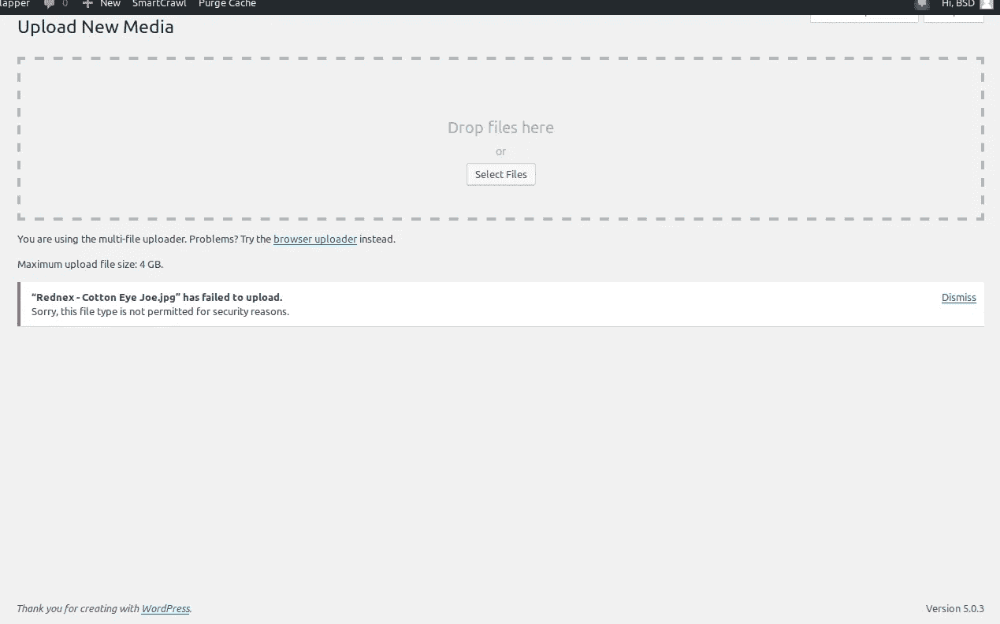

# 抱歉，出于安全原因，不允许使用此文件类型—错误修复指南

> 原文：<https://medium.com/visualmodo/sorry-this-file-type-is-not-permitted-for-security-reasons-error-fix-guide-31dbf61fd877?source=collection_archive---------0----------------------->

最后，如果你试图上传一个文件到你的媒体库，并收到“对不起，出于安全原因，这种文件类型是不允许的”的错误，你可能会感到不知如何继续。幸运的是，有几种方法可以修复错误并使事情恢复正常。在这篇文章中，我们将解释为什么 WordPress 中会出现“对不起，出于安全原因，不允许使用这种文件类型”的错误。然后，我们会告诉你解决错误的方法，并上传任何文件到你的 WordPress 站点。

当你试图通过管理面板上传文件到你的网站时，WordPress 显示这个错误“对不起，由于安全原因，此文件类型不被允许”。出于安全原因，用户只允许上传特定类型的文件到 WordPress 网站。这是为了防止用户上传可执行文件到他们的网站。WordPress 只允许用户上传以下类型的文件。如果您尝试上传任何其他类型的文件，您会得到错误消息“对不起，出于安全原因，此文件类型是不允许的”。

# 不允许使用 WordPress 插件修复文件

有几个插件能够让你上传禁止的文件类型，如文件管理器和增强型媒体库。这些插件的设置可以让你添加允许的多用途互联网邮件扩展(MIME)类型来上传到 WordPress。

MIME 类型描述文件包含的内容，并告诉您的浏览器如何正确显示它。例如，文件扩展名。jpg 对应于 MIME 类型 image/jpeg，在 web 浏览器中显示为图像。我们将使用增强的媒体库插件来添加新的允许上传的 MIME 类型。你可以在 WordPress 的插件区快速安装并激活插件:插件激活后，我们将进入我们的设置，看到有一个 MIME 类型>媒体选项:

有两种方法允许上传特定的 MIME 类型。第一种方法是在 Allow Upload 列中选择对应于所需 MIME 类型的框。但是，如果您想要的类型没有列出，您必须选择页面顶部的添加新 MIME 类型。

这将添加一个新行，您可以在其中输入扩展名、MIME 类型和标签。接下来，为新的 MIME 类型选择“允许上传”框。如果你改变了主意，你可以使用每一行末尾的按钮删除条目，或者选择恢复 WordPress 默认 MIME 类型为原始设置。

# wp-config.php 文件

如果您希望允许上传所有文件类型，可以通过编辑 wp-config.php 来实现，该文件包含与您的站点数据库相关的信息。再说一次，你会想要备份你的网站，以防在你编辑的时候出现问题。然后，您将使用 FTP 访问 wp-config.php，就像我们在前面的方法中描述的那样。该文件应该位于您网站的根目录中。选择查看/编辑打开文本编辑器。您可以将以下代码添加到文件中，位于“/*仅此而已，停止编辑”行上方的任何位置。博客快乐。*/":

> define(' ALLOW _ UNFILTERED _ UPLOADS '，true)；

最后，完成编辑后保存您的更改。请注意，这样做意味着无法防止您或用户意外地(或有目的地)将恶意文件上传到您的网站，因此在采取这种方法之前，尝试其他方法可能是明智的。

# 多地点定位

如果你使用 WordPress Multisite，你可以很容易地解决这个安全问题。您可以在“上传文件类型”中添加想要上传的文件类型。网络管理区域中的 [WordPress Multisite](https://visualmodo.com/wordpress-multisite-explained/) 设置中的选项。请导航到网络管理区>设置>上传设置并添加必要的文件类型。确保文件类型用空格分隔，而不是用逗号分隔。