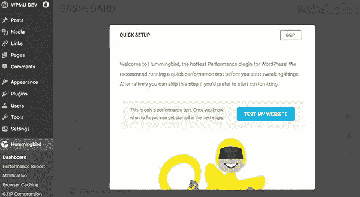
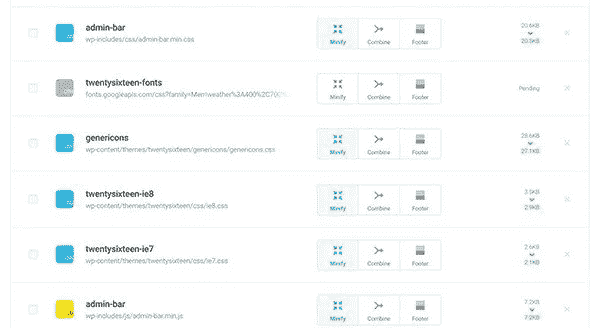
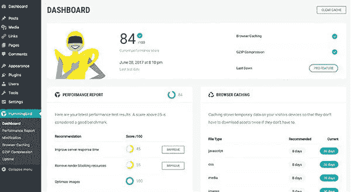

# 速度优化免费 WordPress 插件

> 原文：<https://medium.com/visualmodo/speed-optimization-free-wordpress-plugin-e6c62b7304c8?source=collection_archive---------3----------------------->

非常需要速度吗？免费满足它！—用蜂鸟。速度优化插件[可以在 WordPress.org](https://wordpress.org/plugins/hummingbird-performance/)下载。

蜂鸟是 WordPress 的终极性能优化插件。一旦激活，它会扫描您的网站，寻找潜在的速度改进，并为文件压缩、缩小和浏览器缓存提供微调控制。蜂鸟不仅让你的网站更快，它还能帮助你提高你的[谷歌页面速度洞察](https://developers.google.com/speed/pagespeed/insights/)分数！

# 又快又免费！？掐我，我一定是在做梦

你可能已经注意到我们一直在寻找回馈 WordPress 社区的方式，以及比分享我们最喜欢的工具更好的传播爱的方式！

嗯，[每个人都在为页面速度小题大做，因为它*是*小题大做](https://premium.wpmudev.org/blog/make-wordpress-fly-hummingbird/)。缓慢的页面会让访问者跳得比发情的兔子还快，如果你的网站没有优化到载入速度极快，你就可以和谷歌首页排名的梦想吻别了。

凭借 25 万的下载量，Hummingbird 和 Smush image optimization 是每个 WordPress 站点的强大站点优化组合。

# 用蜂鸟提高速度

当你安装 Hummingbird 的时候，它会运行一个初始扫描，寻找那些让你的网站变慢的文件，并给出一个建议列表，让你的网站以最高速度运行。

Hummingbird 甚至包括一键改进，可以快速使您的网站发挥最佳性能，而不会混淆指令。

# 蜂鸟缩小能力

从网站的头部加载所有文件会使你的页面加载缓慢。 [Hummingbird 会告诉你你的文件被加载到哪里](https://premium.wpmudev.org/blog/eliminate-render-blocking-issues-hummingbird/)，让你轻松地重新定位它们以加快速度。

重新排序文件提供了一个很大的推动，但我们知道一个错误的举动可能会导致兼容性问题。有了蜂鸟，就不用担心了！移动文件以找到最佳配置，如果出现问题，您可以通过单击来重置。

# 使用 GZIP 压缩让您的文件真正飞翔

激活 GZIP，让与他人共享您的网站更加高效。发送压缩文件更快，可以节省你的托管费用。

听起来很复杂，对吧？不是用蜂鸟。只要激活 GZIP 和蜂鸟会照顾剩下的。这就是我所说的！

# 第二次加载页面会更快

你知道吗，你可以让你的网站为回头客加载得更快。浏览器缓存将内容存储在访问者的浏览器中，这样他们就不必下载两次。

没有摸索与混乱的设置。Hummingbird 检测您的服务器，为您的设置应用最佳设置，并让您对缓存过期进行微调控制。

# 云辉被烘烤成

我们认为 [CloudFlare](https://www.cloudflare.com/) 非常棒，所以我们增加了[从蜂鸟](https://premium.wpmudev.org/blog/hummingbird-cloudflare-integration/)内部控制你的 CloudFlare 浏览器缓存设置的能力。只需添加您的 CloudFlare 密钥并配置即可。

蜂鸟是一种 WordPress 性能优化插件，可以让你的网站以超高速运行，而且是免费的！

# 使用 WPMU DEV 会员资格释放您网站的全部潜力

蜂鸟的[免费版本](https://wordpress.org/plugins/hummingbird-performance/)是充分利用你的网站的一个好方法，但是如果你需要自动扫描、正常运行时间监控、两倍于常规优化的增强缩小压缩、CDN 托管缩小和 [Smush Pro 图像优化](https://premium.wpmudev.org/project/wp-smush-pro/)，使用 WPMU DEV 会员资格提升能力。

此外，如果你运行不止一个网站， [Hummingbird Pro](https://premium.wpmudev.org/project/wp-hummingbird/) 直接锁定[Hub](https://premium.wpmudev.org/blog/update-all-wordpress-plugins-and-themes-with-the-hub/)，这样你就可以从一个地方管理所有网站的优化、安全、[备份](https://premium.wpmudev.org/project/snapshot/)、搜索引擎优化、插件和主题更新等等。准备好开始使用 WPMU 开发了吗？[完全免费入门一个月](https://premium.wpmudev.org/#trial)。

来源:来源[https://visualmodo.com/](https://visualmodo.com/)