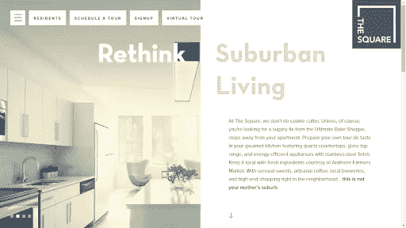
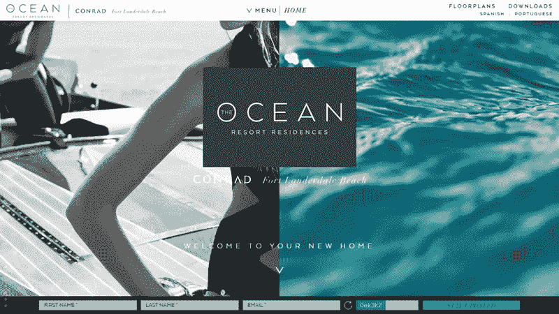
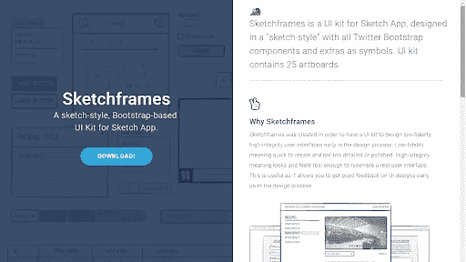
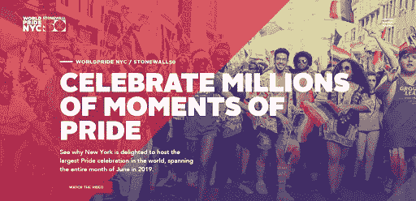

# 确保完美观看体验的分屏设计最佳实践

> 原文：<https://medium.com/visualmodo/split-screen-design-best-practices-that-ensure-a-perfect-viewing-experience-9462417b0357?source=collection_archive---------0----------------------->

如果你的企业需要一个有多个主要目标的网站，分屏布局是最好的选择。这是一个非常非常规的设计方案，对两个重要的网站区域给予了同等的重视，这两个网站区域在最近几年非常受欢迎。

尽管这个解决方案打破了最古老的 UI 设计规则之一，但它工作得很好，许多企业选择采用这样的布局。事实上，与其他布局相比，它有许多优势，包括:

*   从视觉上吸引观众
*   提高移动设备上的 UX。拆分设计可以很容易地适应移动浏览，这是网站在谷歌上排名的关键要求
*   使用对比度帮助观众将注意力集中在特定内容上
*   提供非传统的设计解决方案，提供独特的体验
*   审美素质。如果实施得当，这种布局可以带来极佳的视觉体验。

然而，如果你想在你的[网站](https://awards.visualmodo.com/)上实现分屏布局，也要记住，如果没有正确的执行，这样做可能会破坏 UX。所以，让我们来看看你怎么做对。

# 谁能从分屏设计中受益？

如果你认为分裂设计是你的网站的一个合适的选择，记住它的目的是推广两个或多个东西。例如，它可以很好地为投资组合网站工作；在左边，你可以包括关于你或你的企业的信息，并在右边列出你的最佳作品。结果，访问者将花费更少的时间找到他们想要的信息。

其次，销售有限产品的企业也可以从分割设计布局中获益。例如，通过将屏幕分成两个或更多的类别，并将每个类别用于一个突出的产品，你将使访问者更容易搜索到最受欢迎的产品。

此外，如果你是一家销售一两款数码产品的初创公司，分割设计布局可能是一个完美的解决方案，因为它会将访问者的注意力集中在他们身上，即使他们彼此完全不同。

你甚至没有雇佣一个程序员团队来完成这项工作。即使是小企业也可以在 [WordPress 网站](https://www.websitetooltester.com/en/website-with-wordpress/)上选择一个现成的[分屏主题](https://visualmodo.com/theme/seller-ecommerce-wordpress-theme/)来实现。

正如你所看到的，许多用户可以从分割设计布局中受益，所以如果你认为你已经准备好成为其中一员，这里是我们为你准备的提示。

# 最佳分割设计实践，确保游客获得完美的观赏体验

*   **用鲜明的对比色打造简约设计**

这种做法遵循了卡片的概念(毕竟分屏设计的灵感来自卡片)。通过使用两种对比色来分隔网站的两个部分，并采用极简设计，可以将浏览者的注意力集中在特定的内容上。

请记住，您可以使用您品牌的颜色！这种技巧会让你的品牌更令人难忘。此外，你可以确保你所有的内容都在文件夹上方，这样访问者就不必滚动了。

这是一个遵循这些实践的网站的例子——位于宾夕法尼亚州阿德莫尔的一个公寓楼广场。

*   **在两个零件之间建立流动**

虽然网站的两个部分应该在视觉上彼此不同，但你也可以在它们之间建立联系。这可能是一个很好的设计方案，因为它给人一种从一个部分到另一个部分的视觉流动的印象。

例如，看看下面的例子。Ocean Resort Residences 将多个元素(例如，两个文本和一个标志)层叠在两个屏幕上，以传达它们之间的强大联系。

*   **强调行动号召(CTA)按钮**

对于同时作为登录页面的主页来说，拆分设计可能是一个很棒的解决方案。例如，通过拥抱极简主义和使用适当的颜色，你可以把你的访问者的注意力吸引到 CTA 按钮上。

比如 Sketch frame 的网站就是一个很好的例子，让 CTA 在不使用太多对比的情况下脱颖而出。

*   **应用彩色过场**

这样做是一个很好的方法，可以确保一个愉快的浏览体验，并为你的网站创造一个更令人难忘的外观。例如，看看下面的 NYC Pride 网站。它不仅应用了彩色的过度渲染，而且设计师们还以一种创造性的方式分割屏幕，让它变得非常酷。

因此，不同视觉风格和颜色的组合确实让用户体验独特而难忘。

# 底线

分割设计实践是为你的网站创造独特外观并使其更加用户友好的有效方法。此外，它们在传达产品、服务或网站部分的同等重要性方面也很棒。这对于降低跳出率和确保完美的用户体验尤为重要。

希望这里描述的技巧和实践有助于你对你的网站设计做出最终决定！