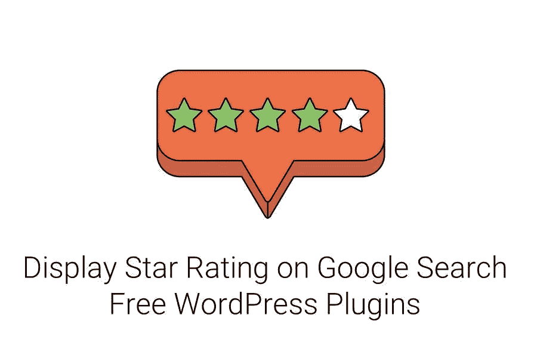

# 谷歌搜索显示免费的 WordPress 插件

> 原文：<https://medium.com/visualmodo/star-rating-on-google-search-display-wordpress-plugins-for-free-3a12050904c?source=collection_archive---------0----------------------->

你可能已经在搜索结果中看到很多评论，在他们的文章标题下面显示明星和评论摘要。在这篇文章中，我们将列出最好的免费 WordPress 插件来显示谷歌搜索结果页面的星级。它们基本上给了人们一个线索，里面有什么。这些评级有助于提高点击率和我的会员收入。

随着越来越多的人点击你的页面，你的销售额就会越来越多，最终你会获得更多的佣金。CTR 取决于各种因素，如撰写磁性标题、锁定相关关键词、在搜索结果中的较高排名以及许多其他因素。但是你知道吗？Google rich snippets 评论评级也在其中发挥了关键作用。因此，你的销售额取决于你从谷歌获得的点击率。

# 所有这些都包含在一个模式丰富的片段中

这个免费的 WordPress 插件可以让你在谷歌搜索结果中显示各种丰富的片段。如果你不知道什么是丰富片段，这里有一个快速定义。rich snippet 是在搜索结果页面上对您的页面的简短描述。丰富的片段可以是图像、价格、作者姓名、星级等形式。

All In One Rich Snippet 支持以下类型的内容格式:评论、事件、产品、人物、食谱、视频、文章、软件应用程序。这是在搜索结果中显示文章星级的最简单的解决方案之一。你所要做的就是在你的 WordPress 文章编辑器中选择文章的类型，然后你就一切就绪了！这个插件是免费的，绝对是 WordPress 最好的星级插件之一。

**在选择这个插件之前**

这是一个在[谷歌搜索](https://visualmodo.com/google-search-console-wordpress/)结果中显示丰富片段的一体化解决方案。此外，它是免费的，你可以从 WordPress 知识库下载。[下载吧](https://wordpress.org/plugins/all-in-one-schemaorg-rich-snippets/)。

# 星级谷歌显示插件:审查块的终极块

Ultimate Blocks 是唯一一个提供“支持模式”的审查块的 Gutenberg Blocks 插件。此区块允许您在博客文章中添加评论框。它允许您添加评论标准行，累积星级将自动计算。

您可以编辑审阅标题、作者姓名、审阅摘要和行动号召按钮。您还可以更改星形颜色、星形悬停颜色、按钮颜色、按钮 URL 和文本。最棒的是，你可以在 Gutenberg 编辑器中编辑这个块。真是‘所见即所得’。目前，该模块只允许作者添加评论。读者不能提交他们的评论。

**在选择这个插件之前**

*   这不是一个专门的星级插件。相反，它提供了一些古腾堡区块来创建更好的和引人入胜的内容。
*   最后，完全免费下载。

# WP SEO 结构化数据模式

这个列表中的另一个插件是 WP SEO 结构化数据模式。这是一个免费的插件，可以让你添加文章、本地企业、事件、产品、组织、视频、服务和评论的模式。

与列表中提到的其他插件不同，配置这个插件可能会让你有点困惑，因为它有很多选项。但是如果你想完全控制一切，这可能是适合你的插件。

该插件还带有一个专业版，具有以下特性:

*   自动填充功能
*   自定义帖子类型支持
*   WordPress 多站点支持
*   更多模式类型(书籍、课程、招聘信息、音乐、电影、食谱、电视节目等)

**为什么是这个插件？**

*   它提供了对一切的完全控制，但你必须处理许多选项。
*   而且，这是一个免费评级的 WordPress 插件。

# Yasr:免费星级谷歌显示插件

这是另一个可以帮助你在谷歌搜索中显示星级的插件。有了这个插件，你可以在你的帖子或页面中显示星级。

你也可以在短代码的帮助下启用访问者评级。该插件还具有根据评论的不同方面给出评级的功能。

这个插件使用起来非常简单，而且免费。虽然从美学角度来说，它不是最好看的，因为它没有任何设计选项允许你调整分级框的外观。

以下是这个插件的特性:

*   模式支持
*   用户评级
*   多重集支持
*   短代码支持
*   使用方便

**这个插件简而言之就是**

*   它允许你在你的博客文章中添加简单的星级。您还可以启用访问者评级。
*   它可以在 WordPress 知识库上找到。