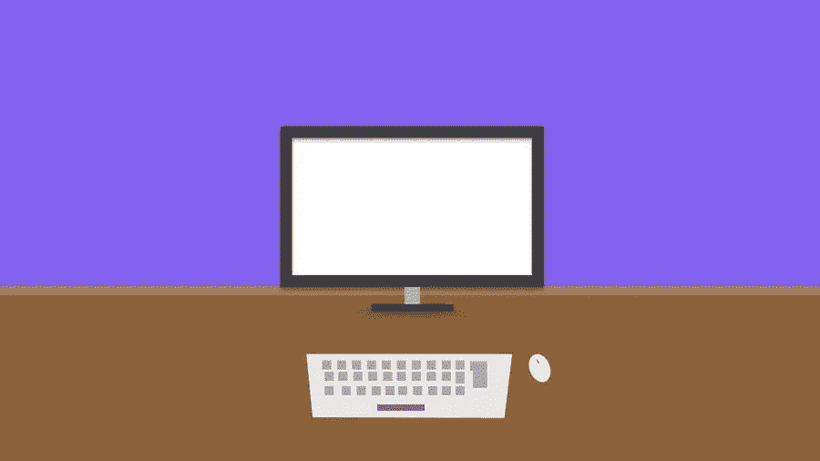

# 开始家庭博客 101

> 原文：<https://medium.com/visualmodo/starting-a-home-blog-101-265ae126ab5c?source=collection_archive---------0----------------------->

博客是一种流行的交流和传播信息的方式。开一个家庭博客比你想象的要容易。不仅风险低，成本也低。这里有一个创建博客的简单指南。

# 创建家庭博客

# 1.选择一个合适的位置

如果你是一家公司或组织的成员，你应该创建一个与你所经营的产品或服务相关的博客。然而，如果你是以个人身份写博客，你可以灵活选择话题。记得写一些让你兴奋的事情。如果你也写一些有很多讨论空间的东西，会有所帮助。选择一个能让你树立权威的利基市场也很重要。所以，想想开始一个家庭博客。

# 2.选择一个博客平台

选择你想创建博客的地方是你需要弄清楚的第一件事。WordPress 是最大的在线博客平台之一。这个内容管理系统有数不清的插件和附件，以及许多设计你的博客的方法。其他可供选择的平台有 Blogger 和 Tumblr。

使用 WordPress 作为博客平台的好处之一是，它有大量免费的布局和主题，易于设置，免费使用，速度快，并提供流畅的交互。

# 3.域名和托管

域名是在网上识别你的网站的名称。这是你博客的唯一地址。免费域名以博客平台的名称结尾，而付费域名可以以 web 后缀结尾，如。或. org。

网络主机是在线存储内容和文件的地方。说到虚拟主机，你可以选择付费或者免费。WordPress、Blogger 和 Tumblr 都有免费博客。免费托管的一个缺点是:

*   你不会得到自己的域名；例如，它看起来像这样:yourblog.blogspot.com。想想开始一个家庭博客。
*   无法完全从你的博客中赚钱。你在上传视频和图片方面也受到限制。
*   你没有自己的博客。这意味着它由其他人托管，他们可以随时删除它。

有了自托管博客，你就可以在你的域名上运行博客。你可以给你的博客取任何你想要的名字，例如，“YourName.com”。这也意味着你可以结束它 with.co.uk，。组织，。com 或任何网络后缀。你也有无限的带宽上传视频和图片。最后，你可以完全控制自托管博客，因为你是博客的真正主人。

如果你选择一个可靠的网络主机是最好的。web 主机提供商的一些首选是 Bluehost 和 Hostgator。

# 4.设计你的博客

安装好 WordPress 后，你需要做的就是进入 WP-Admin 页面，通常是:yourblognamehere.com/ WP-Admin，添加你的第一篇文章。

下一步是让你的博客看起来像你想要的那样。此时，您需要选择一个主题。前往“外观”，然后“主题”，然后安装一个免费的主题。如果你对免费的 WordPress 主题不满意，你可以访问像“主题森林.网”这样的高级主题网站，花 40 美元购买你喜欢的主题。

# 4.创建家庭博客:发布页面和帖子

创建家庭博客的最后一步是发布页面。有了 WordPress，您可以在舒适的卧室里轻松发布页面和帖子。你需要区分页面和帖子。页面提供网站的一般信息。一些必备页面包括主页、博客页面、关于页面和联系人页面。另外两个重要页面是隐私政策页面，让读者放心，你已经保护了他们的信息，以及披露页面，让读者了解你对博客的意图。您的披露页面可以声明您希望赚钱。

要创建页面，请点击屏幕顶部的“新建”按钮，然后选择“页面”键入您的页面标题，然后按 enter 键写入内容。最后，预览页面并按“发布”。

帖子是你在给定的主题上创建的内容。例如，如果你选择写“开一个家庭博客 101”，这是一篇帖子。帖子是一篇独立的文章。当在 WordPress 上发布一篇文章时，点击屏幕顶部的“新建”按钮并从下拉菜单中选择“发布”来打开一篇新的文章。

# 总之，开一个家庭博客

写博客是一种简单的方式来表达你的想法，并向你的受众传播有价值的信息。博客是一门随着时间完善的艺术。成为博客作者的第一步是创建一个博客。虽然社交媒体平台的经验可能会让你很容易开始你的博客之旅，但要找出常见的博客错误并成为一名成功的博客作者需要研究和时间。