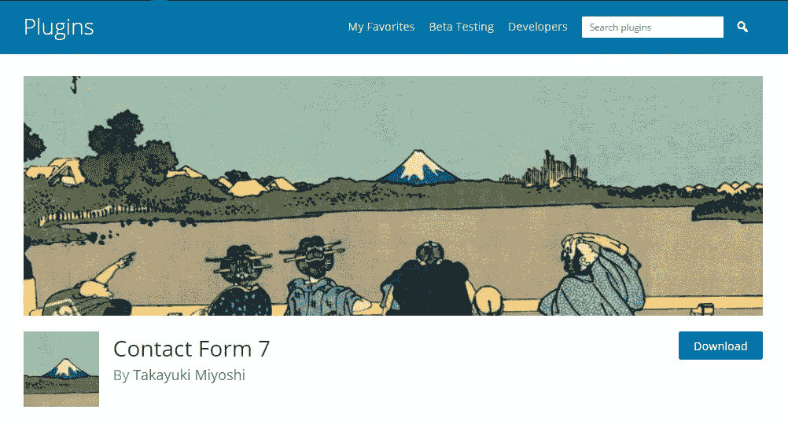
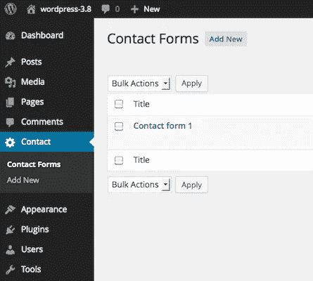

# 从联系表单 7 开始 WordPress 插件

> 原文：<https://medium.com/visualmodo/starting-with-contact-form-7-wordpress-plugin-87415e1d3bfe?source=collection_archive---------0----------------------->

联系表单 WordPress 创建者

本指南是对 WordPress 的联系人表单 7 插件的介绍。需要 WordPress 管理的基本知识。本教程通过各种示例解释了如何在页面上显示表单，以及如何自定义表单和邮件。

# 下载联系表格 7

你可以在你的 WordPress 仪表盘>插件>添加新的< or download the plugin files on [WordPress.org](https://wordpress.org/plugins/contact-form-7/)上搜索插件名称。所有的 [Visualmodo](https://visualmodo.com/) WordPress 主题都为更好的联系人表单插件使用进行了优化，并且还提供了特殊的联系人表单创建和显示选项。

## 显示表单

让我们从在页面上显示一个表单开始。首先，打开 WordPress 管理面板上的*‘联系人’>‘联系人表格’*菜单。您可以在那里管理多个联系人表单。

在安装了 Contact Form 7 插件后，您会看到一个名为“Contact form 1”的默认表单，以及类似这样的代码:

> `[contact-form-7 id="1234" title="Contact form 1"]`

复制这段代码。然后，打开您希望放置联系表的页面的编辑菜单(*‘Pages’>‘Edit’*)。一种流行的做法是为联系人表单页面创建一个名为“Contact”的页面。将您复制的代码粘贴到页面内容中。

现在，您的联系人表单设置已经完成。您网站的访问者现在可以找到该表单，并开始向您提交消息。

接下来，让我们看看如何定制表单和邮件内容。

## 自定义表单

您可能会觉得默认表单对您来说太简单了，并且想要添加更多的字段。您可以在[管理屏幕](http://contactform7.com/admin-screen/)中编辑表单模板并添加其他字段。

要将字段添加到表单中，请为它们制作标签并将其插入到“表单”字段中。您会在“表单”字段中找到不熟悉的代码，例如`[text* your-name]`。这些代码在联系表 7 的词汇表中称为“标签”。

标签有一个相当复杂的[语法](http://contactform7.com/tag-syntax/#form_tag)，但是不要担心！你不必学它。您可以使用 ["Generate Tag"](http://contactform7.com/admin-screen/#tag-generator) 工具生成任意数量的标签。

标签中的第二个词是它的名字。例如，`[text* your-name]`的名字是‘你的名字’这个名称很重要，因为它将在以后的邮件模板中使用。

## 自定义邮件

您可以像编辑表单模板一样，在“邮件”字段集中编辑邮件模板。您也可以在那里使用标记，但是注意邮件的标记不同于表单的标记。

您可以在邮件模板中使用的标签在括号中只包含一个单词，看起来像`[your-name]`。您应该知道，这个“您的姓名”与前一个示例中提到的表单标记的名称相同。这两个标签对应相同的名称。

在 mail 中，`[your-name]`将被用户的输入值替换，该值通过相应的表单域提交，在本例中，表单域是`[text* your-name]`。