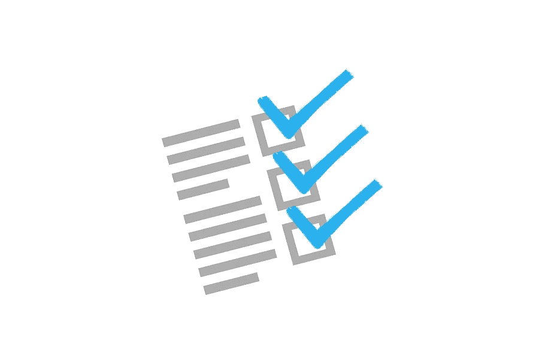

# 2021 年建立网站审计清单的步骤

> 原文：<https://medium.com/visualmodo/steps-to-have-website-audit-checklist-in-2021-22697b024aef?source=collection_archive---------0----------------------->

搜索引擎优化审计负责在搜索引擎结果中获得排名靠前的位置。有许多用于审计目的的工具——最好的方法是自己完成整个 SEO 审计任务，或者选择一个 SEO 审计员来为你做这项工作。搜索引擎优化审计员将开发一个易于阅读的报告，你的网站与其他建议是什么需要增加性能，以改善搜索引擎优化，也称为搜索引擎优化网站审计清单。

在 [SEO 优化](https://visualmodo.com/designing-seo-friendly-site/)之后，下一步要执行的是 SEO 站点审计清单，它包括了执行手动 SEO 审计的所有内容。

# 从谷歌索引中剔除低质量的内容

更少的页面带来更多的流量，难怪谷歌更喜欢你网站上更少的索引页面。低价值的页面意味着它们对谷歌搜索毫无价值，你需要立即对它们去索引。这种现象的名称是索引膨胀，这意味着当许多低索引页面占据了一个网站。有时候你会发现一些自动生成的平台，WordPress，或者 medium 在索引页面上添加了一些他们独特的低价值内容。这些页面通常对谷歌搜索没有任何价值，必须从谷歌搜索列表中删除。

通过选择一个 **SEO 网站审核清单，去掉这些[额外的线索](https://segurosorocaba.com/contato/)，你可以为你的网站清单快速获得巨大的流量。**

# 优化页面加载网站审计清单

你的网站在清单上的加载时间会影响转化率。网站审计清单产生更多的流量，在搜索引擎结果中获得更高的排名。确保你的网站的主页，关键登陆博客文章需要更少的时间来加载。目标，你的网站需要 2 秒钟加载。当涉及到客户服务网页时，它需要更快。当机会来敲门的时候，不要让它从你的手中溜走。