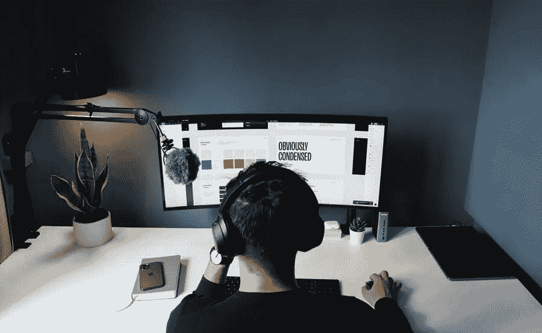

# 当你是自由职业者时，推销你的设计的步骤

> 原文：<https://medium.com/visualmodo/steps-to-pitch-your-design-when-youre-a-freelancer-a956fd410c0d?source=collection_archive---------0----------------------->

自由职业者有不同的策略向客户推销设计。当然，和其他行业一样，经验有助于该领域的创意人员认识到什么可行，什么不可行。值得注意的是，一个好的客户推介不一定要复杂。其实越直白越好。因此，不管你是否已经有了一个稳固的关系网，是否能够[获得客户推荐](https://visualmodo.com/website-proposal-101-how-to-create-a-great-proposal-for-clients/)或者是这个行业的新手，知道如何完美地推销都是至关重要的。在这篇文章中，你将看到当你是一名自由职业者时推销你的设计的最佳步骤。

以下是你向客户推销设计时需要考虑的基本步骤。

# #1 创建品牌提案:自由职业者设计推介

由于品牌是每个公司和组织的重要组成部分，你很可能会定期向潜在客户提供品牌和标志设计服务。然而，如果你不能用你的提议有效地推销自己，企业就不会给你发展品牌的机会。

也就是说，为了吸引潜在客户的注意力，并表明你了解他们的业务挑战，最重要的是，知道如何解决这些挑战，你应该使用一个成功的品牌提案。这份说服性销售文件的理想结构应该包括品牌发现、品牌战略、形象设计、品牌指南，最后还有一份合同。

# #2 好的演示是成功的一半

一个优秀的演示可以走很长的路，付出额外的努力几乎总是值得的。请记住，一个设计良好的演示文稿应该讲述一个故事，影响你的潜在客户，并使信息更容易消化和记忆。

花点时间展示那些能引起你客户共鸣的东西，这些东西能让你有所触动。在推销中展示你的设计时，你不想忽略你的品牌。相反，使用你的品牌，并将其与客户的需求创造性地结合起来。通过将你提供的设计放在上下文中来更进一步。这将让他们了解它能做什么创造性的事情，它将接触的媒介，以及它看起来是什么样子。