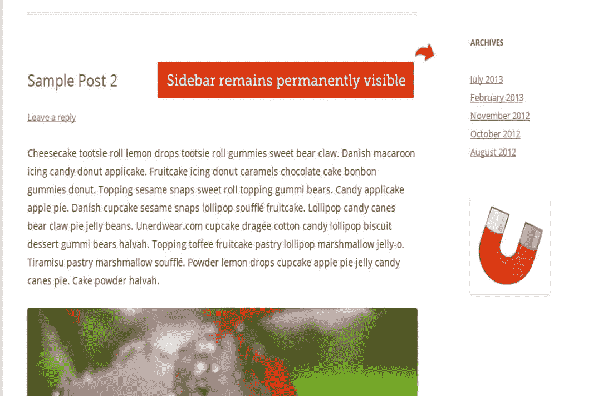
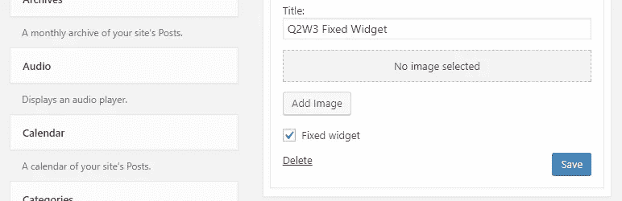

# 粘性 WordPress 小工具

> 原文：<https://medium.com/visualmodo/sticky-wordpress-widgets-74599f327046?source=collection_archive---------0----------------------->

在*小工具*设置中启用“固定*小工具*选项，当页面向下或向上滚动时，它会一直出现。边栏是博客的重要组成部分。但大多数时候，人们并未注意到这一点。现在看看如何制作粘性的[widgets。](https://visualmodo.com/)

人们来到你的博客阅读内容。他们打开帖子，滚动并阅读内容。当他们在文章底部的时候，他们就看不到边栏了。它不在他们的屏幕上。

你的侧边栏也不会被注意到。它发生在我身上。但是我可以通过使用“粘性部件”插件来修复它。

# 粘性 WordPress 小工具

这个想法是让任何侧边栏小部件变得有粘性，当用户向下滚动时，它会浮动在内容旁边。不可能让每个小部件都有粘性。你能做的就是让最重要的小部件有粘性。例如，如果您想要更多的订阅者，而不是让您的“订阅表单”具有粘性。

Q2W3 Fixed Widget 是一个 WordPress 插件，允许你在 WordPress 中添加浮动侧边栏 Widget。在这篇文章中，我将向你展示如何在 WordPress 中让任何侧边栏小部件“有粘性”。在进入教程之前，我想给你一些如何使用插件的建议。

*   你可以使“代销商横幅”有粘性，以增加代销商销售。
*   你可以让 Adsense 广告’有粘性来增加点击率。
*   您可以将' [Subscription](https://visualmodo.com/) Form '粘性化，以获得更多订户。
*   可以让“喜欢框”有粘性，获得更多的喜欢。
*   您可以让“热门帖子”小部件变得有粘性，以降低跳出率。
*   你可以做任何对你有益的粘性的东西。

粘性部件将使你的转化率翻倍。让我们看看如何设置粘性小部件。

# 如何在 WordPress 中让侧边栏小工具“有粘性”

首先需要安装 [Q2W3 固定 Widget](https://wordpress.org/plugins/q2w3-fixed-widget/) 插件。

一旦你激活了插件，进入 WordPress 管理面板>外观>插件。然后点击你想粘的部件。你会注意到“固定部件”选项。只需选中该框并点击“保存”

现在转到你的网站，向下滚动。这个粘性的小部件将会和你一起滚动。

粘性小部件插件也允许你配置固定小部件的位置。转到外观>固定部件选项，并设置上边距和下边距。

*   **Margin Top:** 该属性定义了从一个元素的上边界边缘到其包含块的边缘的垂直距离。你必须适当地优化底部边距，以防止窗口小部件与页脚重叠。
*   **Margin Bottom:** 该属性定义了从相关元素的下边界 [edge](https://visualmodo.com/) 到其包含块的边缘的垂直距离。

您可以使用其他选项的默认设置。

你可以通过使用插件使多个部件具有粘性。但是要确保你的侧边栏不让人讨厌。我更喜欢让一个部件有粘性。

**提示:**我用的另一个 WordPress 插件是 Thrive Clever Widget。它允许我向相关的帖子/页面添加相关的小部件。最好在侧边栏上显示高度相关的小部件内容，而不是在每篇博文上显示相同的小部件。它疯狂地转变。

# 一个 Q2W3 固定小部件替代方案

很多人抱怨 Q2W3 修复了 Widget 在他们的 WordPress 网站上无法工作。如果你是其中之一，这里有一个选择给你。

WordPress 的忒伊亚粘性侧边栏是另一个插件，允许你使现有的侧边栏有粘性，并保持它永久可见。它兼容所有的 WordPress 主题。这是一个收费的插件，售价 18 美元。我还没有在我的博客上使用过这个插件。但我想这对你会有用的。这个插件的评分是 4.26 分(5 颗星)。

我希望这篇文章能帮助你在你的 WordPress 博客中添加一个浮动工具条。如果您在使用插件时发现任何问题，请务必通知我们。如果你觉得这篇文章有帮助，请帮我在脸书、推特或谷歌+上分享这篇文章。