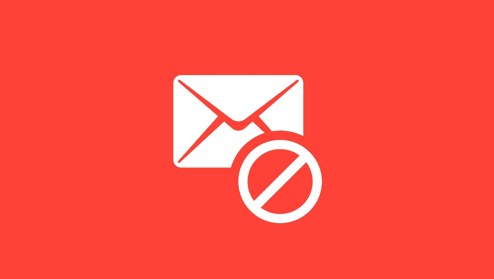
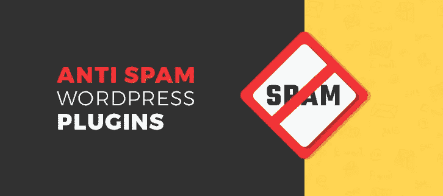

# 立即停止垃圾评论

> 原文：<https://medium.com/visualmodo/stop-spam-comments-now-3b5912f5ae45?source=collection_archive---------0----------------------->

垃圾评论是残酷的现实，每一个幼稚、热情、毫无准备的博主都会被他们收到的垃圾评论数量震惊。WordPress 可能会有所帮助，但是你需要做好心理准备面对一个严峻的事实:你收到的超过 99%的评论都是垃圾评论。如果你对这个问题置之不理，垃圾评论会完全取代你的网站数据库，让你永远被禁止进入搜索引擎索引。

# 立即停止垃圾评论

需要摆脱垃圾评论吗？你就要明白了。

立即激活你网站上的免费[反垃圾邮件](https://wordpress.org/plugins/anti-spam/)插件。然后，当垃圾邮件停止时，你可以回来阅读我下面的解释🙂

# 你需要知道的是:

绝大多数垃圾评论都是自动生成的。它不是来自那些访问你的网站并提交垃圾评论的人。它来自自动提交它们的软件。

如今垃圾邮件发送者使用的自动化软件[非常强大。他们从网上搜集数以千计的网站来评论他们的利基，并使用多线程来一次评论几十个网站。一天提交上万条垃圾评论，毫无挑战。](https://visualmodo.com/)

听起来对我们很不利，是吧？好消息是他们并不那么难阻止。

有一些方法可以区分自动机器人访客和真正的人类访客。例如，他们可以被骗去做真人永远不会做的事情(比如填写一个看不见的表单域)。

# 垃圾评论的解决方案

[反垃圾邮件](https://wordpress.org/plugins/anti-spam/)很好地融合了像这样的技术来检测机器人，结果是惊人的。根据我的经验，它可以阻挡 100%的自动垃圾邮件。只要激活插件，你就可以解决垃圾评论了。

在过去的几个月里，我也用 WP 格斗家[插件取得了很好的效果。与反垃圾邮件相比，它更加可定制，功能更加丰富，但两者都运行良好。](https://wordpress.org/plugins/goodbye-captcha/)

流行的 Akismet 插件也能有效地处理垃圾评论，但是它需要每月订阅才能在你的网站上运行。