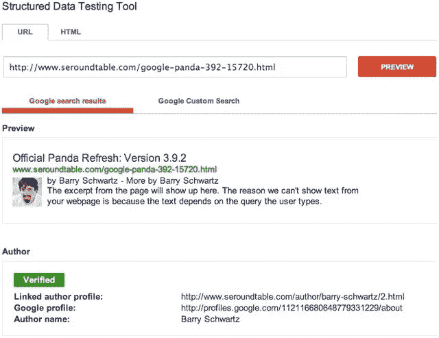
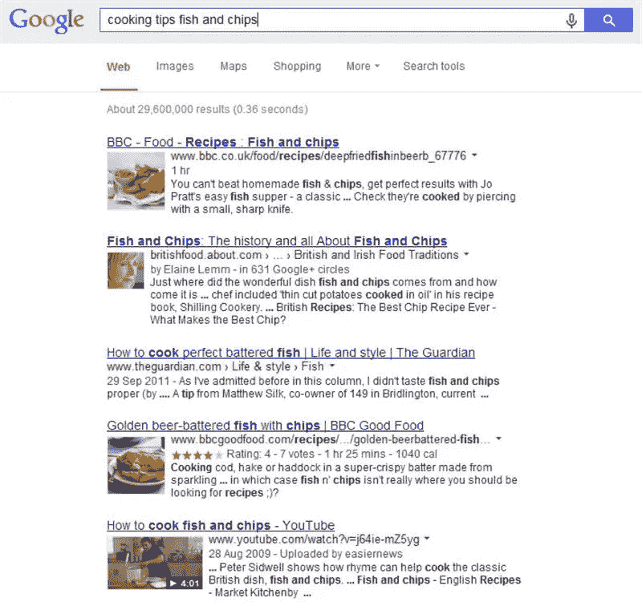

# 结构化数据 SEO 使用指南

> 原文：<https://medium.com/visualmodo/structured-data-seo-usage-guide-de9ed98707b2?source=collection_archive---------0----------------------->

谷歌使用它在网络上找到的结构化数据来理解页面的内容，以及收集关于网络和整个世界的信息。例如，这里有一个 JSON-LD *结构化数据*片段，它可能出现在无限滚珠轴承公司的联系页面上。

你可能听说过结构化数据、Schema.org 和 JSON-LD。但是这些术语到底是什么意思呢？什么是结构化数据？结构化数据做什么？而且和 SEO 有什么关系？对于所有不知道什么是结构化数据的人来说:这篇文章会让你明白。

# 什么是结构化数据？

结构化数据是代码。这是一段你可以放在网站上的代码。它是特定格式的代码，以搜索引擎能够理解的方式编写。搜索[引擎](https://visualmodo.com/)读取代码，并用它以特定的方式显示搜索结果。

想象一下，你有一个网站，上面有很多食谱。如果你将结构化数据添加到一个有食谱的页面，你在搜索引擎中的结果将会改变。显示的内容会“更加丰富”。这就是我们称这些结果为丰富片段的原因。这是一个丰富的片段的样子:

除了标题，网址和搜索结果的描述，你可以看到需要多长时间才能做出绝对最好的千层面。你会看到千层面含有多少卡路里。你需要向你的[网页](https://visualmodo.com/)添加结构化数据来获得如此丰富的片段。

有各种各样的结构化数据。结构化数据总是一种代码格式。例如，书籍、评论、电影和在线商店中的产品都有结构化数据。在所有情况下，结构化数据在搜索结果中为您的代码片段添加了更多细节。

我们必须在这里做一个旁注。不幸的是，Google 并不总是为你的页面创建丰富的片段，即使你已经添加了结构化数据。没有任何保证。所以你所能做的就是把它添加到你的页面上，然后希望谷歌会把它捡起来！

# 你如何处理结构化数据？

有了结构化数据，你可以和搜索引擎“对话”。你可以告诉搜索引擎你的食谱中有哪些配料，你可以告诉他们准备时间有多长，你可以告诉他们这道菜将含有多少卡路里。谷歌将能够立即掌握所有这些信息，并决定在搜索结果中显示这些信息。

因此，结构化数据是一种工具，你可以用它来告诉谷歌(在某种程度上，它理解你在说什么)关于你的网站上的一个页面的详细信息。然后，谷歌将能够使用这些信息来创建信息丰富的搜索结果。观众喜欢这些丰富的片段！

# 什么是 schema.org？

大型搜索引擎开发了一个名为[Schema.org 的项目。在 Schema.org 上，你可以找到所有搜索引擎支持的结构化数据标记。这使得 Schema.org 成为大量代码的集合。](http://schema.org/)

您可以使用 Schema.org 来查找特定页面所需的标记。例如，如果你在你的网站上卖 t 恤，你可以在你的代码片段中显示你卖的 t 恤的颜色和尺码。你应该调查 Schema.org/Product，找出可能性。

在 Schema.org，你可以复制代码示例。复制之后，您必须根据您的特定偏好修改代码。

Schema.org 是大型搜索引擎理解的代码格式分类。您会发现代码看起来像什么的例子。还有其他形式的结构化数据。例如 Open Graph(脸书使用的)和 Twitter cards(Twitter 使用的)。

# JSON-LD 是什么？

JSON-LD 是 Schema.org 的标记之一。只是写代码的一种方式。在 Schema.org，你还会发现其他标记，如微数据或 RDFa。在 Yoast，我们会建议你总是使用 JSON-LD，因为它不像其他标记那样容易破坏你的站点。你可以相对容易地使用[谷歌](https://visualmodo.com/)标签管理器将 JSON-LD 添加到你的网站上。这在其他标记中是不可能的。

# 为什么结构化数据对 SEO 很重要？

结构化数据对 SEO 很重要，因为它会让 Google 更容易掌握你的页面和网站的内容。[谷歌](https://visualmodo.com/)需要找出一个页面将要在搜索结果中显示什么。使用结构化数据就像与谷歌对话，告诉谷歌你的网站是关于什么的。这将有助于你的排名。

最重要的是，结构化数据将改变你的片段(你的搜索结果)的外观。它会向您的客户显示更多信息。更具体的信息。这将增加客户点击你的结果的可能性。更多的点击将最终导致更高的排名！

# 如何使用结构化数据？

使用结构化数据听起来很难，但是每个人都可以做到(通过适当的培训)。你必须得到正确的代码，你必须适应这些代码，你需要使用谷歌标签管理器把它放在你的网站上。

我们已经写了很多关于[Schema.org](https://visualmodo.com/)和 JSON-LD 的帖子，这将有助于你更多地了解这个主题。

# 没有代码英雄？用外挂！

许多结构化数据标记也可以使用插件添加到你的网站上。例如，我们的本地 SEO 插件使用结构化数据来显示你的商店的位置或多个位置。您不必编写代码来获得丰富的代码片段，您只需使用我们的插件，填写一些细节，我们就会为您完成。还有更多插件可以帮助你使用结构化数据，而无需纠结于任何[代码](https://visualmodo.com/)！