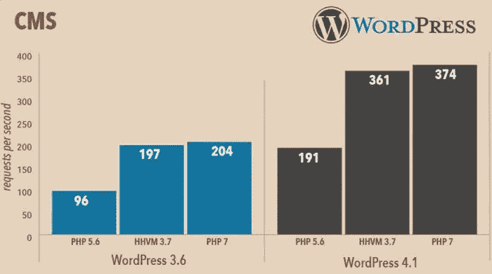
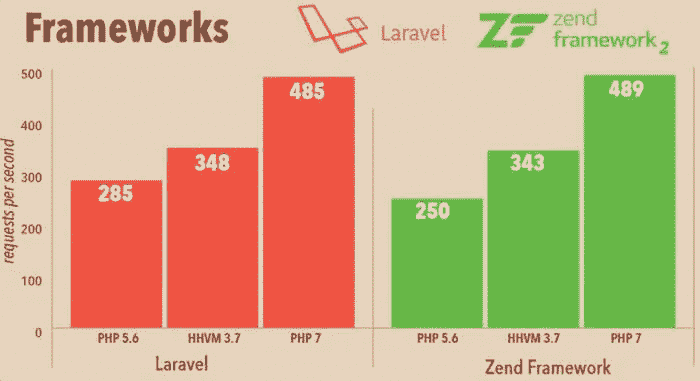
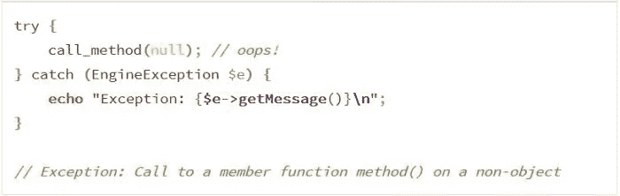
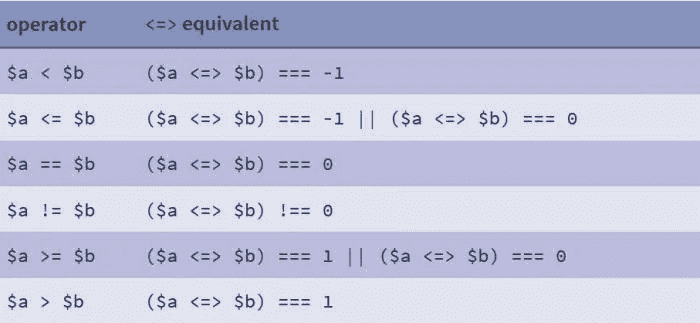
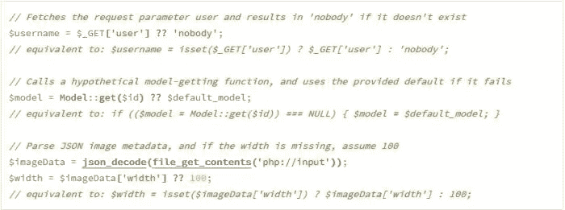
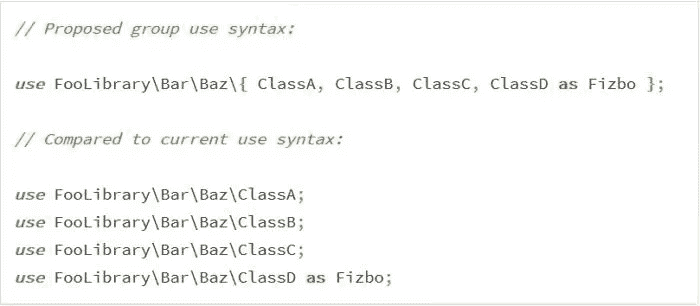

# PHP 7 的好处

> 原文：<https://medium.com/visualmodo/the-benefits-of-php-7-79ed19c714de?source=collection_archive---------8----------------------->

你需要知道的 10 件事

你是网站开发者还是网站所有者？你的网站运行在 PHP 支持的 CMS 上吗，比如 WordPress，Drupal，Joomla 或者 Magento？那么我有好消息告诉你:新的 **PHP 7 的功能完整版本最近发布了**。7.0.0 主版本包含了如此多的很酷的特性，以至于我们决定为它写一整篇文章。但是首先，我们需要插入一些提示。现在看看 PHP 7 的所有好处

让我们来看看 PHP 7 的好处。

## 1.名字是 PHP 7(不是 6)

目前的稳定版使用版本号 [PHP 5.6](http://php.net/ChangeLog-5.php#5.6.11) 。在一些争论之后，开发团队决定在下一个主要版本中省略 PHP 6 的名字。PHP 6 在过去已经作为一个实验项目存在，但从未进入生产阶段。

为了防止用户混淆以前的尝试和最新的开发，新的主要版本将以 PHP 7 的名字运行。

## 2.全新的 Zend 发动机

Zend engine 自 1999 年与新的 PHP 4 版本一起推出以来一直为 PHP 提供动力。Zend——不要与 [Zend 框架](http://framework.zend.com/)混淆——是一个用 C 编写的开源执行引擎，它解释 PHP 语言。当前的 PHP 5。x 系列使用 **Zend Engine II** 增强了初始引擎的功能性，并为该语言添加了一个**可扩展对象模型**和一个**显著的性能增强**。

PHP 7 获得了一个全新版本的引擎，代号为 [PHP#NG(下一代)](https://wiki.php.net/phpng)。

## 3.两倍的速度

新的 PHPNG 引擎最容易识别的优势是显著的性能改进。PHPNG 的开发团队重构了 Zend 引擎，并显著优化了内存使用。

结果呢？你可以在下面看到 Zend Performance 团队提供的性能基准。通过使用 PHP 7，不仅你的代码会执行得更快，而且你需要更少的服务器来服务相同数量的用户。

## 4.促进错误处理

至少可以说，对于 PHP 编码人员来说，处理致命的和可捕捉的致命错误从来都不是一件容易的事情。新的**引擎异常**将允许你用异常替换这类错误。如果没有捕捉到异常，PHP 将继续返回与当前 5 . 0 中相同的致命错误。x 系列。

新的 **\EngineException** 对象没有扩展 **\Exception** 基类。这确保了向后兼容性，并在错误处理中产生两种不同的异常:**传统的**和**引擎异常**。

为了让程序员能够捕捉到这两者，PHP 7 引入了一个新的**共享父类**，名为 **\BaseException** 。

## 5.64 位 Windows 系统支持

PHP 是 LAMP 栈的重要成员，这意味着它的原生环境是 Linux——但是也有可能在 Windows 系统上运行它。五号。x 系列还不提供 64 位整数或大文件支持，所以直到现在 x64 版本都被认为是实验性的。

PHP 7 将改变这一点，因为它**引入了一致的 64 位支持**，这意味着本机 64 位整数和大文件都将得到支持，允许您将来在 64 位 Windows 系统上自信地运行该语言。

## 6.新的宇宙飞船和零合并运算符

**飞船操作器**运行的正式名称为[组合比较操作器](https://wiki.php.net/rfc/combined-comparison-operator)。新运算符的符号看起来是这样的:`<=>`(有点像简化的宇宙飞船，如果你想象的没错的话)。

如果两个操作数相等，则 spacehip 运算符返回 0，如果左操作数较大，则返回 1，如果右操作数较大，则返回-1。它也被称为**三向比较运算符**，它已经存在于其他流行的编程语言中，如 Perl 和 Ruby。

[零合并运算符](https://wiki.php.net/rfc/isset_ternary)用两个问号(？？).当您想检查某个东西是否存在，并在它不存在的情况下返回默认值时，可以使用它。如果第一个操作数存在且不为空，则联合运算符返回第一个操作数的结果，否则返回第二个操作数的结果。

下面是新运算符如何减少基本声明所花费的时间:

## 7.启用准确的类型声明

你有没有想过通过声明函数的返回类型来防止意外的返回值？嗯，新的 PHP 7 使开发者能够借助[返回类型声明](https://wiki.php.net/rfc/return_types)来提高他们代码的质量。

下图描绘了一个非常简单的用例，其中 **foo()** 函数应该返回一个数组。点击查看更复杂的例子[。](https://wiki.php.net/rfc/return_types#examples)

为了进一步增强这个特性，PHP 7 为标量类型引入了 4 个新的类型声明: **int、float、string** 和 **bool** 。新的[标量类型](https://wiki.php.net/rfc/scalar_type_hints_v5)允许开发人员表示他们期望返回整数、浮点数、字符串或布尔值。PHP 7 引入的新的标量类型也将受到参数类型提示的支持，这使得开发人员可以从 PHP 5 开始强制参数的类型。x 系列。

## 8.添加匿名类

PHP 7 使您能够使用匿名类，这在其他面向对象的语言中已经是很好的实践了，比如 C#和 Java。匿名类是没有名字的类。它实例化的对象与命名类的对象具有相同的功能。

语法和我们在传统 PHP 类中习惯的一样，只是缺少了名字。如果匿名类用得好，它们可以加速编码和执行时间。当一个类在执行过程中只使用一次时，或者当一个类不需要被记录时，匿名类是非常好的。

## 9.便于从同一命名空间导入

新的[组使用声明](https://wiki.php.net/rfc/group_use_declarations)特性对于那些想要从同一个名称空间导入多个类的人来说是天赐之物。新的语法减少了冗长，让你的代码看起来更整洁、更容易，并且节省了你大量的打字时间。

通读和调试代码也更容易，因为组使用声明可以帮助您识别属于同一个模块的导入。

## 10.打扫房间

PHP 7 的目标是释放空间以实现改进，因此有必要去除许多不推荐的功能以及旧的和不受支持的服务器 API 和扩展。如果你想详细查看这些，点击[这里](https://wiki.php.net/rfc/remove_deprecated_functionality_in_php7)和[这里](https://wiki.php.net/rfc/removal_of_dead_sapis_and_exts)。

在 PHP 5 中，所有被移除的项目都已经被弃用了一段时间，所以很可能你已经很久没有使用它们了。但是请注意，如果你有一个运行在旧版本 PHP 上的旧应用**，新的 PHP 7 可能会**破解代码**。**

****

**PHP 7 的好处由 visualmodo 提供来源[https://visualmodo.com/](https://visualmodo.com/)**