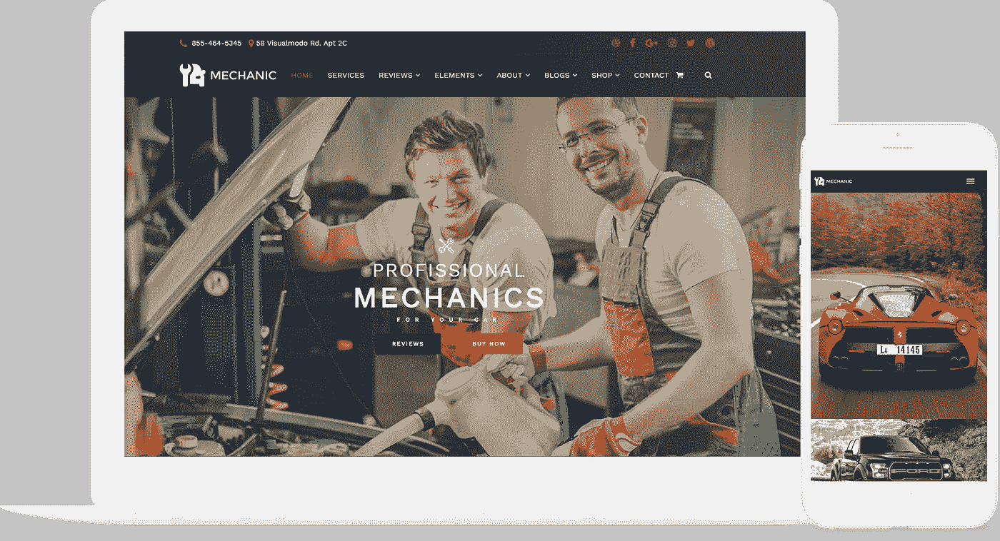
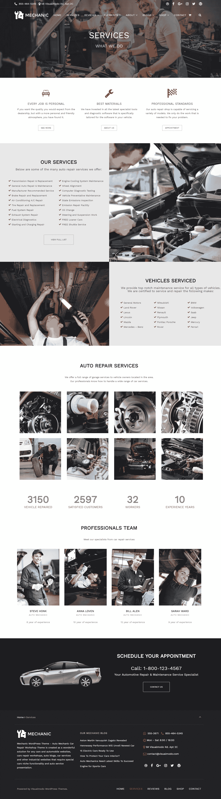

# 最佳汽车维修 WordPress 主题

> 原文：<https://medium.com/visualmodo/the-best-car-repair-wordpress-theme-8beb44bc3e5b?source=collection_archive---------0----------------------->

机械 WordPress 主题

你正在为汽车维修或汽车经销商业务寻找最好的 WordPress 主题吗？当浏览汽车维修 WordPress 主题时，你可能无法立即判断一个主题是否适用于汽车维修网站。您将看到的许多主题可能会有一个通用的业务或公司外观。在这篇文章中，我们为汽车维修和汽车经销商网站精心挑选了最好的 WordPress 主题。

# [最好的汽车维修 WordPress 主题](https://visualmodo.com/theme/mechanic-wordpress-theme/)

技工主题——汽车技工汽车维修车间主题是为任何汽车和汽车网站、汽车维修车间、汽车博客、汽车服务和其他需要特殊汽车利基功能和汽车服务演示的行业网站创建的一个极好的解决方案。

机械师汽车修理主题功能完全设计和集成 WooCommerce 商店插件兼容性，以及许多短代码来显示您的汽车产品和汽车零件。你可以在你的网站上添加价格表，也可以像画廊一样展示你的汽车维修服务。

# [现场试玩](http://theme.visualmodo.com/mechanic/) [立即下载](https://visualmodo.com/theme/mechanic-wordpress-theme/)

技工高级 WordPress 主题——无需编码即可构建任何技工网站设计！您可以在几分钟内建立并运行一个设备齐全的网站。Mechanic WordPress 主题不仅仅是一个模板，它是一个拥有大量功能的惊人例子的集合。

Mechanic WordPress 主题是一个干净、现代、简约的汽车服务主题。它有各种各样令人难以置信的功能，包括价值 150 美元的好东西，你需要以一种非常简单的方式创建一个令人敬畏的网站，节省金钱和时间。无需代码知识即可构建任何网站设计！

**一键式演示内容导入**——WordPress 主题最有用的功能之一。你会喜欢在与精彩的主题演示页面相同的起点上开始网站开发过程，这样你就可以快速设计出你梦想中的网站。您可以充分利用我们精心制作的演示内容，只需点击一下鼠标，就可以创建一个现成的网站！

页面生成器**——visual modo 用户可以在 Mechanic WordPress 主题中使用 best，一个不可思议的拖放式页面生成器。查看一些页面生成器元素**