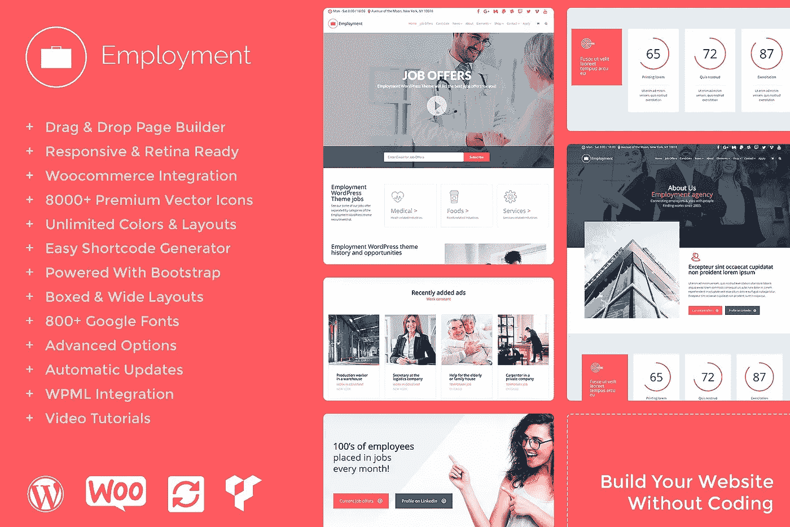

# 最好的工作板块 WordPress 主题

> 原文：<https://medium.com/visualmodo/the-best-job-board-wordpress-theme-395e73e5a1bd?source=collection_archive---------0----------------------->

工作门户和就业

工作板 WordPress 主题是一个完整的工作门户 WordPress 主题，允许你创建一个有用的和易于使用的工作列表网站。使用就业主题，您可以创建一个完整的和完全响应的工作门户，职业平台来运行人力资源管理，招聘或职位发布网站。

# 工作板 WordPress 主题功能

就业主题已经建立了计划，使其与著名的插件兼容，如。就业不仅仅是一个工作板块的主题，它是任何想要一个简单的工作脚本来赚钱的人的最好的工作门户模板选择。

**工作板 WordPress 主题**是一个干净、现代、垂直的导航菜单 WordPress 主题。它有各种各样令人难以置信的功能，包括价值 150 美元的好东西，你需要用一种非常简单的省钱省时的方式创建一个令人敬畏的网站。无需编码即可构建任何网站设计！您可以在几分钟内建立并运行一个设备齐全的网站。**就业**不仅仅是一个主题，它是一个具有大量特征的惊人例子的集合。

# [现场试玩](https://theme.visualmodo.com/employment/) — [下载](https://visualmodo.com/theme/employment-wordpress-theme/)

**一键式演示内容导入**——WordPress 主题最有用的功能之一。你会喜欢在与精彩的主题演示页面相同的起点上开始网站开发过程，这样你就可以快速设计出你梦想中的网站。您可以充分利用我们精心制作的演示内容，只需点击一下鼠标，就可以创建一个现成的网站！

**页面生成器**——WordPress 的拖放式可视化编辑器(价值 45 美元)将为你节省大量的时间来处理你的网站内容。现在，您可以在几分钟内创建复杂的布局！这个页面生成器可以用在你的网站前端，让你的工作更轻松。你所需要做的就是拖放内容，并立即看到结果。

**Visual Composer 的终极插件** —扩展 Visual Composer 并为其添加更多功能！这个插件(价值 25 美元，免费)在 WPBakery 提供的内置元素的基础上，在你的可视化编辑器中添加了几个高级元素。包装中的每一个元素都经过精心制作，非常注重细节，目的很简单，就是为您提供终极体验。我们投入了大量的时间和精力来确保所有的元素都是灵活的，这样它们将为您打开无限的可能性，同时保持核心的简单性。