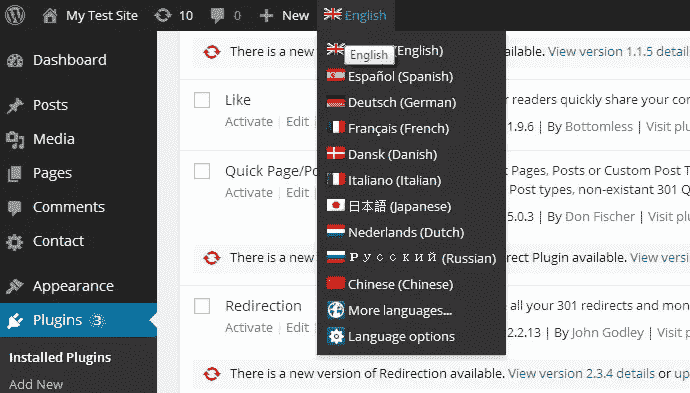
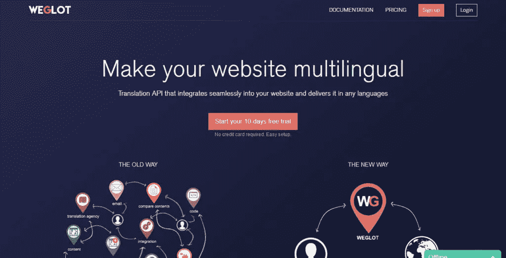
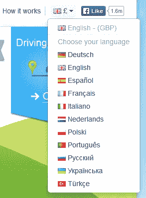
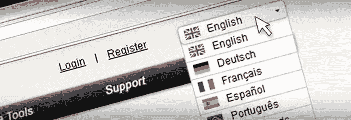

# 翻译网站的最佳方法

> 原文：<https://medium.com/visualmodo/the-best-ways-to-translate-websites-2d5a52b7e5b1?source=collection_archive---------0----------------------->

5 个最佳节目

WordPress 是最流行的网站管理平台之一。这部分是由于 WordPress 用户可以利用的插件和升级的广泛范围。这些工具帮助用户定制他们的网站，分析他们的流量，吸引客人，等等。查看翻译网站的最佳工具。

在这些可用的工具中，有几个翻译插件可以轻松地将网站内容翻译成另一种语言。这有助于你接触到更多的观众，而依靠你所在的行业对你的成功至关重要。例如，如果你的网站致力于电子学习和数字教育，那么一个用于[教育翻译](https://www.morningtrans.com/services/localization/elearning-localization/)的插件对于接触和吸引全球学生观众至关重要。

虽然雇佣专业翻译公司会让你得到最好的结果，但是如果你预算有限或者时间紧迫，WordPress 插件会很有用。当然，它们并不都同样有效。以下是计划翻译 WordPress 网站的五个最佳选择。

# 翻译网站的最佳方法:

# [威格洛](https://weglot.com/)

Weglot 是一个受欢迎的 [WordPress](https://visualmodo.com/wordpress-themes/) 翻译插件，有几个原因。对于小网站来说，当用户只需要翻译 2000 字或更少时，它是免费的。保费计划的费用取决于每个用户的特定需求。

Weglot 允许您自动和手动翻译内容，使其成为一个灵活的工具。用户可以将内容翻译成 60 多种不同的语言。这些特性解释了为什么[超过 20，000 个站点](https://weglot.com/)已经在使用这个相当新的产品。

# [WPML](https://wpml.org/)

WordPress 多语言插件多年来一直是最常用的高级翻译插件之一。它提供了 40 多种语言的翻译，并包括一些功能，可以更容易地将当地方言整合到您的内容中。这导致了更大程度的真实性。

WPML 用户也对其客户支持大加赞赏。这在翻译网站时非常重要:你可能需要外界的帮助来避免错误。

# [q 平移](https://wordpress.org/plugins/qtranslate-x/)

虽然像 WPML 这样的工具需要花钱，但 qTranslate 是免费的。由于易于安装和使用，它也赢得了良好的声誉。最重要的是，qTranslate 允许用户在需要时使用专业的人工翻译。

# [转置](https://wordpress.org/plugins/transposh-translation-filter-for-wordpress/)

和 qTranslate 一样，Transposh 是免费的。它在翻译插件中是独一无二的，因为如果用户愿意，他们可以允许客人编辑他们网站上的非英语内容。如果你和那些对你的目标语言更熟悉的人合作，这是很有用的。有了这个工具，如果你允许的话，他们可以通过众包人工翻译进行必要的修改。

# [多语言新闻自由](https://wordpress.org/plugins/multilingual-press/)

多语言印刷插件的免费版本要求用户安装并运行 Multisite 插件，然后才能利用其功能。这个插件[在一个 WordPress 安装下连接多个站点](https://codex.wordpress.org/Create_A_Network)。多语言 Press 插件可以很容易地翻译所有这些连接在一起的网站。这个程序最适合那些打算在几个不同的 WordPress 网站上翻译内容的人。

这些工具都不能完全取代或复制专业翻译的技能。相反，如果您需要以较低的成本快速翻译内容，它们会很有用。它们可以提供一个很好的起点，但是如果你想真正给国际观众留下正确的印象，确保你有一个专家在某个时候审查翻译完成。

所有的 Visualmodo 主题都完全兼容所有的翻译网站的插件，并为更好地使用它而优化。

**作者:雷伊·斯坦巴赫。**

瑞伊毕业于塔夫茨大学，拥有国际关系和中文学位。在中国的国外生活和工作了一段时间后，她回到纽约追求她的事业，继续策划高质量的内容。当然，雷伊热衷于旅游、美食和写作。

Twitter 句柄:[@ araesininsesun](https://twitter.com/araesininthesun)