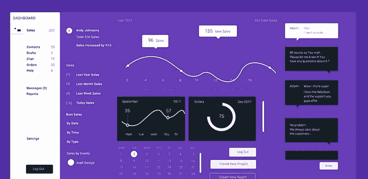
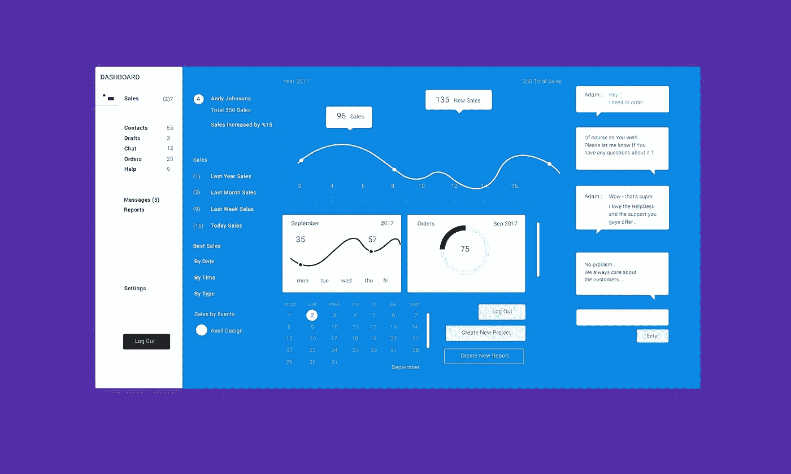
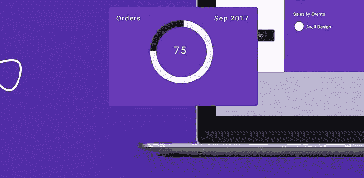
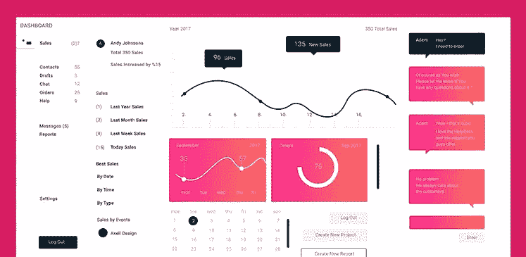

# 出色的仪表板 UI 套件

> 原文：<https://medium.com/visualmodo/the-brilliant-dashboard-ui-kit-4f76612848d9?source=collection_archive---------0----------------------->

您的项目需要高质量、高效的仪表板 UI 主题吗？你在寻找高级设计师，但却想花较少的钱吗？

# 出色的仪表板 UI 套件

如果你是开发人员、编码人员、网站设计人员或平面设计人员，你就不用再找了。

Photoshop 的 UI Brilliand Dashboard KIT 让您现在就可以创建一个令人惊叹的产品！

它只需 5 美元，包括一个 Photoshop 文件，有 5 种不同的颜色风格。

–您可以使用图层复合窗口轻松更改它们。

–可编辑，以英文层命名，让您快速轻松地工作。

–选择最喜欢的风格，创建一个漂亮的[页面](https://visualmodo.com/)，让您的客户惊叹不已。

它包含了最需要的图表和 UI 元素，如日历、聊天、销售界面、按钮等

许多公司使用 UI 套件/ [主题](https://visualmodo.com/)来加速开发和设计过程。大玩家正在使用现成的模板，不仅因为它们非常好，给人留下深刻印象，还因为它们使网页设计工作更容易，最重要的是更便宜、更快。

这是非常受欢迎的，似乎这种趋势将会上升。

如果你想改变任何部分——颜色、渐变、字体、大小……一切都由你决定。

最有趣的好处是:

–顶级质量设计

–高度可定制的布局

–矢量形状层

–免费使用谷歌字体

一切都可以在 Photoshop CC 中自定义。

选择这个将节省你大量的时间和金钱，而不是寻找和支付给设计师。

使用这个[仪表盘](https://visualmodo.com/) UI 套件，给你的客户留下深刻印象。

你不必是设计师——有了这个主题，无论你是开发人员、程序员还是企业家，你都可以专注于对你来说最重要的事情。

**下载**

**链接:**[https://creative market . com/gagarindes 984/2405112-Brilliant-Photoshop-Dashboard-UI-Kit](https://creativemarket.com/gagarindes984/2405112-Brilliant-Photoshop-Dashboard-UI-Kit)