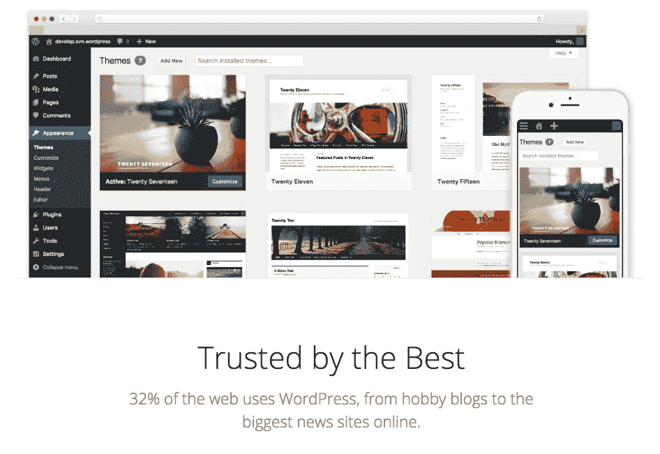
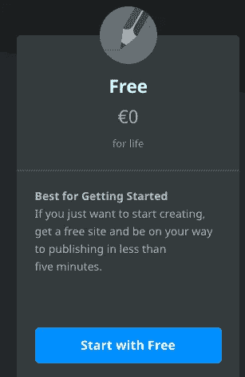
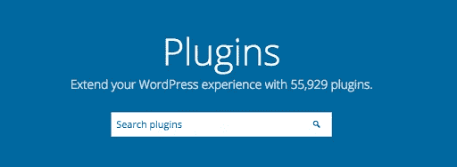

# WordPress 的成本。Org:真的免费吗？

> 原文：<https://medium.com/visualmodo/the-cost-of-wordpress-org-is-it-really-free-42f191ffce4f?source=collection_archive---------0----------------------->

所以你决定在 *WordPress* 上建立你的网站。那么，互联网上 32%的网站所有者会同意你的选择。WordPress.org 免费开源的*占据了 60%的市场份额，是世界上最受欢迎的内容管理系统(CMS)。即使软件本身是免费的，你仍然需要为你的网站做预算。让我们来看看 WordPress.org*网站*的真实成本。*

# 是的，它是免费的(嗯，有点)

WordPress.org 是一个免费的开源软件，每个人都可以用它来创建和完全控制自己的网站。下载实现不用花一毛钱。但是，既然是自托管解决方案，不买虚拟主机和域名就不能用。这就是真正的成本所在。

然而，也有选择让[免费的 WordPress.org 主持](https://hosting.review/web-hosting/free-wordpress-hosting/)，最受欢迎和最明显的是*WordPress.com*。当然，像任何地方一样— **免费通常意味着有限的功能，在这种情况下更是如此。**

免费的 WordPress.com 计划非常有限，只适合小项目，比如个人博客。在你网站的 URL 中有一个*WordPress.com*子域，在你的页面上有广告，有限的存储空间，并且只有基本的功能，建立一个有代表性和专业外观的网站是相当困难的。

因此，如果你的网站有更广泛的覆盖面，甚至可能代表你的品牌，免费版本应该是不可能的。

# 那么，WordPress.org 网站到底要花多少钱呢？

你的*WordPress.org*网站的成本将取决于你的[网站](https://visualmodo.com/blog/)的用途。一般起点是 200 美元/年，但如果你追求高性能和专业性，价格可能会达到 800 美元甚至更多。

如果你刚刚起步，想尝试创建网站，最基本的东西不会花你很多钱。如果你想更进一步——准备花更多的钱。

## WordPress.org 托管费用

如果你不希望你的网站有大量的流量，共享主机是最便宜的选择。选择这个不会减少你的银行账户——你每月只需支付 5 美元。但是流量较高的网站需要专门的托管。根据主机提供商的不同，这可能会花费更多。总而言之，对于一个高质量和可靠的主机来说，每月 5-20 美元的价格是合理的。

## 域名成本

你还需要为你的网站买一个域名。这里的价格取决于:

*   要选择什么域扩展(。com 显然是最常见的一个)；
*   你选择的域名注册商；

这里有一个经验法则——让你的域名扩展与你网站的内容相匹配。如果你有一个科技博客，一个*。tech* extension 可能比其他的更适合。

定制域名的价格可能会波动，但实际上你可以支付大约 15 美元/年(T3)的费用(T2)。自定义域名可以为你的在线形象和品牌形象增色不少——请谨慎选择。

## 你还应该考虑哪些其他费用？

主题是你网站最重要的组成部分之一。毕竟，这是你的访问者将会看到并用来浏览你的页面。一个主题应该在所有设备上都好看，这意味着它也应该是移动友好的。

WordPress.org 有一些基本的免费主题库。但是如果你正在寻找一个高质量的、可定制的和用户友好的设计，你可能需要投资一些钱。有数千种主题可供选择，**它们的价格在 50 美元到 200 美元之间。给免费的人一个机会，测试他们的表现——这可能对你来说已经足够了。**

额外费用**插件也可能会增加你的*WordPress.org*网站**的最终成本。例如， [Akismet 反垃圾邮件](https://wordpress.org/plugins/akismet/)插件每月 5 美元，这是一个很好的垃圾邮件和恶意内容防御系统，你可能会想包括它。从安全、网络表单创建到信息备份——插件可能是一项巨大的投资，所以仔细研究一下吧。

最后，如果你努力的不仅仅是一个基本的网站，来自开发者的专业帮助也会提高价格。网站维护任务应该定期执行，你可以自己做，例如，创建网站的备份，更新主题/插件或运行性能测试。但是如果你缺乏技能或者时间，外包一个 WordPress 专家来维护你的网站**将会花费你 10 到 70 美元以上/小时或者一个固定价格**，这取决于服务。

# 一个 WordPress.org 网站的最终成本是多少？

WordPress.org 网站没有单一的价格点。预算会有很大的不同，这取决于你所追求的专业水平和表现。对于一个中小型网站来说，每年节省 200 美元是一个很好的起点。然而，如果你想增强体验，专用主机、高级主题和插件以及专业开发者的帮助的成本可能会达到四位数。