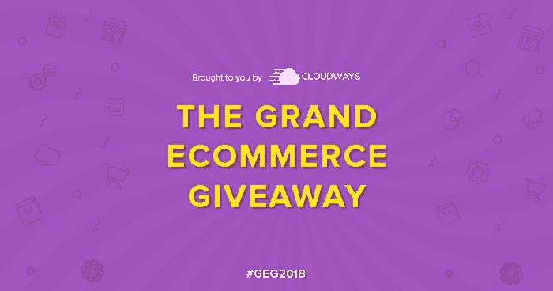

# 盛大的电子商务赠品:为 WordPress & WooCommerce 爱好者提供价值 35，000+美元的赠品！

> 原文：<https://medium.com/visualmodo/the-grand-ecommerce-giveaway-worth-35-000-for-wordpress-woocommerce-enthusiasts-75175225f7ac?source=collection_archive---------0----------------------->

我们在 Cloudways 的朋友正在为 WordPress 社区提供价值 35，000 美元的 WordPress / WooCommerce 主题、插件和营销工具。参与赠品的最后日期是 2018 年 11 月 26 日。立即进入[大电子商务赠品](https://www.cloudways.com/en/ecommerce-giveaway.php)页面。

WordPress 现在为 30%的网络提供动力，大量的电子商务商店都建立在它的基础上。为了支持这些电子商务努力， [Cloudways](https://www.cloudways.com/en/?id=309377) 与业内一些最大的公司合作，带来了一个史诗般的赠品。

假日季节即将来临，因为它见证了最高数量的网上销售。Cloudways 主动为他们提供工具，帮助他们充分利用假期。

# 查看大电子商务赠品:工具列表

通过参加赠品，电子商务店主可以赢得十几个价值数千美元的营销、开发和设计工具，并让他们的业务获得击败所有竞争对手的优势。

# 以下是参与者可以赢得的奖品！

*   Ahrefs:最好的竞争对手研究工具和 [SEO 反向链接](https://visualmodo.com/blog/)检查器
*   Awario:市场上最好的社交媒体和网络监控工具
*   博客社交:像专业人士一样自动发布博客
*   wave . video:insta gram 故事视频、FB 视频封面和广告的视频制作者
*   Customer.io:为 web 和移动应用程序自动发送强大的行为消息
*   Mangools:查找关键词，跟踪排名，做网站审计——一个工具
*   一个 SEO 插件:优化你的 WordPress 站点的 SEO
*   Cloudways:为您的企业提供最快的托管云
*   LiveChat:实时聊天和帮助台，快速响应
*   AliDropship 插件:在 WordPress 上建立全球速卖通直运业务
*   Omniconvert:了解买家，优化转化率
*   monster insights:WordPress 最好的谷歌分析插件
*   [VisualModo](https://visualmodo.com/) :满足您所有需求的美丽商业主题
*   YITH:电子商务最常用的 WordPress 插件
*   和 30 种其他顶级工具

# 能赢多少？

Cloudways 将在前三名获奖者中分配 35，000 美元以上的奖金。这是细目分类:

*   第一名获胜者+ Visualmodo 主题价值 14，540 美元的工具、插件和主机点数
*   价值 8，959 美元的工具、插件和托管积分，用于第二名获奖者+ Visualmodo 主题
*   价值 5，871 美元的工具、插件和托管积分，用于第三名获奖者+ Visualmodo 主题

即使你没有获得前三个奖项，你仍然可以获得一些奖品，包括高级电子商务营销工具，主机信贷和更多。事实上，另外八(8)名幸运儿将获得价值超过 10，000 美元的工具。

# 你怎么能进去？

有十一(10+)种方法可以参加比赛。首先，访问[大电子商务赠品](https://www.cloudways.com/blog/grand-ecommerce-giveaway/)页面并输入您的电子邮件地址。请确保通过验证电子邮件地址来确认您的参与。

# 赢得这份赠品的秘诀

[Cloudways](https://www.cloudways.com/en/?id=309377) 希望你赢得这个赠品，为此，他们还提到了增加你赢得这个大型电子商务赠品的机会的顶级技巧:

*   使用真实的社交档案
*   不要使用一次性电子邮件地址
*   你得分越多，赢的机会就越大
*   留意高点进场

# 立即参加赠品活动！

快一点！比赛截止日期为 2018 年 11 月 26 日。所以，今天就开始报名参加比赛，增加你获胜的机会。