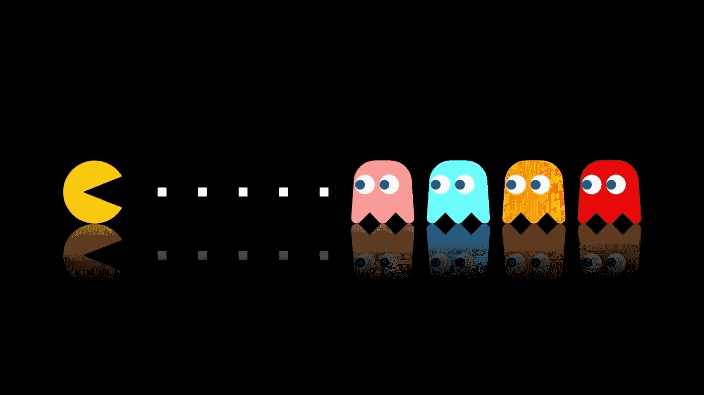

# 游戏的历史

> 原文：<https://medium.com/visualmodo/the-history-of-games-1464e3db4f96?source=collection_archive---------1----------------------->

查看所有关于游戏的历史。人类历史和游戏密不可分。无可辩驳的证据表明，乐趣和游戏本身并不是无足轻重的追求，相反，它们是我们生活中必不可少的一部分。当你理解了游戏的演变，你就可以开始做出明智的选择，在你的游戏化设计中加入哪些游戏元素。

# 游戏的历史

# 模糊而遥远的过去

你去过动物园吗？如果是这样，你很可能已经坐下来观察猴子和猿一段时间了。很容易就能看到他们在玩耍。他们会互相追逐，扔东西，扑向对方，诸如此类的事情。假设人类只是进化得更好的猴子，这似乎很有可能，很可能我们已经玩了很长很长时间的游戏。在我们学会说话甚至用两条腿站立之前，我们可能正在玩任何游戏。

这意味着我们不知道我们玩的第一个游戏是什么样的。然而，我们确实对现代游戏开发的时间线有一个很好的概念。真正好的游戏风格的例子是 casino.netbet.co.uk。

# 3000 年前掷骰子

骰子不是现代发明。事实上，它们可能是人类已知的最古老的游戏工具之一。在伊朗东南部的一次挖掘中，考古学家发现了一套 3000 年前的骰子！我们不知道早期的波斯人会玩什么游戏，但是骰子的流行持续了几个世纪。

*从这幅岩画中可以看出，骰子游戏已经伴随人类很长时间了。*

在 14 世纪的英国，人们玩一种叫做“冒险”的游戏(杰弗雷·乔叟的名著*坎特伯雷故事*中提到过)，而“冒险”直到 19 世纪才失宠。它有一个非常复杂的规则集，后来被规则更简单的骰子游戏所取代。

> “拿一个简单的想法，认真对待。”
> —查理·芒格，美国投资家、商人、律师和慈善家

无论是雕刻在骨头上还是铸造在塑料上，骰子的简单性(一个只有点的立方体)作为一个有效的、尽管偶然的决定因素是永恒的。你可能不知道这一点，但赌场中最受欢迎的游戏仍然是——直到 21 世纪——骰子游戏。掷骰子是赌场中唯一胜算对赌徒有利的游戏。尽管如此，这是赌场最赚钱的游戏；人们似乎不知道什么时候该停止玩耍。他们也玩——在其他地方，也在一系列充满乐趣的活动中使用骰子，这些年来，这些活动已经扩展到较少的成人环境，如家庭和学校。Yahtzee 围绕骰子旋转，龙与地下城&结合骰子也不是没有意义的，即使这些骰子有 4、10、12、20 甚至更多的面。

# 瓷砖和骨牌

在中国有超过 2900 年历史的瓷砖游戏的参考。多米诺骨牌出现在 1000 年后的宋朝(也在中国)。然而，西方的多米诺骨牌可能是在 18 世纪才开始的，而麻将(世界上最受欢迎的 T2 牌游戏——源于中国)直到 19 世纪才出现。

# 桌游甚至更古老

如果你喜欢大富翁或拼字游戏的 T4 游戏，看起来你是一个好伙伴。已知最早的棋盘游戏有 5000 年的历史，是埃及人玩的。我们不知道这些游戏的规则，但是有一个“塞涅特”棋盘可以追溯到公元前 3500 年左右！

中国人在公元前 200 年发明了他们已知的第一种棋盘游戏，而在西欧，他们从公元前 400 年就开始玩 Tafl(一种非常类似于象棋的游戏)

国际象棋通常被认为是“原型”棋类游戏，它本身非常古老，但是在国际象棋发明之前就有棋类游戏了。

# 还在玩！

如果你玩过围棋、象棋、双陆棋或者九人莫里斯，那么你就玩过一款有着一千多年[历史](https://visualmodo.com/)的游戏！围棋起源于公元前 200 年的朝鲜，西洋双陆棋起源于公元 600 年左右的伊朗(包括骰子)，象棋起源于同一时期的印度，九人制的莫里斯可能来自中世纪的英格兰，但许多人认为它起源于罗马帝国！

蛇和梯子，世界上最受欢迎的儿童游戏之一，可能起源于 16 世纪的印度。而且，令人惊讶的是，骰子也决定了游戏中玩家的概率。

第一个商业棋盘游戏出现在 1800 年，由英国的乔治·福克斯制作。它被称为幸福大厦，本质上是一种类似于 Ludo 的“竞赛游戏”。现存最古老的桌游公司是 Milton Bradley(他的著名游戏包括；垮台，饥饿的河马和连接 4)，他们成立于 1860 年！

《幸福的大厦》是第一款商业化(即工业化)生产的棋盘游戏。

# 给我发牌！

纸牌游戏是最近的发明，第一次使用纸牌可能是在古代中国。它们可能是在唐朝(公元 6 世纪-公元 9 世纪)玩的。纸牌在 14 世纪传入欧洲，早期的纸牌与塔罗牌非常相似，我们可以在网上或几乎任何书店的“思想、身体和精神”部分找到塔罗牌的现代和经典中世纪版本。

我们最熟悉的四种花色(红心、黑桃、梅花和方块)牌是 1480 年左右在法国发明的。我们仍在玩的最古老的纸牌游戏可能是 17 世纪的克里比奇纸牌游戏。桥直到 19 世纪初才出现。

在 20 世纪 90 年代，纸牌被重新使用，像“魔法！“聚会”被引入，并变得难以置信地流行于 T2。纸牌游戏也将扩展到 trumps——这是英国学校中最受欢迎的经典游戏，包括从赛车到宇宙飞船、西方枪战片和恐怖怪物等项目，玩家可以比较他们最上面的牌的统计数据，并据此输赢。

# 桌上游戏

Carom 可能是最古老的桌上游戏(它非常类似于 tiddlywinks 或 shuffleboard)，但没有人知道它是何时何地出现的。台球、台球和斯诺克都是相对较新的发明，轮盘赌是在 19 世纪才出现的。

*上图中的游戏可能看起来(乍一看)像台球，但它实际上是一个现代的台球桌——正如你在桌子上看到的没有口袋。*

# 你在一个好公司里

如你所见，游戏有着悠久而丰富的历史，无论何时你决定玩一个游戏，你都会有好的伙伴。几个世纪以来，人类一直在玩游戏。它们是人类经历的一部分。

# 电子游戏呢？

你可能会惊讶地发现，第一个电子游戏是在电脑出现之前*在美国发明的！早在 1947 年，一项名为“阴极射线管娱乐装置”的专利申请就已提交。在 20 世纪 50 年代，也是在美国，(很少)人开始在大型主机系统上玩电脑游戏——这对于绝大多数人来说是遥不可及的，因为硬件会非常昂贵。*

第一台游戏机是 1972 年发布的 Magnavox Odyssey。《太空入侵者》、《吃豆人》等街机游戏。始于 1978 年，并在 20 世纪 80 年代初大受欢迎。在那段时间里，发布了相当多的游戏机，但 1983 年美国游戏行业的崩溃杀死了大多数参与其中的公司。当日本人拿起缰绳开始开发视频游戏时，游戏机游戏变得普遍流行，标志着街机游戏的缓慢衰落。

> "如今每个人都在某个时候玩过电子游戏，而且电子游戏很有趣."瑞典喜剧演员和网络制作人佩迪皮

如你所见，游戏有着悠久的历史，电子游戏的根源可以追溯到人类最早的游戏。这并不是说我们的祖先需要告诉我们，游戏与生存的疆域有关；游戏是我们基因的一部分。

# 外卖

人类历史和游戏密不可分。几千年来，人们有一种天生的玩游戏的冲动，这种冲动不会很快改变。他们需要什么，就创新什么，几个世纪以来给我们留下了丰富的设备遗产，从基本但强大的骰子奇迹到国际象棋中永恒的策略，直到现代棋盘游戏的图书馆，这些游戏的复杂程度各不相同。只要你对游戏的发展有所了解，你就可以开始做出明智的选择，在你的[游戏化设计](https://visualmodo.com/)中加入哪些游戏元素。