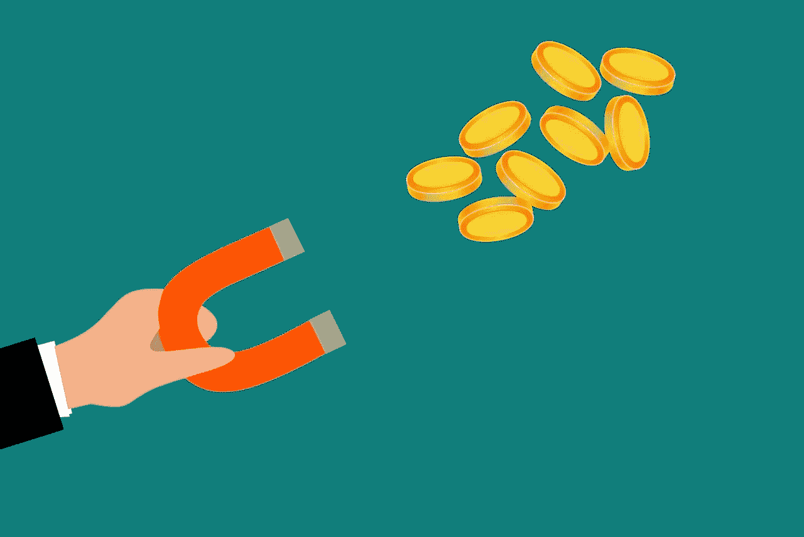

# 留住客户的方法和原因

> 原文：<https://medium.com/visualmodo/the-hows-and-whys-of-customer-retention-6c0a5c5bef9f?source=collection_archive---------0----------------------->

大多数企业投入了大量的时间和金钱来赢得新客户。然而，对大多数公司来说，最重要的收入来源是他们已经拥有的客户群。客户维系是企业最重要的方面之一，对健康的长期利润和增长至关重要。那么为什么顾客会离开，你能做些什么呢？

# 为什么留住客户很重要？

平均而言，留住一个现有客户并把他们引回销售市场比招募新客户要便宜得多，后者的成本大约是前者的 7 倍。然而，一份经济咨询报告显示，在留住客户方面的投资正在下降，而对留住客户的关注却在上升。这没有什么经济意义。现有客户已经对你的公司和购买过程有了一定的信任，因此更有可能在未来再次购买，无论是重复购买还是完全不同的产品或服务。

向现有客户营销也需要更少的努力。营销指标表明，向现有客户销售产品要容易 50%左右。他们不需要被服务说服，更不关心成本。因此，更高的客户保持率导致更多的销售和利润增加。你应该在营销预算中投入相当大的一部分来制定客户保持策略。

# 为什么顾客通常会离开？

描述:顾客比以往拥有更多的选择，但大多数人离开是因为他们觉得你的企业不关心他们。

客户停止从贵公司购买的原因有很多。他们可以被说服从竞争对手那里购买，但这实际上只占离开者的一小部分，对你的业务直接不满也是如此。客户离开的最常见原因是他们认为你不关心他们。

如果顾客对你的客户服务部门有不好的体验，或者由于缺乏沟通或努力，他们只是得到消息，他们的顾客对你来说不重要，那么他们可以简单地找到其他地方购物。市场上有很多选择。顾客保留是基于忠诚和信任。你必须证明你重视你的顾客，你会尽一切努力让他们站在你这边

# 留住客户

正如我们所看到的，留住客户的第一步也是最重要的一步是出色的客户服务。这意味着当客户需要与你交谈时，你要随时准备好，提供满足他们期望的服务，并妥善应对任何问题。为你的客户着想，他们也会为你着想。不要承诺你做不到的事情——相反，要兑现你的承诺。你也可以使用一些客户维系策略来让你的客户满意。您使用哪一种取决于您的业务:

# 客户保持策略

贵宾奖励计划留住顾客的最好方法之一是为他们的购买行为提供持续的奖励。每次他们消费，都会有所回报。超市用这种方法处理他们的积分卡，提供现金返还和购物凭证。一些流行的在线扑克网站使用 VIP 奖励计划，提供分级积分系统，这样每个人都可以获得奖励，但顶级玩家可以获得更多奖励。

**始终如一的沟通**——对你的客户诚实、开放，但在沟通中要始终如一。你不需要每次伸出手来都强行推销，事实上，你也不应该这样做。当客户最近没有与你的产品互动时，你可以进来打个招呼，或者在他们购买时说声谢谢。使用个性化的跟进来建立关系，并表明你了解客户的需求。利用博客和[社交媒体活动](https://visualmodo.com/?s=social+media+campaigns&submit=Search)与你的受众保持个性化。

**促销和有针对性的优惠**——顾客总是对物有所值感兴趣，所以定期的促销和特别优惠应该能让他们对你的业务保持兴趣，并有购买的欲望。你可以使用有针对性的优惠来吸引你的客户。例如，如果他们经常浏览某个产品类别，你可以对他们感兴趣的产品打折。

**获得反馈** —投诉其实很有价值。它们会告诉你哪里出了问题，并强调客户可能会逃离你的业务。记下你得到的任何反馈，让顾客在购买产品或服务后，能够很容易地给出反馈。考虑偶尔发送反馈表，以获得对客户及其需求的总体了解。最重要的是倾听和回应。