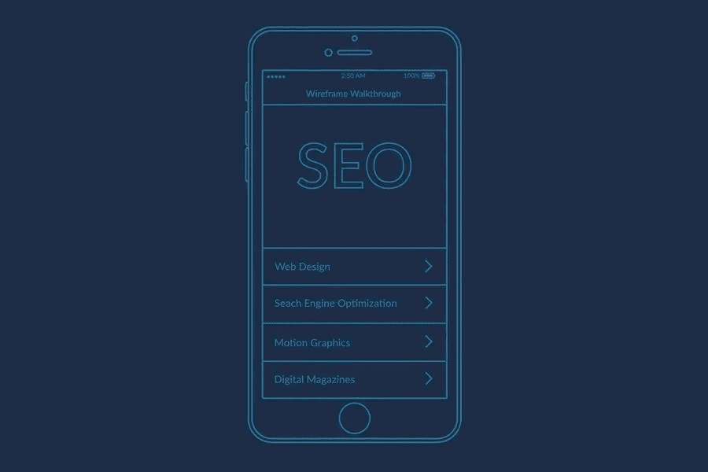

# 搜索引擎优化的神话和事实

> 原文：<https://medium.com/visualmodo/the-myths-and-facts-of-seo-794383839161?source=collection_archive---------0----------------------->

数字世界可以极大地提升你的平台和业务，但你需要正确地做好每一步，以确保成功和繁荣。其中一个步骤是搜索引擎优化，以及如何提高你在搜索结果页的排名。你的排名越高，你将获得更多的流量。这也会带来更多的销售和利润。然而，有许多关于搜索引擎优化的误解，很多人相信虚假信息，忽视重要的事实。因此，继续读下去，彻底理解这些 SEO 神话和事实。

# SEO 事实:链接到其他平台对你有利

你可以放心，链接到其他有权威的平台肯定会对你有利。权威网站总是对搜索引擎排名产生积极的影响。这就是他们称之为权威网站的原因；意味着他们有可信度。这种可信度和力量意味着更多的人会访问这个页面，给你的网站带来更多的正面流量，因为他们很可能会点击你的链接。因此，事实证明，外部链接有助于提高你的平台的认知度，并能显著提升你在搜索引擎上的排名。

# 搜索引擎优化神话:你可以期待在 4 至 6 个月的保证结果

许多人认为你应该期待 4 到 6 个月的结果，他们开始给你错误的保证。这是大错特错的，因为没有一个固定的公式可以得到你想要的结果。许多人和数字营销机构问自己搜索引擎优化需要多长时间来显示任何业务的结果。事实是，没有可能的方法来准确地陈述或知道你的优化策略需要多长时间才能产生好的结果。

如果它是如此简单和容易，那么每一个企业都将在搜索引擎列表中占据首位。只有少数精英公司能够做到这一点，这并不容易。它需要一致性、耐心和大量的研究。此外，不可能保证一个具体的时间取得成果，因为它取决于你的目标市场类型，你的商业项目的规模，你所使用的战略，等等。

# 事实:搜索引擎优化并不便宜

这是真的，你应该预料到搜索引擎优化不会便宜。如果你实施的策略很便宜，而且来自不同数字营销机构的帮助近乎免费，那么你就不会获得可以提升你业务的出色结果。你需要明白，如果你想赚些钱，那么你首先需要花些钱。

不可能做到超级便宜，因为那样就不会有效。如果你不想被骗或敲诈，那么你需要去保费和有效的搜索引擎优化解决方案，这需要花费一些钱，而且往往是昂贵的。您的成功和您网站的成功不是一朝一夕能够实现的。它需要一致性、效率和时间。但所有这些都需要钱，没关系。没有什么美好而难忘的东西是免费的。

# 搜索引擎优化神话:内容是你成功的门票

成千上万的人和数字营销机构认为，内容本身就是通往成功的门票，但这完全不是真的，因为仅凭内容是无法成功的。这只有一半是对的，因为好的内容确实有效，对你的整体排名有积极的影响，但是你需要其他策略来处理它。

你也需要一个链接计划和优秀的网页设计，拥有[可操作的链接](https://visualmodo.com/digital-marketing-in-2020-what-trends-await-us/)。伟大的内容和惊人的设计是天造地设的一对。有些人可能会认为，有些公司在权威平台上没有大量的链接，但它们仍然有不错的排名。但这只是因为这些公司或品牌如此独特，以至于它们没有任何类型的竞争。这意味着他们拥有自己的市场。总的来说，内容和链接相互影响，这是一个很好的成功秘诀。但是，您不能仅凭内容或链接就取得成功，因为您两者都需要。

# 事实:服务器速度很重要

这是非常真实和重要的，因为你的网站的服务器必须快速和正常工作。产生流量意味着有更多的人访问您的平台，但是如果它太慢并且加载速度非常慢，他们不会停留很长时间。如果你的平台加载不够快，有些人会离开，转到下一个链接。一个简单的 4 或 5 秒钟的延迟就能让你的流量增加。这对于你的优化策略是非常重要的，因为如果你的服务器很慢。

这样，您就不会产生积极的流量、获得权威、产生线索、增加销售或增加利润。所以，确保你投资一台速度好的服务器，因为它可以帮助你在搜索列表中获得一个不错的排名。

# 关键词密度就是一切:搜索引擎优化神话和事实

关于关键词密度以及它对你的流量产生计划意味着什么有一个神话，但事实并非如此，因为它与你的关键词的密度水平无关。你应该关注合适的、听起来正常的关键词。它的密度并不重要，也不应该是你高级目标的优先事项。只需确保你的关键词有意义，并完美地写在句子中，让它看起来很自然。任何类型的关键字都很棒，如果它是自然的并且有意义的话。

SEO 可以帮助很多网站所有者和商业平台获得成功所需的曝光率。它可以产生大量的潜在客户，并显著提高销售利润。但是，如果你继续相信搜索引擎优化的神话，你就不能指望实现这一点。将它落实到你的战略中。你需要变聪明，从过去的经验中学习。研究其他人是如何真正成功的。一旦你这样做了，你就能保证有好的结果。因此，更多的积极的交通和更高的排名在搜索结果页，以促进您的整体成功。