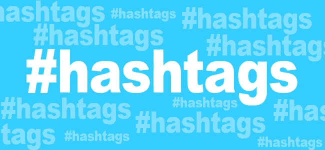
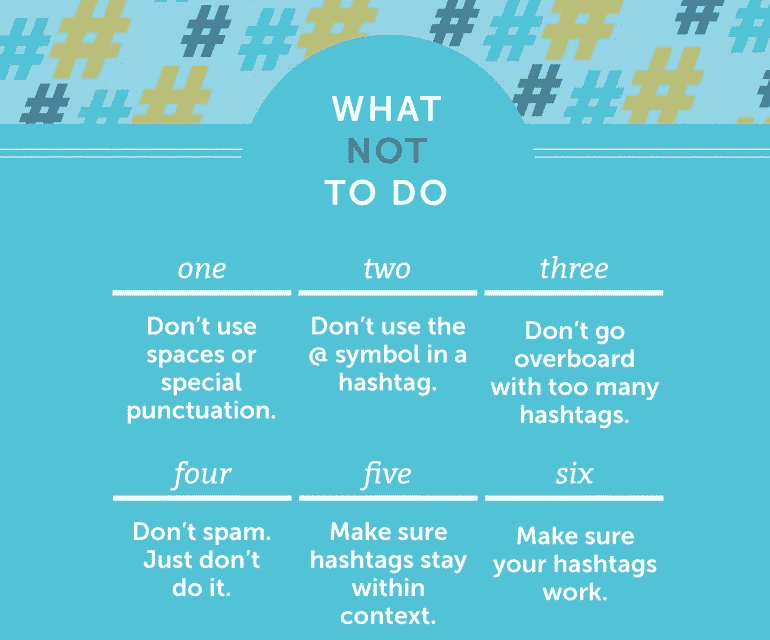

# 标签的力量

> 原文：<https://medium.com/visualmodo/the-power-of-hashtags-6ba83c0c9ea3?source=collection_archive---------0----------------------->

#标签仍然非常受欢迎，在这里， [#Visualmodo，](https://visualmodo.com/)我们再兴奋不过了！今天，你不必成为一个专门的社交媒体用户来接触标签。现在，标签经常出现在餐馆的菜单上、电视和广播脱口秀上，甚至地区和国家新闻也在推广使用标签——它们几乎无处不在！

# 标签的力量

随着#追溯到 2006 年 Twitter 的早期，#标签迅速主导了广告和当代文化——但这对你的业务意味着什么？

# 连通性、意识和简单古老的古怪

标签就像一个“门”，允许企业以一种令人兴奋和新鲜的方式与目标受众交流。使用#，您可以了解生活方式、文化和最新的消费趋势。

你也可以成为虚拟社区的一员，参与对话以进一步了解你的受众，这无疑也有助于你的业务保持相关性！

当结合入站链接时，#甚至可以增加你的推荐流量——事实上，#是一个让你的内容被看到的极好工具！

好处也不止于此。简单而古怪的符号为您提供了解决新的人口统计和文化群体的潜力。此外，随着时间的推移，你甚至可以创建自己独特的#标签来真正建立你的[在线](https://twitter.com/visualmodo)形象！

# 了解标签

显然，标签是一个漂亮的小工具，但知道如何有效地使用它们是至关重要的。因此，为了帮助您从活动中获得最大收益，我们收集了三个重要提示！

1.  **相关性:**选择与你的业务和受众相关的标签。虽然宽泛的标签带来了互动，但关键词特定的标签会让你获得有意义的互动。
2.  **了解平台:**虽然在 Instagram 上使用 20 多个标签很常见，但在 Twitter 上，越少越好。事实上，过多的标签是有害的，会吸引那些只关注#FollowBacks 的账户。Twitter 建议每条推文不要超过 2 个标签，这是最佳实践。
3.  最后，没有人愿意打出冗长的短语，你知道，我们都是忙碌的蜜蜂。所以保持你的标签简短和具体！毕竟，他们应该让订婚变得更容易！

如果您想讨论 Netbiz Group 如何在 2017 年帮助您的业务增长，请联系！