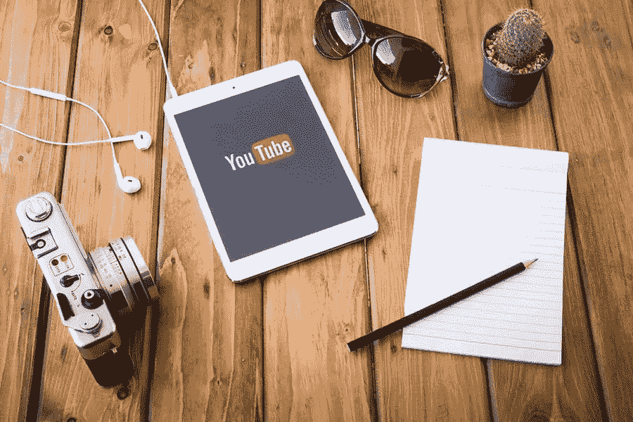

# 营销业务时 YouTube 的力量

> 原文：<https://medium.com/visualmodo/the-power-of-youtube-when-marketing-your-business-c35b900ba931?source=collection_archive---------0----------------------->

根据一份统计报告，大约 73%的美国成年人使用 YouTube，因此它被认为是美国最受欢迎的在线平台。这就是为什么 YouTube 是一个强大的视频营销平台，在这里你可以推广你的产品和服务，同时为你的目标观众提供娱乐、帮助和支持。在这篇文章中，你将会学到更多关于 YouTube 的力量，以及如何利用它来进行商业营销和推广。

# 释放 YouTube 在商业营销中的力量

# 用 YouTube 提升你的品牌

虽然你的网站是你在线形象的核心基础，但你的 YouTube 频道被认为是营销你的业务的延伸。定制您的渠道可以帮助您吸引更多的客户，并增加人们对您品牌的了解。

# 一个伟大的 YouTube 身份

这就是为什么通过查看这个快速、有用的 YouTube 商业营销指南来建立一个伟大的 YouTube 身份是至关重要的:

*   **一致的香奈儿名称**:在所有媒体平台上创建一个一致的频道名称，尤其是 YouTube，因为你将发布的所有视频都将以这个名称命名。
*   **上传一个惊艳的频道图标**:就像你在脸书看到的个人资料图片一样，拥有一个吸引人的 YouTube 频道图标是必不可少的，比如专业头像或公司标志。让它独一无二，明智地选择背景色。例如，你可以选择蓝色、金色或红色作为今年的幸运色。用户可以通过您的频道图标轻松识别您。按照谷歌的建议，上传一张 800 x 800 像素大小的圆形或方形图片。
*   **上传吸引人的频道图片**:上传一张 2560 x 1440 像素大小的图片给你的频道图片，让你的视频更吸引人。图片应该可以在不同的设备上缩放，比如智能电视、智能手机、平板电脑和笔记本电脑。
*   **简短甜蜜的 YouTube 预告片**:保持你的 YouTube 预告片在 30 秒到 1 分钟左右，永远不要超过。它应该显示你的频道是什么，以及一条鼓励观众订阅的短信。
*   **整合你的社交媒体账户**:别忘了将你的 YouTube 频道链接到你的网站和其他社交媒体账户。这增加了 YouTube 营销的力量，因此你可以在任何地方与你的订户联系。你可以在你的 YouTube 频道的“关于”部分这样做。

# 通过您的缩略图吸引更多观众

虽然缩略图可能看起来没有那么有影响力，但它实际上在为你的 YouTube 视频吸引更多观众方面起着至关重要的作用。什么是 YouTube 缩略图？这是一个可点击的图像，是在线观众在浏览 YouTube 时首先看到的。

就像你如何提高你家的吸引力，让自己在邻居中脱颖而出，获得客人和访客的称赞一样，让你的 YouTube 缩略图吸引更多的观众来观看你的视频也很重要。但是你是怎么做到的呢？

以下是为 YouTube 商业营销制作精心设计的缩略图的一些有用技巧:

*   **遵循正确的 YouTube 缩略图大小和尺寸**:一个好的缩略图的图像大小是 1280 x 720 像素。选择可以缩小的较大尺寸，而不是选择较小的尺寸，以确保高质量的缩略图。
*   **使用高质量的照片作为你缩略图的背景**:通过上传高质量的图片来抓住浏览者的注意力。它是你的视频的一个预告片，同时让你的观众熟悉你的风格。
*   **添加文本标题**:添加文本标题可以让观众更好地了解你的视频。如果您正在创建像电视节目这样的系列节目，您可以给缩略图编号。
*   **一致的字体风格**:通过与字体风格保持一致，以及使用吸引人的颜色和强大的整体设计，创建强烈的视觉效果并与观众快速交流。选择易读的字体，如“gothic”或无衬线字体。此外，重量级或粗体字体是一个很好的选择。

# 制作最好的 YouTube 视频来推广你的业务

在开始拍摄前设定一个目标。YouTube 营销的成功依赖于视频的相关性、娱乐性和有效性。你想通过分享你的知识、专业技能、个人故事以及其他人对你的企业的评价来向你的目标受众展示你的产品和服务的重要性。

通过了解你可以为你的 YouTube 频道拍摄的不同类型的视频，你将能够吸引更多的观众到你的频道和网站。当然，这将意味着网站流量和潜在销售额的增加。

# 在你制作下一个 YouTube 视频之前

*   **案例研究和项目回顾**:包括案例研究的发现和结果可以帮助提高你的可信度，展示你作为你所属的商业领域的思想领袖的权威。
*   **客户评价视频**:上传满意客户的评价视频，帮助你建立信誉和良好声誉。
*   **YouTube Live** :与脸书 Live 类似，它允许向公众播放未经编辑或过滤的直播内容，这在提供实时反馈方面吸引了更多的观众。
*   **教程或讲解视频**:讲解视频是深入解释如何使用产品或产品或服务的各个部分的视频。教程可用于回答客户支持问题或解释新产品功能。
*   **影响者访谈**:影响者通常是思想领袖，他们可以扩大你企业的可信度。你可以采访当地的教授、倡导领袖或名人，以促进当地的业务。
*   **活动视频**:如果你正在参加一个交易会、博览会或会议，你可以上传活动视频，展示你与观众分享这些视频的兴奋心情。
*   视频博客:通过视频博客记录你的日常生活事件。确保上传内容可消化的视频，这些视频反映了你的博客文章的内容。

# 如何营销你的 YouTube 视频来推广你的业务

利用 YouTube 的力量营销你的业务如果你想让你的视频像病毒一样传播，或者至少抓住你的目标观众的心，使用视频营销需要付出大量的努力。当然，每个人都欢迎观看你的视频，但你想吸引和获得更多的潜在客户来利用你的产品和服务。那么，你如何推广你的 YouTube 视频，以促进你的业务呢？

# 营销业务时释放 YouTube 力量的技巧和诀窍

*   **采用 SEO 优化策略**:确保你的 YouTube 频道的标题和描述是搜索引擎优化的。因此，观众可以很容易地在搜索结果的顶部看到您的视频。这就是为什么学习 YouTube SEO 对于在 YouTube、Google 和其他搜索引擎的顶部结果或前几页可见是很重要的。
*   **以真实人物为特色**:你的视频或图形设计不需要纯文本或幻灯片格式。在你的视频中展现真实的人，创造积极的影响。这是一个分享人们如何看待和使用你的产品的好方法。你的客户在使用你的服务时有多开心。使用动画脸也可以达到这个目的，尤其是如果你的目标观众是年轻的话。
*   **包括 CTA**:不要忘了告诉观众在看完你的视频后你希望他们接下来做什么。在所有视频中加入行动号召或 CTA。这将有助于提高你的转换率，线索和收入。
*   **让它可以分享**:定期制作视频，制作视频系列有助于提高品牌知名度。不要忘记通过创建包含您的视频的播放列表来共享您的视频。检查您的 YouTube Studio 帐户的“视频管理器”选项，并检查您的 YouTube 隐私设置。选择“视频”,然后选择“可见性”下的“公开”,使视频可被他人查看和共享。
*   **添加订阅按钮**:一个吸引观众的好方法是[在你的网站上添加订阅按钮](https://visualmodo.com/adding-youtube-subscribe-button-in-wordpress/)。

# 制作优秀 YouTube 视频所需的东西

虽然您可以使用智能手机拍摄视频，但拥有可靠的视频制作设备来制作视频非常重要。在拍摄下一个 YouTube 商业营销视频之前，你需要准备的基本东西包括一个相机。三脚架、灯光、麦克风和视频编辑软件。以下是在制作 YouTube 视频之前选择合适的视频制作设备的一些技巧:

*   相机:如果你还在起步阶段，你可以使用高质量的摄像机或网络摄像头。无反光镜相机和数码单反相机是很好的投资，一旦你准备好了，它们是升级的绝佳选择。网络摄像头是即插即用的摄像机，非常经济可靠，非常适合直播。另一方面，便携式摄像机是一种重量轻、适合任何拍摄场合的录像机。
*   **麦克风**:购买一个外置麦克风，这样观众就可以清楚地听到你在视频中解释或说的内容。由于环境声音，内置摄像头或电话麦克风的质量往往很差。您可以选择 USB、label 或猎枪式话筒。
*   **三脚架**:用三脚架保持稳定的进尺。观众很容易被视频上如此多的动作分散注意力，让他们离开你的频道。所以对于专业视频制作来说，买个三脚架甚至是万向稳定器都是值得的。

# 总结 YouTube 在营销你的企业时的力量

YouTube 是一个非常强大的在线营销策略，适用于中小型企业或中小型企业，以及大型公司或企业。它为任何种类和规模的企业创造了公平竞争的环境。你的企业可以通过优化你的渠道元素在搜索结果中的排名，从 YouTube 营销中获益。

持续上传视频，增加你的浏览量和订阅量，增强 YouTube 营销你的业务的能力。然而，要确保你的视频没有过多的广告。专注于鼓舞、帮助和娱乐观众，而不是直接推销你的产品和服务。通过这种方式，你将实现你的营销目标，并使你的企业繁荣，成长，变得更加成功。