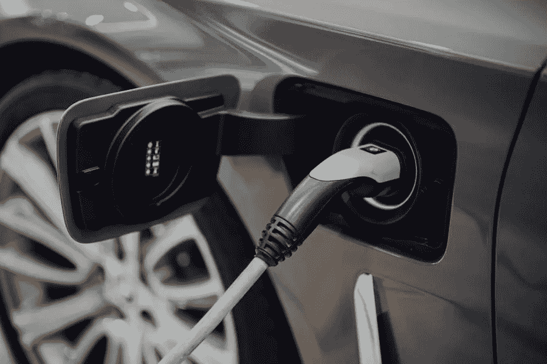

# 电动汽车相对于耗油汽车的主要优势

> 原文：<https://medium.com/visualmodo/the-primary-advantage-of-an-electric-car-versus-a-gas-guzzler-car-b31f3842fe05?source=collection_archive---------0----------------------->

电动汽车相对于汽油燃料汽车的主要优势是使用电池或电力为汽车充电，而不是使用汽油。它更环保，有助于避免污染。在这篇文章中，我们将分享电动汽车相对于耗油汽车的优势和好处。

这是电动汽车相对于汽油汽车的主要优势。但是还有其他的优势。首先，车辆不需要插电。不涉及任何排放。这意味着没有废气污染大气。此外，电动汽车的电池在行驶过程中的充电次数要比汽油汽车多很多倍。

# 电动汽车相对于耗油汽车的优势

此外，没有废气污染意味着不用担心尾气排放。这意味着汽油作为燃料燃烧掉的空气被认为比电动汽车发出的咕噜声更清洁。此外，汽油车的行驶里程比电动车更有限。只有几个城市的汽油是合法的，所以司机不能走很远。

正如你可能已经猜到的，电动模型的成本也较低。它的价格大约是同等汽油价格的一半。因此，如果你的驾驶距离是中短距离，你可能会发现使用电动汽车更经济。然而，如果你长途旅行，汽油驱动的汽车将是更好的选择，因为它能够以更少的停留覆盖更长的距离。

电动模式的主要优势还在于你到达目的地的速度。汽油动力汽车需要更长时间才能到达目的地。如果你不是一个早起的人，你会考虑投资一辆汽油驱动的汽车。气体

机动车辆往往更重，占用更多空间。你还需要更频繁地支付加油费用。没有适当的保养和维修，汽油车更容易出故障。它比电动汽车更像是一辆“颠簸的汽车”。这是电动汽车的一大优势。

当然，电动汽车的主要优势在于它是环保的。汽油驱动的汽车向大气中释放有害的温室气体，导致全球变暖。相比之下，电力驱动的汽车更省油，碳排放量也更小。