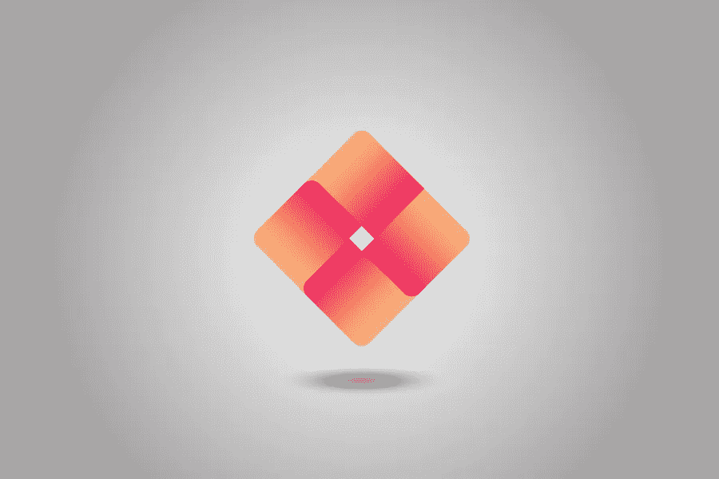

# 标志设计背后的心理学如何为你的品牌选择正确的标志

> 原文：<https://medium.com/visualmodo/the-psychology-behind-logo-design-how-to-choose-the-right-logo-for-your-brand-7291f8c59196?source=collection_archive---------0----------------------->

标志设计背后的心理学:如何为你的品牌选择合适的标志？即使在开展业务之前，品牌也是首要考虑的事情。你的标志是视觉品牌美学的主要元素。因此，当你开始创业时，制作一个能够恰当代表你的企业并引发正确情绪的标志非常重要。

理解标志设计的颜色、形状和风格背后的心理是确保你的品牌留下影响的一个很好的方法。标志设计就是创造一个品牌的视觉形象，唤起某种情感。

考虑到这一点，我们为创建具有积极品牌效应的标志创建了一个终极指南。

# 色彩背后的心理学

不同的颜色对读者的心理有不同的影响，影响用户看你品牌的方式。

通常，像红色、黄色或橙色这样的暖色与舒适、温暖、敌意和愤怒有关。另一方面，像蓝绿色或紫色这样的冷色——如红色、黄色和橙色——会给人平静和悲伤的感觉。

帮助你理解色彩心理学概念的最好例子之一就是谷歌官方标志。谷歌团队做了很多实验，想出了一个有一定行为效果的 logo。只是为了了解他们实验的深度，标识 G 是为了反映孩子般的简单。倒 e 型和多色彩的游戏性在其中起了重要作用。

为了进一步优化谷歌标识，他们在字母之间添加了空格。此外，重要的是要知道，他们必须推动和调整红色，绿色和黄色的活力，以避免光学混合的 G。这是标志设计背后的心理。

但是谷歌不是唯一一个使用色彩心理学的品牌，你可以注意到许多其他品牌，如 Slack，脸书(使用蓝色背景和白色字母来展示信任和真诚)。

但是谷歌不是唯一一个使用色彩心理学的品牌，你可以注意到许多其他品牌，如 Slack，脸书(使用蓝色背景和白色字母来展示信任和真诚)。

# 色彩漫游:标志设计背后的心理学

*   **蓝色—** 三星、脸书等品牌使用的主色，以平复冲击力
*   **黑色**——耐克使用的力量&力量
*   灰色——对于权威性和专业性来说，最好的例子是 2003 年的 WordPress 标志。
*   白色——虽然它以唤起简单、完美和纯真而闻名，但设计师经常用它来获得一种组合效果。
*   绿色——根据色调的不同，绿色可能会留下广泛的影响，但最常见的是自然、成长与和平。雪碧是常青树的例子。
*   **棕色**——律师事务所或建筑公司常用的暖色。
*   **黄色**——黄色代表幸福和快乐。麦当劳把它和红色一起用来表示活力和快乐。
*   **红色** —红色引发强烈的情感，如侵略性、能量、激情，因此被那些瞄准年轻观众的人所使用，例如——标志设计背后的可口可乐心理学。