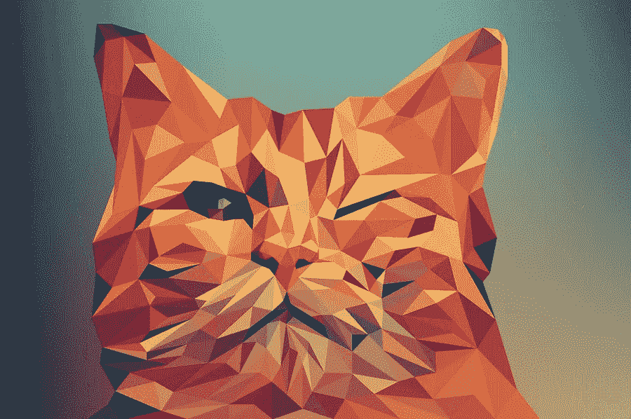

# 财富在于发现并利用你的插图风格

> 原文：<https://medium.com/visualmodo/the-riches-are-in-the-niches-finding-and-capitalizing-on-your-illustration-style-de4d57110852?source=collection_archive---------0----------------------->

当涉及到从插图中赚钱时，道路可能是崎岖不平的，即使对从事插图工作多年的人来说也是如此。如果你刚刚开始你的插画生涯，那么获得第一笔大额佣金似乎几乎是不可能的，但是找到并坚持你的风格是达到这个目标的最好方法之一。承认并发挥你的优势已经成功了一半，另一半我们会在这里解释！

# 如何找到并利用您的插图风格？

# 搜索引擎优化

为了吸引更多的工作，我们可能会试图将自己分散到不同的风格中，但通常会产生相反的效果。找到自己的风格并坚持下去是找到你想要的客户的最有效的方法之一。例如，如果你的插图风格适合“动漫”这一大背景，那么想想它又是如何被分解的。也许你特别擅长画围绕食物的动画，也许赌博动画更适合你的风格，甚至可爱的动物动画。所有这两个或三个词的术语将提供一个更加明确和集中的搜索引擎优化。

如果你是一个寻找动画风格的餐厅菜单插图的客户，你更可能寻找“动画食物插图画家”，而不仅仅是“动画插图”。同样，你和其他人的竞争会少得多,“动漫插画”在谷歌上的点击率为 9.76 亿，而“动漫食品插画”的点击率远低于 2700 万。在这种情况下，财富真的在利基市场。

# 有多少张图片？

在某种程度上，选择在你的主页上使用多少图片是个人的选择。一般来说，从你最好的照片中选择 3-5 张是相当安全的建议。然而，这并不是说没有灵活性的空间。很大程度上，哪些图像会出现在你的主页上取决于它们是如何紧密结合在一起的。有了大量的图像，就很难创建一个“房子风格”，页面也会变得混乱。

如果你设置使用许多图像，那么解决这个问题的一个好方法是使用缩略图。专注于工作的小部分。最好是遵循类似配色方案的位，并将其用作[缩略图](https://en.wikipedia.org/wiki/Thumbnail)。然后创建一个可点击的按钮，让潜在客户可以看到大版本的图像。这种在你的主页上包含文件夹的方法对于那些在作品中包含很多细节的艺术家来说尤其有效。然而，也希望他们的主页看起来干净和专业。

如果你想要一个更加[简约的风格](https://visualmodo.com/theme/minimalist-wordpress-theme/)，一个大胆而美丽的方式来设计你的主页

只有一张壮观的照片。选择一个突出的作品，并使之成为一个特色，最好占据页面的三分之二或更多。从作品中挑选出主要的颜色，用在标题和副标题上。所以，把主页本身当成一个插图。以这种方式运用你的技能，两者皆有。你作为一个插图画家的天赋，以及你帮助完成新任务的能力。

# 你的插图风格的配色方案

虽然我们总是被告知使用白色背景。但是有时候跳出框框思考是值得的。如果你是一个风格特别大胆的插画师，为什么不把它融入你的网站呢？Malika Favre 风格大胆，融合了 Op-Art 和 Pop Art 的所有精华。她的网站简洁明快，但她大胆的原色设计独树一帜。在主页上给予[配色](https://www.businessinsider.com/shocking-drastic-logo-changes-2013-4)关注的焦点。喜欢这是一个勇敢的举动，但对于这种风格的插图，它的工作非常出色。

重要的是不要忘记颜色对我们大脑的影响。一些具有黑暗或神秘风格的插图画家可能会从使用黑色背景中受益。贾斯汀·马勒主页上戏剧性的明暗对比效果是在漆黑的背景下由光线和色彩的爆发创造出来的。这个网站给人一种戏剧性和阳刚的感觉，清晰、干净的线条看起来很美，整个印象非常巧妙。想象一下，如果背景是白色的，效果会大大增强。