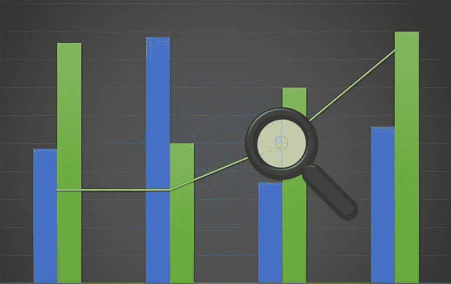

# 蒂莫西·赛克斯评论细价股交易

> 原文：<https://medium.com/visualmodo/the-timothy-sykes-review-trading-in-penny-stocks-1717c2bb25de?source=collection_archive---------0----------------------->

“细价股”在交易界正变得越来越受欢迎，虽然职业经纪人可能从远古时代就开始与它们交易，但独立投资者甚至正在缓慢地进行转变。一些经纪人甚至到了只交易细价股的程度，因为它们的高增长潜力和随之而来的利润。

今天，我们将为您提供一个关于细价股的速成课程，以及您需要做些什么来确保您的投资获得最大回报。所以事不宜迟，我们走吧！

# 什么是仙股？

顾名思义，细价股是(或至少曾经是)股价为几便士的股票。如今，这个术语也包括价格在 5 美元范围内的股票。尽管 5 美元的股票没有达到“一分钱”的门槛，但当你将这些价格与更大的蓝筹股(其价格可以超过 1000 美元的门槛)进行比较时，即使是 5 美元的股票也是“几分之一美元”。

除了价格低，细价股也有很高的利润和增长潜力。发行这种股票的公司通常刚刚完成在 T2 的首次公开募股，并处于其最终商业发展计划的早期阶段。因此，随着公司业务的增长，股票价格很有可能会随着时间的推移而上涨。统计数据显示，一些细价股公司在两年内实现了 2400%的增长。想象一下，如果出现这种增长，你的储蓄会增加多少。

# 股票交易量——蒂莫西·赛克斯

此外，与细价股相关的另一个优势是，与投资蓝筹股相比，你可以获得更大数量的股票，在你的投资组合中拥有更大的持有量。你可以用 10000 美元买到比谷歌(1100 美元以上)和苹果(208 美元)更多的细价股。与不到 10 股谷歌股票和 50 股苹果股票相比，用这笔钱，你可以买到 2000 股仙股(如果每股 5 美元)。

然而，虽然潜在的利润和大量持有是非常诱人的品质，人们需要记住，细价股并不是一种保证致富的方式。就像你对待其他股票一样，交易细价股有很大的风险。发行这些股票的公司可能会在你投资的第二天就倒闭，甚至会继续运营 50 年。有如此多的因素在起作用，以至于人们需要接受风险并做好遭受损失的准备。

# 风险缓解

减轻与便士股票相关的风险的最好方法是忠于你的分析。确保您定期、彻底地分析和审查您的投资组合以及已发行该投资组合股票的公司。谈到公司，您应该考虑的一些因素包括收入、利润、亏损、业务战略、法规遵从性、营销战略和客户互动。

分析可以减轻上述风险，因为您所关注的所有因素都将对公司产生深远影响，进而影响股价。监管合规方面的一个小失误。客户因疏忽服务或货物而提出的重大投诉，很可能导致这些公司。实际上处于婴儿期，完全崩溃和折叠。

如果你想改变你的投资组合只包括便士股票。你需要更加专注于事物的分析部分。分析和持续的警惕为任何成功的便士股票投资组合提供了坚实的基础。

# 蒂莫西·赛克斯投资策略公司的便士股票

便士股票最常见、最容易管理的投资策略是“买入并持有”。这是你购买大量股票的地方。有了便士股票，你将能够确保你的持有量因为低价格而变得很大。长时间握住它们。一旦你的股票达到了预期的股价，你就可以出售并享受利润。只要一切顺利，久而久之和股价都会上涨。股票的风险慢慢降低，直到增长停滞，价格达到稳定。

另一个策略是通过日间交易进行卖空。然而，这种方法也有缺点。首先也是最重要的一点，你不能以独立投资者的身份去做。尤其是如果您的投资仅用于为自己或家人储蓄和建立储蓄账户。这种方法需要深入分析，不仅要详细得多，还需要持续的实时警惕。专业经纪人可以做到这一点，但是你必须承担佣金。这种策略也有很多风险。

# 自学——蒂莫西·赛克斯评论

如果你能在这个话题上多学习一些，可能也会有所帮助。如果交易细价股吸引你，那么你可以大大增加你的知识。订阅蒂莫西·赛克斯的服务。有大量的教育 DVD 和网上的蒂莫西·赛克斯百万富翁挑战。你可以学习一长串的话题，包括细价股票交易。股票市场分析、法规遵从性和税收。《百万富翁挑战赛》甚至让你了解不同股票的最新动态。股票投资技巧，以及关于市场发展的有趣文章。要了解更多，请查看这篇蒂莫西·赛克斯评论。

# 蒂莫西·赛克斯的细价股票

最后，细价股似乎是一种简单的致富方式。但是没有什么比这更偏离事实了。你仍然需要对股票给予一定程度的关注，以确保你的投资是安全的。此外，该股正朝着正确的方向发展。通过正确的分析，持续的警惕，以及一点点的学习。你将能够进行股票交易并获得可观的利润。