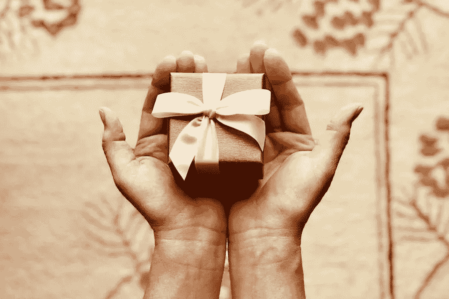

# 2021 年十大包装设计趋势

> 原文：<https://medium.com/visualmodo/the-top-10-packaging-design-trends-for-2021-d0cc89725eb8?source=collection_archive---------0----------------------->

对于 2021 年，你可以尝试可回收包装，简单而大胆的设计，重复的图案，柔和的颜色设计，复古包装来吸引消费者。包装是产品的重要组成部分。它拥有品牌身份并吸引顾客。每年都会出现新的设计和潮流，吸引每个人的注意力。在许多方面，包装是销售产品的关键。在这篇文章中，你会看到今年八大包装设计趋势。

这对电子商务企业来说更是如此。因为他们没有实体店，他们需要非常注重包装，以维持他们的客户群。除此之外，你也可以尝试[自定义二维码](https://www.beaconstac.com/qr-code-generator)让它变得更简单。

有时候，一个产品可能会很神奇，但如果它是用劣质纸或塑料包装的，你就不会对打开产品感到兴奋。

每年我们都会看到不同和独特的东西，像其他任何一年一样，2021 年也有一系列不同的包装风格。

# 为什么包装设计很重要？

包装有很多好处。首先，一个精心设计的包装可以让你大致了解盒子里面是什么。

它还可以增加产品的美感和价值。它可能不会直接提升产品，但肯定有助于[创造一个好印象](https://visualmodo.com/pattern-backgrounds-download/)。

注意小公司比大的商业公司有更多独特的包装。

除了美观，独特设计的包装可以帮助公司发展和增加其客户群。

你必须记住不同的产品需要不同的包装。你不能对所有类型的产品都使用简单的图案包装。你也不应该每样东西都有插图。

在决定产品的包装质量时，你必须富有创造性和深思熟虑。

你必须考虑包装的设计，使用的材料和目的。这个包装应该能让人知道盒子里装的是什么。

如果是香水，那你就要用一些有档次的，优雅的。如果是食物，那么最好有一个明亮的包装，有插图或图片。一种药，那么你应该保持包装简单，轻便，使用易读的字体。

确保在你所有的临床产品上贴上营养成分标签，以确保顾客的信任并提升你的品牌知名度。

现在你知道独特设计包装的重要性了。话虽如此，让我们来看看 2021 年一些精彩的包装设计趋势

# 1.可回收包装

拯救环境是一件大事，为此必须采取几项措施。

然而，环保和可回收的包装可以帮助你拯救环境。

可回收包装由经过适当处理后可以重复使用的材料制成。

我们的 Z 世代和千禧一代非常关心回收利用。这就是为什么这些类型的包装最近大受欢迎。

随着世界面临最糟糕的时期，现在很明显，回收不再是一种奢侈；这是必须的。

所以，用可回收材料创造一个独特的设计。

可持续发展对客户来说始终至关重要。因此，如果他们得到可持续包装，这将吸引他们从你的公司购买更多的产品。

例如，让我们看看节俭瓶。这些瓶子由 94%的回收纸板制成。

不仅瓶子是用回收材料制成的，瓶子也可以回收利用。

可回收包装可以成为食品的一大主题。你可以推销你的食品及其包装来吸引消费者。

# 2.经典复古包装

复古包装一直是潮流，今年也不例外。

从 2018 年开始，我们看到了一些令人惊叹的复古设计创意，复古复兴仍在进行中。我们甚至看到了复古时尚的复兴。

至于经典和复古包装，你必须确保设计，包装上的文字，颜色，一切都会让你觉得你回到了过去。

当打开包装或盒子时，顾客应该感觉他们打开了怀旧之门。

您可以在各种产品中使用复古包装，如糖果、衣服、书籍和化妆品。

# 3.智能包装

我们回到了过去，但让我们回到现在，展望未来。您可以用便捷的智能包装设计打动您的客户。

二维码、增强现实和 RFID 技术可以用来让你的包装看起来很前卫。

这些代码甚至可以用来跟踪你的产品，如果你看不见他们。

我们可以在智能手机上看到很多智能包装。它们装在很酷的盒子里，具有独特的功能，这使得拆箱更令人兴奋。

如果你的公司销售技术和小工具，那么确保使用智能包装的想法来占上风。

你也可以把它们用作孩子的玩具。用舒缓眼睛的颜色搭配你的智能包装。

未来的小工具和玩具将会有更好的包装，甚至可能增加游戏化和数字游戏体验。

# 4.简单而大胆的设计

有些人可能会寻找更简单的包装。

好吧，不要害怕，因为你甚至可以用简单的设计和轻微的大胆来迷惑顾客。

简单而优雅的设计可以让顾客立即理解他们的产品，这也可以向顾客传达一个关于品牌的强烈信息。

简洁大胆的设计会更加强调产品。你可以在你的包里放一些简单的几何形状，但是要添加大胆的颜色来形成对比和补充。

# 5.带有印刷品和插图的设计

带有印刷和插图的设计是一个古老的传统。但是，商店没有使用随机的印刷和插图，而是为 2021 年选择了一些新的想法。

他们现在使用与包装内产品相关的印刷。

这允许更多的创造性，并增加其对客户的吸引力。印刷品不一定需要完全是里面的东西，而是一些与项目相关的抽象印刷品。

这会让接收者在最后一刻才明白。巧克力棒非常适合印刷和装饰包装。

# 6.重复图案包装设计趋势

现在，在一个正常的设计中，印刷遍布包装，由不同形状的多个图案组成。

但是在一个重复的图案中，同样的设计会重复多次，并代表里面的物体。

平滑背景中无缝重复的图案会给人以内容的概念。另一个简单而优雅的包装设计。

重复设计的包装易于记忆，是小型企业的首选。

它们代表简单，这些有时会大有帮助。

# 7.淡色或纯色设计

这些颜色在几年前就已经过时了，但从目前的市场来看，它们将在 2021 年卷土重来。

柔和的颜色有舒缓眼睛的效果。任何具有这种温暖、平静色彩的设计都会立即吸引顾客或接受者的目光。

给产品包装一个苍白的效果创造了某种魅力。

暖色对顾客很有吸引力，仿佛他们即将得到温暖和平静的东西。

有时甚至一种纯色也能代表你的整个品牌理念。如果你的产品是空气清新剂、身体喷雾或除臭剂，纯色和鲜艳的颜色可以告诉你到底会发生什么。

绿色将代表振兴的东西。红色意味着强烈的气味。还有像酸橙、熏衣草、橙这样的味道，在任何地方都可以通过颜色表现出来。

如果你有不同类型的相同产品，强烈的纯色设计是一个很好的选择。