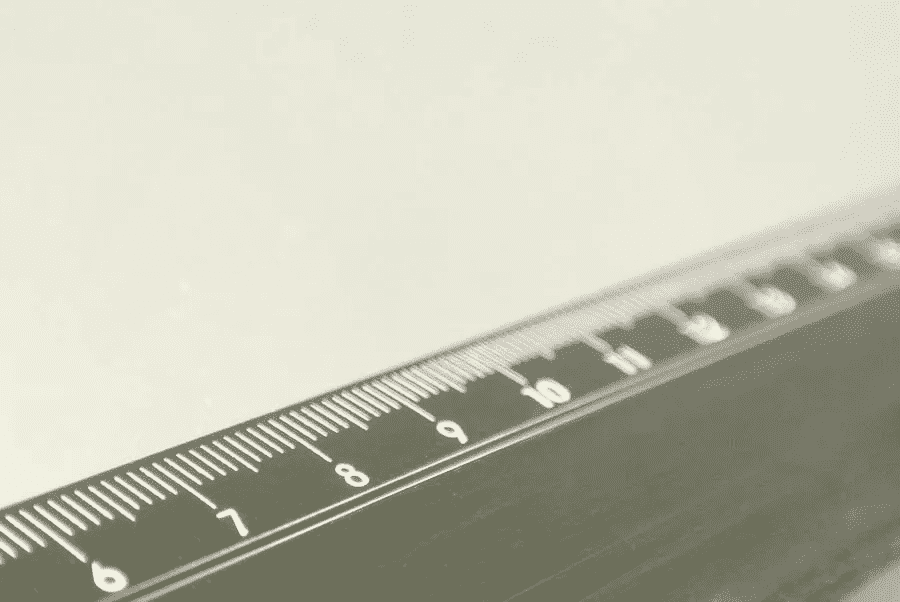

# 每个社交媒体平台的照片尺寸终极指南

> 原文：<https://medium.com/visualmodo/the-ultimate-guide-to-photo-dimensions-for-every-social-media-platform-6cc40b57bea2?source=collection_archive---------1----------------------->

充分利用社交媒体意味着发布对你的目标受众有益的最佳内容。但是在你这样做之前，你需要知道一个基本的因素——你所使用的通道的照片尺寸。在这篇文章中，你会看到每个社交媒体平台的照片尺寸终极指南。

不用说，知道并使用正确的照片尺寸是一个伟大的社交媒体设计策略的一部分。幸运的是，我们已经收集了通常用于营销的每个平台的图片尺寸。

# 脸书:社交媒体照片尺寸指南

让我们从迄今为止被认为是最受欢迎的社交媒体平台开始。据估计，脸书拥有 16.9 亿用户，已经成为各行各业营销的一个[无价工具](https://visualmodo.com/page-speed-test-optimizing-wordpress-sites/)。

有鉴于此，需要注意的是，维护脸书商业账户需要确保你的个人资料图片是最新的。

# 商务页面个人资料图片(180 x 180 像素)

业务页面配置文件图像被裁剪为正方形，尺寸至少为 180 x 180 像素。这将在桌面上显示为 170 x 170 像素的图像，在智能手机上显示为 128 x 128 像素的图像。在整个平台中，图像将显示为 32 x 32 像素的图像。

# 脸书封面照片(820 x 312 像素)

脸书封面照片的最小尺寸为 400 x 150 像素。如果文件小于此尺寸，图像将被拉伸。在桌面上，这将显示为 820 x 312 像素。然而，在智能手机上，它将显示为 640 x 360 px。

# 共享图像(1，200 x 630 像素)

当你在脸书上分享一张图片时，它会出现在你的关注者的新闻源和你的时间线上。共享图像的理想大小是 1，200 x 630 像素。也就是说，这种测量可以帮助确保图像看起来足够好，可以被你的追随者分享。