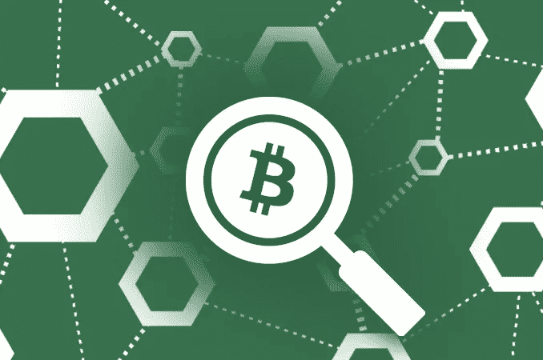
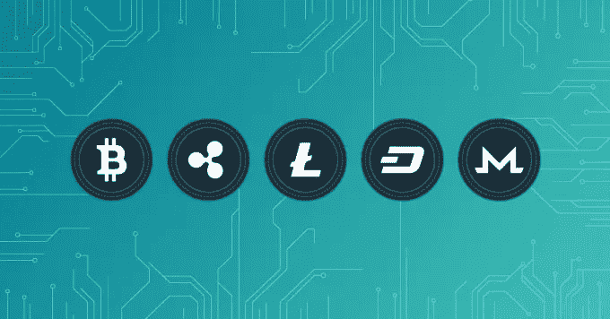

# 区块链在 SEO 中的应用

> 原文：<https://medium.com/visualmodo/the-usage-of-blockchain-in-seo-46a6ff4bd2?source=collection_archive---------0----------------------->

两件看似完全相关的事情是如何以你可能从未想过的方式联系在一起的？这是一个关于区块链和 SEO 的问题。毕竟，在搜索引擎结果页面上获得最高排名与创建分散且安全的交易分类账有什么关系？

最简单的回答是没有直接联系。尽管如此，SEO 专业人士应该密切关注区块链。在不久的将来，这种[技术](https://visualmodo.com/)会以许多间接的方式开始影响 SEO。

# 区块链:简介

区块链最广为人知的是比特币背后的技术。本质上，它是一个[分散的分类账系统](https://en.wikipedia.org/wiki/Blockchain)，交易和其他记录可以在这里进行、验证和存储。它可以并且已经被用于各种场景，在这些场景中，在没有欺诈风险的情况下跟踪和维护记录的能力是必不可少的。

# 使用区块链可以减少 PPC 广告欺诈

谈到在线广告，PPC 仍然是大多数企业的标准。总的来说，PPC 由相对较少的中央机构管理。不出所料，这些公司包括谷歌和脸书。谷歌通过他们的谷歌展示网络，谷歌 Adwords 的一部分，管理网站点击付费。仅供参考，您在搜索结果屏幕上看到的广告是由谷歌搜索网络管理的。本质上，谷歌展示网络匹配广告商和网站。这一过程中最重要的部分之一是验证网站，以帮助避免欺诈。这很关键，因为广告商因欺诈而损失的金额高达数十亿美元。

现在，考虑在这个过程中使用区块链的可能性。谷歌和其他主要参与者将不再需要充当中央权威。相反，广告商和网站可以直接交流。这将包括智能合同的使用、这些合同的验证和安全存储、用户验证、减少和消除欺诈，以及确保企业只为由人类而不是机器人完成的真正点击付费。

当这种情况发生时，消费者在点击广告进入登录页面时也会更有信心。这将导致更多的流量，页面时间，转换，以及其他指标的增加，用于提高搜索引擎优化。

# 搜索引擎可以使用区块链分类账来验证产品的完整性

鞋子、药品、[设计师](https://visualmodo.com/blog/)标签、DVD 和蓝光、手袋和其他物品都有一个共同点。它们是在美国销售的最假冒的商品。不幸的是，互联网为那些出售这种假冒商品的人提供了一种全球经营的手段。即使被抓住了，简单地建立另一个电子商务商店也是一个相对快速简单的过程。

所有这些也影响了合法卖家。有时，欺诈行为不是由他们实施的，而是由向他们提供假冒商品的供应商实施的。还有感知的方式。即使是这些值得信赖的商家，如果他们出售的商品是众所周知的伪造风险很高的商品，也必须与买家的怀疑作斗争。

当然，遭受欺诈的不仅仅是产品。这也是服务的一个问题。事实上，成为劣质或非法服务的卖家会容易得多，因为不需要提供实物产品、维持库存或处理物流。例如，一家努力赢得[可信翻译评论](https://pickwriters.com/top-10-translation-services)的翻译公司可能会沮丧地发现自己在搜索引擎结果中落后于欺诈性服务提供商。

区块链可以颠覆这一切。因为它使用不可变的分类账系统，客户将能够通过零售商或拍卖行向制造商和供应商验证产品的合法性。

除此之外，作为维护“干净”和可靠的搜索记录的努力的一部分，搜索引擎也将能够访问这些区块链数据，以识别哪些卖家是合法的，哪些不是。这可以被整合到他们的算法中。

这样做的结果将是，合法卖家会发现很容易获得 prime SERP 头寸，而欺诈者(理想情况下)会被除名。这意味着改善合法公司的搜索引擎优化，以及增加用户的信任。这两者都能对 SEO 产生积极的影响。

# 区块链账本强制诚信，建立信任

今天，当消费者希望购买产品或服务时，如果他们想在花钱之前进行任何研究，他们有几个选择。他们可以访问产品评论网站和用户论坛。他们可以访问公司网站，阅读产品介绍，甚至观看视频演示。他们可以在社交媒体上搜索意见。他们甚至可以利用消费者机构的网站进行研究。

问题是这些信息很容易被伪造、过时或不准确。没有真正的方法来知道一个评论者是一个真正的客户，还是被公司雇佣来发布评论的人，甚至是一个机器人。用户论坛上的帖子和对机构的投诉也可能是伪造的。

最近披露的互联网上大量虚假账户和内容严重影响了消费者的信任。这种信任的缺乏会影响网站流量、页面停留时间和其他指标。

要明确的是，有办法检测欺诈性评论。不幸的是，并不是所有的消费者都知道这些方法。这些也很耗时。无论是企业还是消费者都不能确定这些努力是否真的有效，以任何有意义的方式帮助减少欺诈性评论的影响。

如果运用得当，区块链可以提供帮助。例如，想象一下在网上搜索一个产品，发现一个热情洋溢的评论。现在，假设您还可以访问区块链分类帐记录，这些记录表明该评论来自具有有效 IP 地址的人、他们已经发布的其他评论以及评论者身份已被验证的指示。

你会更有可能相信那篇评论的真实性。因此，您更有可能访问该产品的网站或登录页面。

虽然客户和企业可能不完全熟悉区块链及其潜力，但这种情况在未来可能会改变。区块链为消费者、搜索引擎、广告商和网站之间的在线互动增加了信任和透明度。正如它在其他行业中起到了颠覆性的作用一样，区块链对 SEO 产生了深刻而不断变化的影响。

# 作者

***伊莉莎·阿博特*** *是一名自由职业者，她的激情在于创造性写作。她获得了计算机科学学位，并撰写了关于如何应用机器学习来处理复杂问题的文章。对教育的见解、有用的工具和宝贵的大学经历——她已经覆盖了你；)*