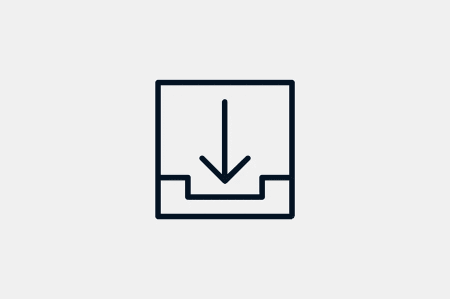

# 选择数据机房提供商之前需要考虑的事项

> 原文：<https://medium.com/visualmodo/things-to-consider-before-choosing-a-data-room-provider-3a1ec212e429?source=collection_archive---------0----------------------->

你拥有一家公司或企业吗？随着您公司的发展和多元化，您将需要与金融家和投资者共享敏感的公司数据。到目前为止，您已经发现虚拟数据室是共享和存储机密数据的最佳选择。在本文中，您将看到在选择数据机房提供商之前需要考虑的首要事项。

但是，当涉及到公司数据共享和存储时，尤其是对于合并或为您的企业筹集资金等重大交易，您必须选择一个对您的行业有丰富知识的经验丰富的供应商，以确保您保护您的信息和业务。

在你出去购买虚拟数据室之前。请务必查看此软件建议的数据室指南，以便您能够选择最好的 VDR，它具有您或您的客户开展业务所需的所有功能。考虑 VDR 提供商设计平台的具体目的。而且还要看客户服务的选择和价格。

在选择数据机房提供商之前，有 3 件重要的事情需要考虑。

# 1.强安全性选择数据机房提供商

而安全性通常被认为是虚拟数据室的同义词。始终寻找最高的安全级别非常重要，尤其是在处理非常敏感的数据时。不要冒险将你的重要信息放在错误的平台上。在您考虑 VDR 提供商之前，请询问他们是否提供安全功能。例如数据加密、动态水印、双因素认证、SAS 认证和数据备份。

此外，询问数据机房提供商是否提供针对您的业务的额外安全功能。例如，如果您不想下载敏感文件。您可以请求 VDR 提供商设置权限，以便任何用户都不能下载文档并将其保存在自己的计算机上。