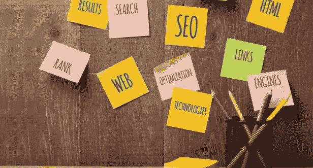
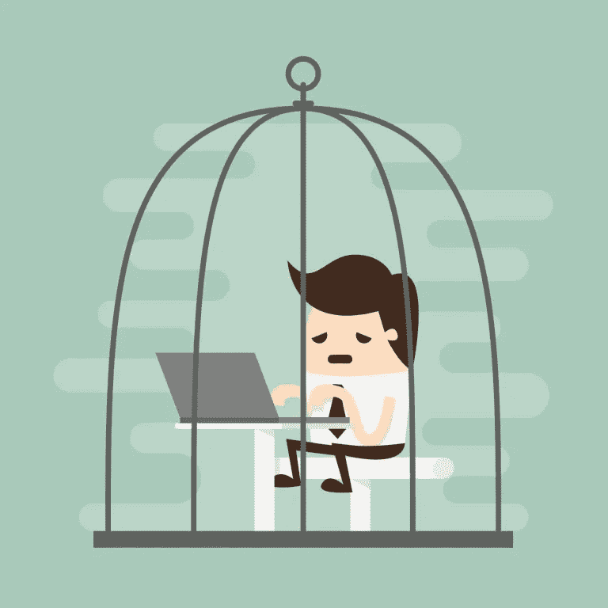
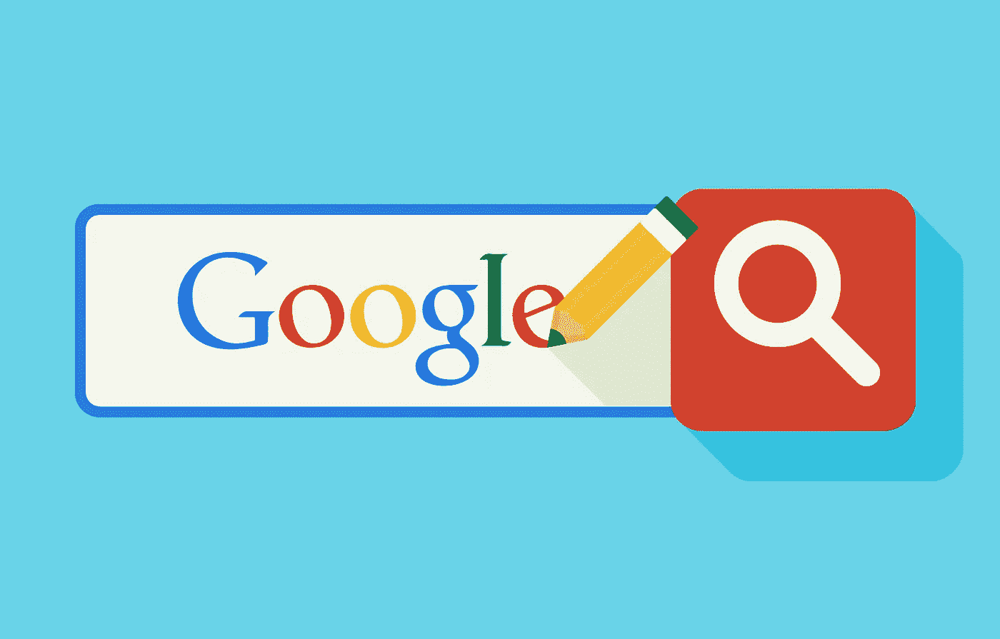

# 让你的网站受到谷歌惩罚的东西

> 原文：<https://medium.com/visualmodo/things-witch-make-your-site-penalized-by-google-678f0bfce394?source=collection_archive---------0----------------------->

在创建或处理你的网站内容时有一些不好的做法会使你的网站受到谷歌的惩罚，现在看看这些事情来避免它并提高你的网页排名。

几乎每一个网站所有者都希望看到他们的网站在谷歌搜索结果中排名前五(或者至少在第一个搜索结果页面显示的 10 个网站中)。为了实现这一点，有必要投资于搜索引擎优化，进行关键字研究，调查竞争，制定一项战略，将赚取你的网站所需的排名，然后通过所需的步法以最有效和专业的方式。

# 让你的网站受到谷歌惩罚的东西

SEO 是一个非常动态的领域，今天工作得很好的东西明天可能不会成功，但是每个 SEO 专业人员都可以列出几个必须注意的基本事项，这些事项将有助于提高网站的排名，其他事项可能会损害它们。谷歌公开宣称，他们的政策是惩罚那些采取了不可接受的搜索引擎优化措施或被发现在某些方面存在不足的网站。在这篇文章中，ost 为你收集了 12 件你应该小心的事情，为了防止你的网站在搜索结果排名中下降，甚至完全从搜索结果中消失，你应该避免这些事情。

# 重复内容和未经授权使用图像

高质量的原创内容是 SEO 的主要支柱之一，任何人使用他人发布的内容不仅侵犯了版权，还会给他们的网站带来严重的危害。不断添加新的高质量内容的需求促使许多网站所有者转向专业的内容作者。确保你购买的内容是原创的是至关重要的，你可以从文本中谷歌摘录，以检查它们是否已经存在于另一个网站上。使用别人的内容被称为“剽窃”，你可以使用一些工具来避免成为受害者，比如[http://smallseotools.com/plagiarism-checker/](http://smallseotools.com/plagiarism-checker/)和[http://www.copyscape.com/](http://www.copyscape.com/)。
避免转发已经出现在你网站其他页面上的内容也很重要，这里有一个工具链接，可以帮助你做到这一点[http://siteliner.com/](http://siteliner.com/)。就谷歌而言，未经授权使用图片也是一大禁忌，因为网站会受到处罚。未经版权所有者同意，避免使用图片是非常重要的。有时，允许任何人直接在图片或信息图表下发表署名，请确保在到期时给予这样的署名。在我们之前的一篇文章中，我们提供了一份高质量图片的商业库存清单。

# 隐藏的内容和链接

在遥远的过去，可以发布谷歌机器人会考虑的内容，同时不让网站访问者看到(这种行为被称为“黑帽 SEO”)。一个简单的方法是将文本字体涂上与背景相同的颜色。
链接也可以被遮盖，例如，来自锚词的链接被涂上与它们周围的文本相同的颜色，或者来自单个像素的链接。一个有隐藏内容和/或隐藏链接的网站最终会受到惩罚，因此，确保访问者和搜索引擎看到的是同一个网站是至关重要的。

# 垃圾链接

入站链接赢得您的[网站](https://visualmodo.com/)信用，并有助于它被授予更高的排名。这是因为这样的链接证明你的网站在某种程度上被认为是权威。SEO 专家致力于建立入站链接库，但重要的是要记住，链接的价值可能会有很大的不同，有些链接甚至可能是有害的。谷歌识别垃圾链接，并惩罚被垃圾链接污染的网站。谷歌有一个“手动垃圾邮件行动”部门，负责检测和惩罚带有“非自然链接模式”的网站。
你可以使用谷歌的网站管理员工具来跟踪你的网站的链接。也有专门为检测垃圾链接而设计的工具，使用最好的工具需要付费，但有免费试用选项，这里有一个这样的工具的好例子[http://cognitiveseo.com/.](http://cognitiveseo.com/.)

# 没有真正价值的附属网站

联盟营销是有效和受欢迎的。创建高质量的网站并没有错，这些网站会将访问者引向他们可能会购买的其他网站。谷歌会识别这些网站，只有当它们提供真正有价值的内容时，才会给它们高排名。

# 低质量内容

在我们之前的一篇文章中，我们讨论了高质量内容的重要性。就质量而言，添加新内容的需求不会驱使你做出妥协，这一点很重要。谷歌讨厌没有实际价值的内容，以及有语法错误、长而不连贯的句子等糟糕的文字。

# 夸张、不自然地使用关键词

这是很自然的，任何人在谷歌上搜索某个单词或术语都会找到包含它们的网页。SEO 是基于提升被认为是高排名的关键词和短语。一旦我们建立了一个我们想要推广的关键词和术语的列表，我们必须以最有效的方式将它们整合到我们网站的相关页面中。重要的是避免不自然地使用这些关键词和短语，在不需要的地方添加它们，或者一遍又一遍地强调它们。

# 有大量出站链接的页面

SEO 是一个三面金字塔，一面是网站的整体质量(内容、代码、加载速度等。)，另一个是访问者流量模式，第三个是入站和出站链接的质量。链接的价值由各种参数确定，例如它们所在网页的权威和信任等级，它们出现在页面上的什么位置(标题，通过相关的锚词，其中的文本等等。)，是不是换链接之类的情况。从某个页面的出站链接的数量极大地影响了所述链接的价值。一个包含太多链接的页面的入站链接甚至会损害你的网站。

# 指向恶意网站的链接

从很早开始，谷歌就以一个遵循严格道德准则的搜索引擎而闻名。这并不意味着谷歌充当某种类型的网络“警察部队”,但谷歌认为有些网站是不道德的，例如色情或赌博网站。这类网站的链接可能会损害你网站的排名。

# 大衣料

伪装——向搜索引擎爬虫显示一个版本的内容，向访问者显示另一个版本的内容
我们已经讨论过在网站上显示内容的弊端，这种方式会导致搜索引擎机器人显示一个版本，而访问者看到另一个版本。在过去，搜索引擎优化(SEO)专业人士[和](https://visualmodo.com/wordpress-themes/)广泛使用隐藏文字，隐藏文字是为了在不增加访问者负担的情况下将关键字堆积在网页上。除了使用与背景颜色相同的文本，还可以使用 CSS 中的 div 隐藏文本，使用 javascript 隐藏元素等等。你必须确保你的网站不包含隐藏文本，因为谷歌的机器人最终会揭开这种企图，你的网站会因此受到惩罚。

# 关键词和短语的过度使用

多长时间和在哪里加入关键词和短语是关于创建最适合 SEO 需求的内容的主要问题之一。在过去，搜索引擎优化专家会让关键词在网页文本中占据一定的比例(通常是 3-4%)。如今，众所周知，谷歌更喜欢自然地使用关键词，因此避免强行使用关键词是明智的。

不要惩罚网站的一个重要提示:使用正确的语义很重要，提供一个关键词云(包含与手头主题相关的关键词)，这将有助于谷歌(以及访问者)了解事情的全部。

# 数据安全漏洞、网络钓鱼和计算机病毒

谷歌必须确保网络用户不必担心点击搜索结果中的任何链接。这就是为什么谷歌竭尽全力确保被黑客攻击的网站、被计算机病毒污染的网站或用于网络钓鱼的网站(使用虚假身份以鼓励交出敏感数据)不会出现在搜索结果中。

# 重定向和规范标签

规范标签用于定义网页的首选版本，因此有可能让谷歌的机器人抓取一个版本，而忽略另一个版本。为了避免内容被认为是重复的，恰当地使用规范标签是很重要的。重定向(如 301、302 和 304)用于将登陆某个网页的访问者直接转到另一个网页，正确使用重定向很重要，这样访问者(和谷歌的机器人)就不会被转到显示错误信息的页面，这里有一个工具可以检查网页的 HTTP 状态码，避免网站受到惩罚。

在[结论](https://visualmodo.com/wordpress-membership/)中:SEO 需要努力，为了让你的网站在谷歌搜索结果中获得更好的排名，可以做很多事情，但也有陷阱，如果你不注意，这些事情会导致你的网站排名下降，有时会很严重。作为一条经验法则，最好是走直路，建立一个高质量、用户友好、内容丰富的网站。使用复制的内容、未经版权所有者同意的图片(或未分配应得的积分)、不自然的链接模式(垃圾链接或来自谨慎网站的链接)、夸大使用关键字和短语、代码错误(如导致错误消息的重定向)，所有这些以及更多可能会导致 Google 认为某个网站受到处罚，授予它比它本来有权获得的排名更低的排名。