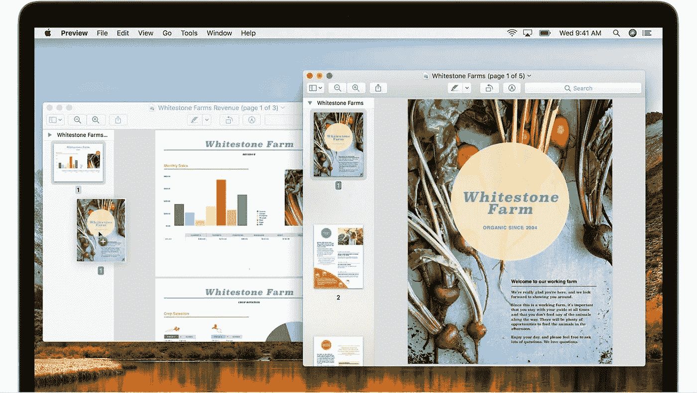

# 在网页上使用 pdf 的提示

> 原文：<https://medium.com/visualmodo/tips-for-using-pdfs-on-web-pages-204ac571351?source=collection_archive---------0----------------------->

可移植文档格式，也称为 PDF，与网页兼容。在下面的文章中，我们会给你一些在你的网站上有效使用 pdf 的建议。

# 我们从 PDF 的创建开始

上传到网上的 PDF 文件应该很小，大约 30-40KB。大多数浏览器在渲染之前会先下载文件，所以可能会花很长时间才能打开，读者会反弹

确保您已经为 web 优化了 PDF 文档的图像。这样做将使文件更小，更容易让客户打开。

有一些网络写作的规则应该适用于 PDF 的内容。网页内容必须有适当的结构，以减轻爬虫的工作和排名更高。这包括增强的可读性和关键字的正确实现

如果您的文档比平时长，建议包含一个可点击的目录，以便更容易地在整个文件中导航。此外，确保你使用相同的字体，并使其更大，尤其是如果你的观众是老年人。

# 在您的网站中实现 pdf

当在你的网站上添加这样的文件时，向读者指出来，因为它可能会让一些客户感到困惑。这就是为什么你必须让他们知道他们正在打开一个 PDF 文件，可以下载，甚至可以打印。

当涉及到允许打印的目录或内容时，pdf 被认为是网页的 T2 替代品。

注意 PDF 文档有很大的用途，但是你不能用它代替网页。某些开发工具允许将这样的文件转换成 HTML 页面，这很容易被爬虫搜索到，并且会在搜索引擎上提高你的排名。

您还可以受益于 SodaPDF 的在线服务，这些服务随时随地提供各种功能。例如，您可以在 sodapdf.com/rotate-pdf/[享受 PDF 解锁或在线 PDF 旋转](http://sodapdf.com/rotate-pdf/)

# 网站上 PDF 文件的常见用法

可移植文档格式有很多好处，我们已经列出了使用这种格式的最常见的情况。

*   用于打印的文档

假设您已经准备好了可以打印的文档，然后您可以将它们上传为 PDF 文件，以确保它们保持不变。

此外，PDF 文件可以包括加密，甚至密码保护，以防你想限制观众。

*   保护文档

在 [PDF](https://visualmodo.com/) 文件上有各种安全控制，可以很容易地实现增强的安全性。其中一个方法，是添加一个密码，就像我们上面告诉你的那样。

大多数 PDF 阅读器都有其他增强安全性的功能，因此您可以选择想要的保护级别。

*   文档下载

与 PDF 不同，以 Excel、PowerPoint 或 Word 格式上传的文档可以被任何下载者修改。此外，它对多个设备负责，所以你会知道[每个人](https://visualmodo.com/)都可以打开它。