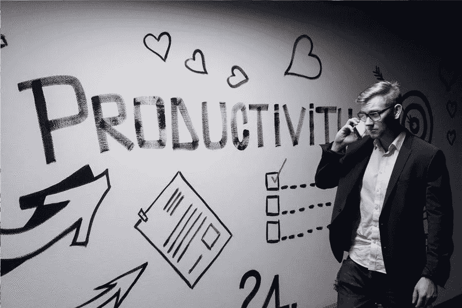

# 在锁定期间在家工作时提高工作效率的技巧

> 原文：<https://medium.com/visualmodo/tips-to-enhance-productivity-while-working-from-home-during-lockdown-ed91f5b5c4b4?source=collection_archive---------0----------------------->

在小说《新冠肺炎病毒爆发》之前，在家工作被认为是为一流公司和组织保留的趋势。只有 3.4%的人口有幸享受这一特权。随着社交距离和锁定的出现，远程工作的人数呈指数级增长。尽管在家工作既有益又方便，但即使在 COVID-9 爆发之前，也不全是阳光和彩虹。现在每个人都回家了，保持工作效率变得更加困难。这就是为什么我们列出了五条建议，告诉你如何在家庭办公室处于锁定状态时，提高在家工作的体验和效率。

# 锁定期间在家工作时提高工作效率

# 1 创造更好的工作环境

没有什么比把工作区放在卧室里更让人分心的了。每小时打个“短”盹后，感到无聊并在床上跳起来的几率相当高。也就是说，如果你想提高你的工作效率，从而在家工作，那么你应该做的第一件事就是创造一个更好的工作空间。如果你有一个车库，地下室，阁楼，或一个多余的闲置房间，努力创造一个漂亮的专用家庭办公室。

这样，一旦你在那里，你的大脑会自动切换到工作模式。此外，有了这样一个专业的家庭办公室，你的配偶、孩子或任何其他亲人就不太可能让你分心。此外，如果你有唠叨的孩子，你可以总是把自己锁在那里，完成你的工作，然后再处理他们。

# 2 在锁定状态下拥有真正的工作时间，以提高工作效率

在真实的办公室环境中工作时，我们总是很有效率，很大一部分原因是因为时间表为我们的工作日提供了结构。这个时间表不仅会塑造你的一天，还会让你保持动力，因为一旦你在喝完咖啡后回到工作中，你的大脑就会准备好处理你的经理扔给你的任何工作量。

但是现在没有时间表了。工作时间由你决定。不幸的是，虽然这种灵活性和自由是我们一直想要的，但它会导致你懈怠。如果你想保持高效率，有更好的在家工作的经历，并且保住你的工作，那么你需要有一个时间表。设定一些真正的工作时间，在此期间你将专注于完成你的工作。因此，这是一个在家工作时提高工作效率的好方法。

# 3 发现你的生产周期

设定真实的工作时间可能对一些人有用，但不是对所有人都有用。有些人只有在监督下才能工作得最好。换句话说，如果没有人不断地让他们站起来，一些人会变得舒适和懒散。

如果这就是你，那么即使你设定了工作时间，闹钟响了，你也不会急着去那个家庭办公室。当你最终做到时，你可能会开始浏览你的手机，而不是工作。

为了提高你在家工作的体验和效率，你需要确定你最有效率的时间。例如，你在清晨有更好的专注力吗？如果是的话，那么早点起床去工作，这样当你的家人起床的时候，你就已经完成了你的工作。简而言之，发现你的生产力高峰期，并在这段时间制定一个工作计划。

# 4 连接:生产力工作锁定

在正式的办公室工作环境中，同事可能会让你分心。毕竟，他们所做的只是停在你的办公桌旁。当你只想专注于手头的工作时，和你聊天或拉你去吃午饭。虽然这在以前可能看起来很讨厌，但你在普通工作环境中与同事的社会联系在你的生产力中发挥了重要作用。

为了保持这种社会联系，也为了更好地在家工作。你需要和你的同事保持联系。在那次正式的视频会议之后，一定要打电话给一些你最喜欢的同事。看看他们是如何应对的，赶上他们，他们甚至会给你更多关于如何提高生产力的建议。

# 5 把你的手机和社交媒体放在够不着的地方

在家工作时把手机放在身边意味着你可能会在手机上花费无数个小时。有鉴于此，请将其放在您够不到的地方。例如，如果你在地下室建立了一个专用的工作空间，把你的手机留在楼上的卧室里。你会发现不必要的时候很难一路去摘。因此，这是一个在家工作时提高工作效率的好方法。

注意，你可能会把手机放在够不着的地方，但最终会浪费掉你在手机上通过笔记本电脑访问[社交媒体](https://visualmodo.com/the-role-of-your-business-website-in-the-age-of-social-media/)所浪费的时间。注销你所有的社交媒体账户。你现在看到的是刚刚出现在屏幕上的脸书通知。

在家工作很方便，也是我们大多数人一直想要的。但它也提出了一系列独特的挑战，主要是由这种环境中的无数干扰造成的。然而，你可以通过遵循上面的建议来增强你的体验。