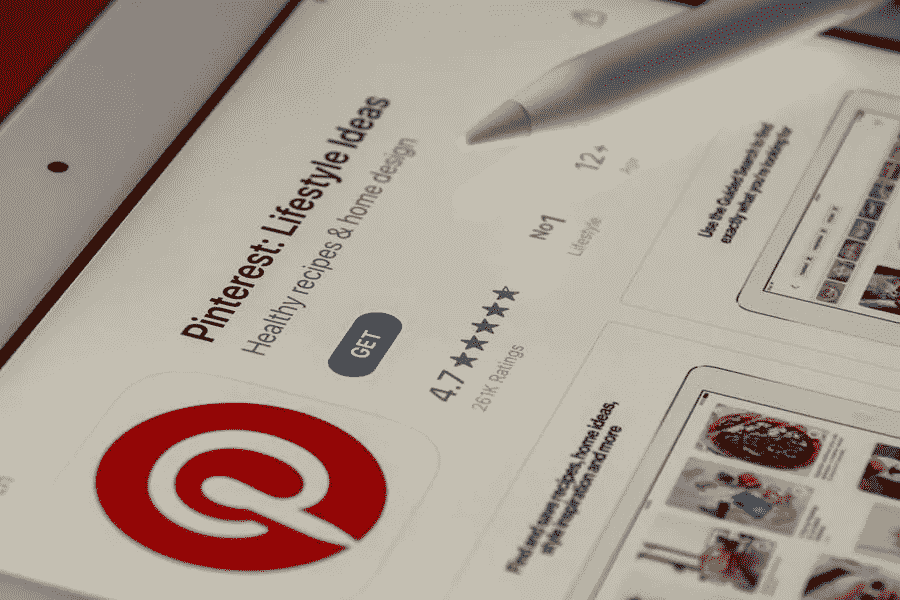

# 获取更多 Pinterest 关注者和潜在客户的技巧

> 原文：<https://medium.com/visualmodo/tips-to-get-more-pinterest-followers-and-leads-488c9394c7ee?source=collection_archive---------1----------------------->

Pinterest 是关于发现、分享和灵感的。因此，如果你的社交媒体目标之一是提高你的 Pinterest 粉丝群并获得更多线索，你会想要发布这份指南。在本文中，我们将分享获得更多 Pinterest 关注者和潜在客户的技巧。

Pinterest 提供了一个很好的平台来联系现有客户，并找到真正对你的内容感兴趣的新粉丝。每月活跃用户超过 2.5 亿，超过 70%的用户表示他们发现了新的 Pinterest 品牌。

加上 Pinterest 的销售能力，该平台已经成为购物灵感的来源，为他们提供了更重要的价值主张。许多人购买 Pinterest 的关注者，以获得更多的 Pinterest 喜欢和 repins。这样，他们可以快速产生销售线索，增加销售额。此外，你可以使用营销工具来增加 Pinterest 的粉丝。

如果你想“锁定”你的成功，请遵循以下步骤。

# 知道 Pinterest 的受众在哪里:

这里有一些有价值的统计数据可以考虑:

*   首先，Pinterest 的用户群以女性为主，只有 30%的男性使用 Pinterest。然而，这个数字还在增长。
*   其次，千禧一代是 Pinterest 上最活跃的群体。
*   美国拥有一半的 Pinterest 用户。
*   最后，记住这一点，根据你试图吸引的人口统计数据来看看 Pinterest 的基础[。](https://visualmodo.com/best-social-media-platforms-for-professionals-and-business-in-2019/)

# 加入相关的小组委员会，获得更多的 Pinterest 追随者

根据你所处的位置查看一下顶级董事会，并要求加入董事会。在这里，你最有可能找到志同道合的用户，他们可能成为你企业的下一个潜在客户。群板是寻找新追随者并与他们互动的好地方。你也可以从许多营销网站便宜地购买 Pinterest 关注者，比如 BuyTrueFollowers 和 InternetMarketingRocks。在美国和其他国家有许多其他网站可以购买 Pinterest 粉丝，但你需要选择最好的网站，记住你的预算。