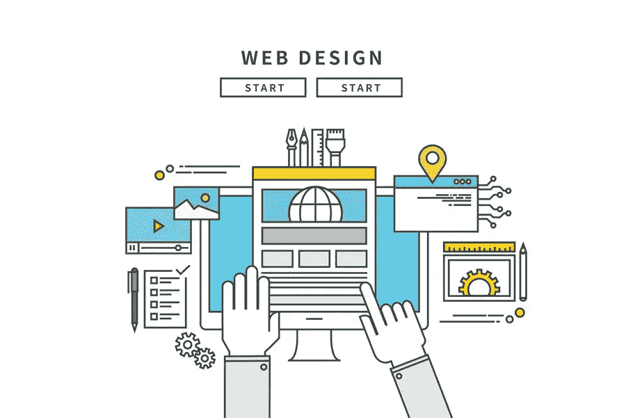

# 帮助你的 WordPress 站点 SEO 获得更多在线牵引力的提示

> 原文：<https://medium.com/visualmodo/tips-to-help-your-wordpress-site-seo-to-gain-more-traction-online-1f4cdfff6458?source=collection_archive---------0----------------------->

在博客和内容的世界里，WordPress 是最流行和最容易使用的工具之一。有了它提供的好处，难怪它会像今天这样受欢迎。WordPress 是有成本效益的，因为拥有和维护一个 WordPress 站点是非常便宜的。WordPress 还可以随时更新，可以与不同的在线工具集成，并具有响应性的 web 设计。WordPress 可能在很多方面都有用，但是因为很多人已经在使用它，你应该为你的 WordPress 站点采用不同的搜索引擎优化(SEO)策略来获得更多的在线吸引力。你可以使用网站搜索引擎优化作为你在万维网中脱颖而出的杠杆。

# 帮助你的 WordPress 站点 SEO 的提示

SEO 是通过确保某个特定在线平台出现在搜索引擎结果页面(SERPs)的顶部来最大化该平台在线访问者数量的实践。这是通过在网站中添加不同的组件来实现的，这些组件适合搜索引擎的算法。从长远来看，一个排名高的网站会让一个企业更容易发展壮大。你可以通过你的 WordPress 网站按照这些 SEO 提示来体验所有这些:

*   选择正确的主题:你的主题或者你的 WordPress 网站的整体外观可以决定你的 SEO 排名。如果你使用一个太复杂的主题，使得在线用户很难阅读内容，你的网站 SEO 排名将永远不会提高。事实上，你为撰写和发布高质量内容所做的一切努力都将毫无价值。如果可能的话，使用一个简单但不影响 WordPress 网站质量的主题。寻找一个主题，允许你的网站快速加载，提高用户可读性，并且易于使用。当你把这些从你的列表中勾掉的时候，用户会有更多的理由在你的网站停留很长时间，这将改善你的谷歌搜索引擎优化结果。
*   **优化 SEO 插件:**一旦你使用 SEO 插件，让你的 WordPress 网站在搜索结果的第一页登陆将会很容易。今天，有各种各样的插件可供选择，鼓励你添加元描述、元标题和关键字等。这些插件甚至为任何 WordPress 站点提供整体 SEO 解决方案。寻找你的 SEO 插件选项，评估哪些最适合你的 WordPress 站点，然后慢慢地在你的 WordPress 站点上采用这些插件。你越了解这些 SEO 插件是如何工作的，你就越能为你的 SEO 排名优化它们。
*   不可否认，媒体是你的 WordPress 网站的重要组成部分。然而，如何或在哪里使用媒体可能会破坏或改善你的搜索引擎优化工作。如果你想体验后者，在你如何命名你的图片时要小心。不要只是为了做而命名它们。当你在你的 WordPress 站点中正确命名图片时，你将有更好的机会在图片搜索中排名靠前。

虽然在你的 WordPress 站点上传一张图片，然后用一个复杂的名字，这很诱人，但是不要这样做。你为图片使用的所有标签都应该与你的目标受众相关。这些词越简单，他们就越容易在网上找你。

*   **让你的内容可以分享:**制作与目标受众相关的高质量内容可以帮助你提高排名。毕竟在 SEO 中内容才是王道。然而，如果你想更上一层楼，就在[工作，让你的内容可以共享](https://www.forbes.com/sites/jaysondemers/2017/03/22/the-psychology-of-shareable-content/)。在你的 WordPress 网站中，提供社交媒体分享按钮，如脸书、Twitter、LinkedIn 和 Instagram。这些按钮会让你的目标受众更容易分享你的 WordPress 站点的内容，这将带来几个好处。你会体验到你的 WordPress 站点的流量增加和曝光率提高。
*   稳定地添加新的帖子:使用 WordPress 网站不是一次性的任务。你不能指望你的站点 SEO 排名会因为你有一个 WordPress 站点而暴涨。为了取得好的结果，你必须投入时间和精力来维护你的 WordPress 站点——定期添加新的帖子是一个好的开始。一旦你确定了谁是你的目标受众，制作适合他们的内容，并严格遵守出版时间表。决定你是一周做一次、两次还是三次。这样做会让你在谷歌上排名靠前。
*   **转向响应式设计:**使用台式电脑浏览互联网可能是一种常见的做法，但这种情况正在慢慢改变——这都是因为技术。今天，越来越多的人在使用互联网时使用手机和其他手持设备。如果你想迎合这个目标受众，适应行业趋势，创建一个具有[响应设计](https://visualmodo.com/using-responsive-wordpress-theme-crucial/)的 WordPress 网站。无论使用什么设备，它都应该是可访问的，并且应该包含相同的功能。

# 搜索引擎优化作为您的解决方案

利用 WordPress 网站可能有助于你的业务增长，但是随着竞争越来越激烈，这已经不够了。请记住，你不是第一个或唯一一个使用这个平台的企业。如果你想让你的 WordPress 网站因为所有正确的原因而为人所知，考虑使用不同的 SEO 策略。无论你是使用 WordPress 网站的新手还是老手，SEO 都会帮助你得到你想要的结果。这可能是解决方案，这样你就可以最终在网上获得牵引力。