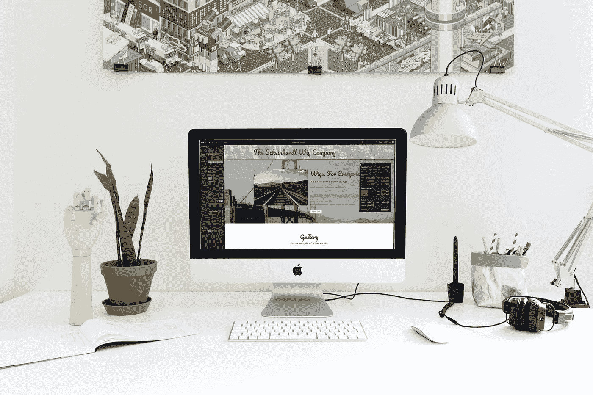

# 让你的网页设计看起来更专业的小贴士

> 原文：<https://medium.com/visualmodo/tips-to-make-your-web-design-look-more-professional-75b34d59a812?source=collection_archive---------0----------------------->

你的网站是你的企业在互联网上的脸面，这就是为什么你需要它看起来尽可能的专业。然而，一些网站管理员把一个视觉上华丽的网站等同于拥有一个看起来专业的网站。事实是，一个网站可以看起来令人难以置信的赏心悦目，但在人们眼中仍然显得不专业。现在，怎样才能让你的网页设计看起来更专业呢？这里有一些建议可以帮助你获得专业的形象，给人们留下足够的印象，让他们和你做生意。

# 让网页设计看起来更专业

**让你的网站易于浏览**

一个网站可以看起来简单明了，但对于那些觉得容易导航的人来说，仍然是高度专业的。当网站中的一切都组织得井井有条时，用户将更有可能探索它，并最终为您提供您需要的线索和转换。一个华丽的网站，因为结构混乱而难以导航，对任何人来说都不会显得专业。

**简单的网页设计成功了**

有些网页设计师喜欢炫耀他们的艺术才能，最终设计出来的网页看起来拥挤不堪，充满了边框、颜色和阴影。

他们没有意识到的是，人们不喜欢任何形式的视觉过度杀伤。华而不实的元素甚至会把它们关掉。如今用户更喜欢设计简洁。例如，一个网页设计者可以放入大量的空白，这样看起来更舒服，也为其他网页设计元素提供了更多的喘息空间。

**使用正确的字体，并恰当地**

你不能仅仅因为喜欢网站的外观而使用一种字体。如果你的企业有独特的风格、风味或文化，那么你应该选择与之相适应的字体。更多的异想天开的字体对于那些经营娱乐的企业来说是完美的，而提供更多正式产品的企业会选择反映这一特点的字体。

大字体更适合标题、副标题和题目，所以要坚持使用大字体。你写的内容中的字体也应该足够大以便阅读。避免使用太小的字体，因为如果用户几乎什么也看不清，他们不会对退出你的网站感到不安。

**做一些色彩协调**

颜色可以在很大程度上影响网站的整体设计。如果你要在网页设计中使用一种以上的颜色，你应该确保它们协调一致，能够很好地融合。你也应该考虑到色彩心理学，只使用你认为能体现你的生意的颜色。

**上传大幅高质量图像**

高质量的大照片令人惊叹，看起来非常专业，它们一定会吸引人们，让他们在你的网站上多呆一会儿。在你的网站上使用它们，尤其是在登陆页面。

**写出有用的、相关的、吸引人的内容**

一个网站上的文字内容是一个网站专业水平最清晰的指标之一。当网站的文字无懈可击，没有许多其他网站常见的拼写和语法错误时，访问者会发现这个网站非常- [专业。如果文案也是相关的，并能帮助访问者得到他们需要的东西，那也是有帮助的。](https://visualmodo.com/blog/)

会写的站长可以自己做内容，让自己的站点显得更专业。如果他们认为他们的写作没有达到标准，或者他们太忙于其他事情，那么他们可以选择雇佣专业作家来处理他们的书面内容。

**一个 CTA 按钮就够了**

只放一个行动号召或 CTA 按钮会让你的访问者更容易做出相应的回应。一些网站有多个 CTA 按钮，结果是可以预见的:人们会被这些选择弄糊涂，最终跳到另一个网站。

有了一个主 CTA，你的网站看起来会比那些跨多个页面的 CTA 更专业。

**优先考虑响应能力**

有了谷歌的移动优先索引，让一个网站更加移动友好的需求变得势在必行。

除了谷歌现在使用其移动版本作为网站排名的基础之外，能够在所有屏幕和平台上正常显示是网站管理员专业水平的一个明显标志。这表明他或她实际上关心移动用户的需求，多年来移动用户的数量一直超过桌面用户。在他们看来，一个他们可以在智能手机和平板电脑上轻松访问的网站是一个看起来很专业的网页设计。

这些只是让你的网站看起来更专业的一些方法。将这些建议应用到你的网站上，你就能让它看起来像你希望的那样专业。