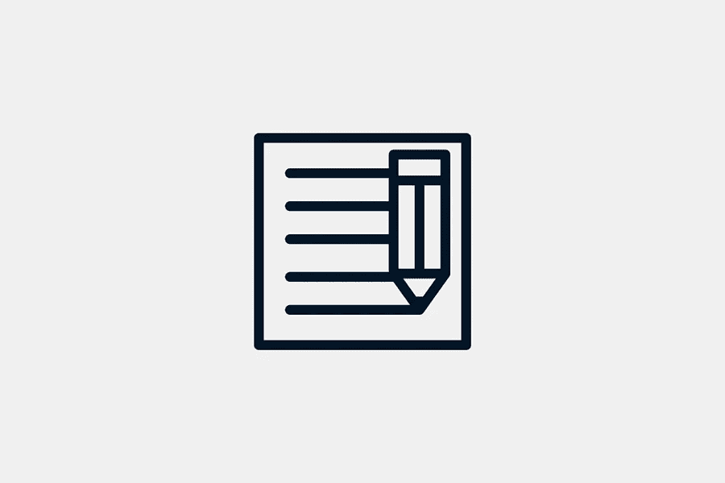

# 专业和初学者博客的 10 大工具

> 原文：<https://medium.com/visualmodo/top-10-tools-for-bloggers-for-pros-and-beginners-5bc3bba36c01?source=collection_archive---------0----------------------->

随着博客空间的竞争越来越激烈，博客作者必须脱颖而出。写得好的内容只是开始；如果你真的想成功，创建博客不仅仅是写作。在这篇文章中，你会看到博客(专业用户和初学者)的顶级工具。

# 最佳博客工具

有几个博客写作软件可以帮助你优化你的写作。如果你也利用其他博客工具来帮助你完善你的博客的图片和搜索引擎优化，这将会很有帮助。

# 谷歌文档

谷歌套件中最重要的博客工具之一，谷歌文档是微软 Word 的绝佳替代品。这个文字处理工具还可以让你访问电子表格和 Excel 表格，这样你就可以保持你的数据有条理。你写的所有东西都将自动保存到云中，你可以轻松地与其他人就同一文档进行协作。你可以随时随地访问谷歌文档。有现成的模板可供您在创建特定文档时使用。

优点:

*   简单的文档导出选项
*   自动云存储
*   方便用户的

缺点:

*   免费有限存储

# 我的库存照片

作为一个博客作者，你总是需要获得高质量的图片来使你的博客文章给人留下更深刻的印象。免费使用的图片总是更受欢迎，因为你不需要支付任何费用就可以在博客中使用它们。你可以浏览网站，找到最适合你的博客的图片，但用图片过度填充文字不是一个好主意。添加最相关的，高质量的图片，使您的观众。

优点:

*   不增加成本
*   高质量的照片
*   使用方便

缺点:

*   各种图片可以改进

# 语法:博客的顶级工具

如果你想让你的在线内容完美无瑕，你可以使用 Grammarly 作为语法和剽窃检查工具。你所要做的就是将写好的文章复制并粘贴到 Grammarly 的界面上，然后观察人工智能算法检查错误。你还会收到一些建议，可以帮助你改进句子结构、[风格](https://getpixels.org/)和语言。如果你使用付费计划，Grammarly 会指导你做什么。剽窃检查器非常有效，它会保护你以后不会尴尬。

优点:

*   免费和付费计划
*   易于使用的用户界面
*   有效算法

缺点:

*   免费计划是有限的

# 坎瓦

如果你想在你的博客文章中包含自定义图片，你会发现 Canva 让你创建专业图片变得如此容易。您可以用各种方式定制图像，以符合您博客的审美。Canva 提供了大量高质量的模板，以防您时间不足。Canva 相对容易学习，这使得它非常适合初学者和专业人士。拖放界面可以让你毫不费力地用很酷的字体创建原始图像。

优点:

*   功能丰富
*   优秀的模板
*   多才多艺的

缺点:

*   编辑时不能改变尺寸

# Movavi 照片编辑器

这是一款专业级的图片编辑器，由 Movavi 开发，由 AI 驱动，适合专业人士和业余爱好者使用。一旦你下载了这个软件，你就有了智能工具，可以让你把图片编辑得尽善尽美。用户界面是直观的，这将有助于您更快地学习编辑过程。有多种效果可供您选择。是否要修饰图像、移除对象、移除背景和恢复旧图像。

优点:

*   首先，先进的编辑工具
*   第二，人工技术的力量
*   最后，大量不同的效果和过滤器

缺点:

*   试用期是有限的

# Sendible:博客的顶级工具

为你的博客想出一个很好的社交媒体管理策略肯定会给你带来优势。通过 Sendible，你可以在一个集中的地方整合你所有的社交网络。你可以监控自己的社交媒体表现，安排发布时间。对于那些想要做大的人来说，Sendible 是最好的博客工具之一，它支持大量的集成，这将使你的生活更加轻松。您将能够访问建议您最有效策略的报告。

优点:

*   首先，社交媒体帖子调度
*   第二，简单的协作工具
*   最后，一个内置的帖子编辑器

缺点:

*   价格昂贵