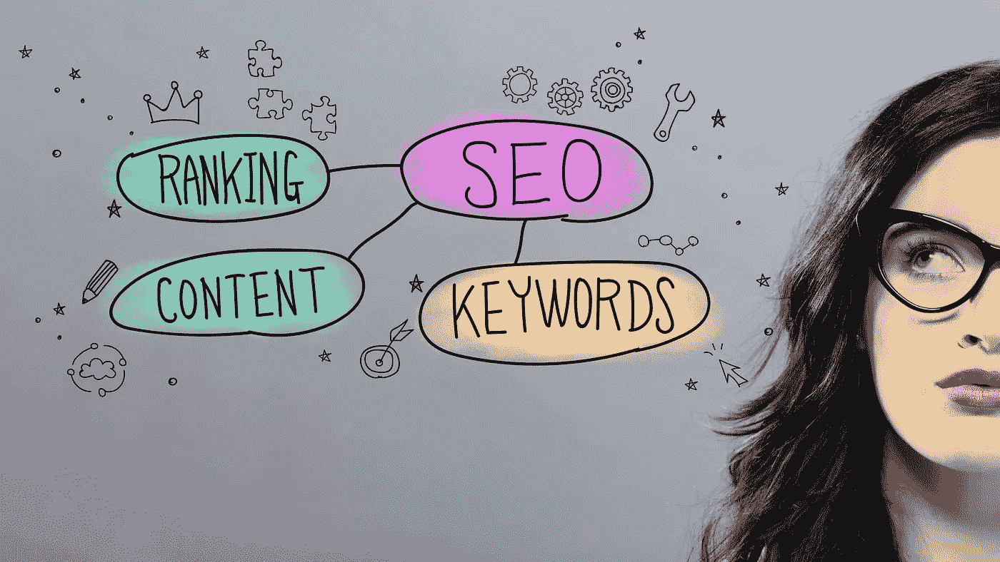

# 将搜索引擎优化纳入数字营销策略的 20 大理由

> 原文：<https://medium.com/visualmodo/top-20-reasons-to-include-seo-in-your-digital-marketing-strategy-403dcd695523?source=collection_archive---------0----------------------->

企业应在营销中积极主动，勇于创新，以保持相关性和竞争力。他们通过将数字时代技术的发展和影响融入其业务流程来实现这一目标。具体到营销，数字广告现在是接触客户最方便、最准确的方式。在这篇文章中，我们将分享在你的数字营销策略中加入 SEO 的 20 大理由。

如今，许多企业主意识到搜索引擎优化(SEO)对成功的营销计划至关重要。他们可能不知道如何使用它。根据俄勒冈网络解决方案，在有价值的内容中实施战略选择的关键词将显著增加你在网络世界中的可见性。更重要的是，它提供了非常宝贵的信息，可以帮助你了解你的客户是如何找到你的。

然而，在比较搜索引擎优化与竞价排名、联盟营销和任何其他营销方式时，你的问题可能是:搜索引擎优化如何符合，这是必要的吗？

为了帮助你做到这一点，下面是一些要点来说明 SEO 在你的营销策略中的作用。此外，下面解释了为什么搜索引擎优化应该优先在您的企业的数字营销活动的原因。

# 什么是 SEO？

SEO 包括开发一个易于分类和搜索的网站。这是数字营销工作不可或缺的组成部分——一种将客户吸引到公司网站的整合模式。

SEO 的目标是让你的网站在搜索引擎的结果页面中排名靠前。当这种情况发生时，你就把数十亿消费者中的一部分带到了你的市场。这意味着很大一部分人在搜索你卖的东西。

在搜索引擎或搜索引擎结果页面(SERP)上拥有最高的排名并保持这一排名是至关重要的。只有这样，你才能有可靠的在线流量。

# SEO 有哪些不同的类型？

有三种类型的 SEO 来介绍，给你的网站提高其在 SERPs 上排名的最高机会。这些类型是:

*   页面内搜索引擎优化

这包括研究关键字，并在您网站的各种网页的高质量内容中使用关键字。

*   离页搜索引擎优化

旨在改善您的网站与其他相关网站的合作关系。离页 SEO 主要关注的是增长反向链接。这些链接可以将大量相关网站的互联流量带到你的网站。

*   技术搜索引擎优化

这包括加载速度、同步、可抓取性、智能设备友好性、数据结构、网站架构和保护。

# 将搜索引擎优化纳入营销策略的理由

接下来要知道的是，有了关于 SEO 的一般知识后，为什么你应该在你的数字营销活动中包括 SEO？

请阅读下文，找出原因。

# 1 高效的搜索引擎优化为你的业务增加了合法性

想想你在谷歌或其他搜索引擎上搜索商品或服务的例子。你认为第一页提供的链接和信息是最可靠的信息来源。

客户很少超出前几个列表，因为他们认为第一页是相关的和值得信赖的。

通过使用波特兰搜索引擎优化服务和参与你的业务搜索引擎优化战略，你正在为你的品牌带来价值。SEO 将你的网页、产品或服务放在第一个搜索页面上。

# 2 容易访问是主流，有价值的内容是重要的

有了令人兴奋和容易找到的信息，用户友好的网站将使你的网站排名。有了原创内容，网页就围绕着关键词的概念建立起来，搜索引擎就可以对你进行索引和评级。

游客的积极体验是获得更高评级的最佳选择。因此，保持你的材料的诚实和重点。避免用流行语和关键词填充内容，以防止人们离开网站。不满意的潜在客户会拿你的排名冒险。

# 3 集客营销优于其他形式的营销

集客营销策略，如搜索引擎优化、社交媒体发布和博客帖子，通常比出境和其他付费做法获得更多的线索。

因此，作为企业主，与其依赖于出站或其他付费广告，从事高质量的内容创作将是一个更有利可图的选择。

此外，改进和最大化你的基于平台的社交媒体页面，并将搜索引擎优化整合到你的企业数字营销技术的各个方面，将是一个更加明智的营销计划。

# 4 搜索引擎越来越大:原因包括搜索引擎优化在你的战略中

当有人提到搜索引擎时，你会自然而然地认为他们在谈论谷歌吗？

这家科技巨头确实拥有很大的市场份额，而且它们如此重要，以至于人们把“谷歌搜索”变成了一个动词。

作为一个企业主，你需要意识到在替代服务上，比如微软的 Bing，也有很大比例的搜索发生。一定要从备选选项中浏览博客，看看你在列表上有多远。你可能会感到惊讶，提高用户参与度和插入元标签可能会在其他搜索引擎上提高一些排名。

# 5 增加你的流量

搜索引擎页面的主要好处是它提供了突出的销售设置。搜索引擎页面上较高的排名会吸引更多的浏览，这有助于更多的访问，并最终增加销售额。

# 大多数人使用移动设备进行搜索

你可能不需要统计数据来证明基于网络的手机市场在过去几年中已经上升，超过了台式机。

SEO 通过利用移动浏览器网页使你的[网站适合移动设备](https://visualmodo.com/the-usage-of-low-code-platform-in-selling-wp-themes/)。因此，如果你想在搜索引擎结果页面中排名靠前，拥有一个手机友好的网站是至关重要的。

# 7 投资回报:原因包括你的战略中的 SEO

SEO 让企业能够监控和衡量结果。它可以让你看到你的营销策略的走向，以及是否有任何改变是必要的。

一个搜索引擎优化组织会根据最终成交前的关键词，追踪用户选择的途径。

这些数据有助于你了解你的搜索引擎优化策略的投资回报率，而不是你的支出。

# 8 为游客创造更好的体验

SEO 的另一个重要性是，你花在生产高质量内容和改进平台上的所有时间，都会增加你网站的可用性。因此，它确保了平稳和乐观的消费者体验。

例如，如果您进行改进以确保网站的响应性，它将开始使所有设备都可以使用它。

同样，你可以减少反弹过程，增加你的加载时间，并鼓励人们花更多的时间在你的网页上。请记住，大多数用户希望在不到两秒钟的时间内加载一个网站。这意味着加载的时间越长，反弹率就越高，从而导致转化率降低。

# 9 成本效益:原因包括搜索引擎优化在你的战略中

SEO 远比其他广告方式划算。这是因为当消费者搜索你的产品或服务时，你可以直接吸引他们。

你的网站建立的越好，你就越有可能使用一个好的搜索引擎优化营销策略找到一个热门线索。

# 10 高效的搜索引擎优化将提高点击费用:原因包括搜索引擎优化在你的策略中

当你使用 PPC 作为另一种营销策略时，你会意识到广告会影响质量评级。PPC 的高质量分数会降低每次点击的价格，让你的广告表现得更好。

用 SEO 提升你的网站将会提高你的 PPC 广告的整体得分率。

许多营销策略往往与搜索引擎优化携手合作。将 SEO 与搜索引擎广告相匹配可以提高广告的效果，增加流量。搜索引擎优化也可以促进重新定位和提高品牌认知度的尝试。

# 11 提高网站的可访问性和可用性

SEO 让人们和浏览器更容易浏览你的页面。它重塑了平台的连接和布局，使其更容易定位。这简化了在网站上寻找信息的任务，并允许搜索引擎轻松地扫描您的网站上的相关页面。

# 12 完全没有操纵内容

任何网站的内容的文字和连接都是骗不了的。传统的黑帽引用——链接到与源网站完全无关的网站的过程——被提及或网络引用所取代。

在使用提及和引用时，一旦一个品牌被完美地整合到网站内容中，这个链接就会指向对源网站有意义的网站。

# 13 提高品牌认知度:原因包括搜索引擎优化在你的战略中

让你的网页在搜索结果中排名靠前，最终会给你带来很多浏览和印象。这意味着你的平台更容易接近，你的公司的品牌知名度就越高。

而且，要想在你的目标关键词上占优势，搜索引擎页面会让用户用相同的关键词来识别你的品牌。这反过来增加了品牌的可信度

# 14 搜索引擎不可靠:原因包括搜索引擎优化在你的策略中

值得一提的是，SEO 是必不可少的，因为浏览器并不理想。所以，当你不采取措施克服自己的不足时，这个价格就会在你的网站上收取。

例如，当你的网站没有提供一个清晰的链接结构，浏览器可能不会充分抓取和基准你的网站，导致排名较低。

事实上，编码错误也可以有效地消除搜索引擎，这使得您的网站不可能规模更高，无论您在 SEO 工作上投入了多少时间和资源。

搜索引擎结果可能出现问题的常见领域包括:

*   内容中包含的照片、音频、视频、文件和其他图形
*   重复文章
*   格式
*   语义学
*   语言

# 15 链接到您的网站是最有价值的

另一种提高你在搜索页面中排名的方法是当其他网站创建指向你网站的链接时。当这种情况发生时，搜索引擎会将你的网页排在产生有用材料的前列。

几年前，要想在搜索引擎上排名，只需要从质量差的页面上获得数百次引用来提高分数。

然而，今天，链接在你的博客或网站上的重要性依赖于链接到你的网站的标准。

仅仅是一些高流量网站与你公司的连接就能为你的评级创造奇迹！

# 16 提高网站的加载速度:原因包括你的战略中的搜索引擎优化

你的网站的加载速度让用户立即体验你的材料。当您的网站加载缓慢时，消费者更有可能在没有看到该链接内容的情况下放弃。SEO 为您提供页面加载级别首选项，以确保它更快更容易。

# 17 更多的链接更高的排名不是今天的战略

扩大搜索引擎规模的一个关键因素是你网站的可信度。创建链接的旧方法有一定的即兴性，并且在整个搜索引擎结果中排名靠前的流行观念正在演变。内容策略并不总是主要手段。但是创造高质量的连接仍然是影响排名的一个重要的 SEO 因素。

从这个意义上说,“联系”一词的含义是不断演变的。传统连接建立背后的核心概念是计算网站将产生的所有关注连接，并完全忽略所有不关注的链接。目标是建立尽可能多的互连。这种方法有缺点，某些黑帽广告客户认为，最终，搜索引擎修改了它的公式，最终结束了传统的链接建设过程。这被称为垃圾邮件。

此外，客座博文也因为一个建立关系的小意图而消失了。客座博文在吸引新粉丝、将自己定位为权威以及与目标人群互动方面表现出色。

# 18 搜索引擎优化的秘密是分析

为了更好的表现，有必要跟踪你在不同搜索引擎上的排名。从监控你网站最关键的指标开始，为你的结果建立一个基准。对你的内容做一些小的改进，如果它影响了你的排名或者可能带来了一些流量，就进行监控。

避免同时实现许多改进，您仍然会处理和报告对于更高的结果是必要的。

# 19 个目标市场:原因包括你的战略中的搜索引擎优化

今天的搜索引擎优化不仅仅关注吸引潜在客户的注意力，而且关注你所提供的信息。尝试通过回答以下问题来评估你的 SEO 营销策略:关于人口统计，客户在找谁？网络搜索表现如何？他们来自哪里？

你的回答越精确，你的 SEO 努力就越有价值。

# 20 社交媒体发挥着关键作用

最后，社交媒体现在是一个不断变化的平台，已经从一个基本的消息平台转移到一个利润丰厚的销售渠道。许多用户开始他们的社交媒体搜索，并以他们的方式进入一个企业的网站。分享最新的、有趣的和定制的内容会吸引更多的用户到你的页面，最终到你的网站。

# 如何将搜索引擎优化纳入你的数字营销策略？

如果你对 SEO 为你的业务带来的好处感到兴奋，那么下一件大事就是在你的营销策略中采用它。从任命 SEO 专家开始，将搜索引擎优化整合到你的数字营销活动中。关键的 SEO-专门的数字营销和技术责任涉及的职位，如前端创作者，SEO 战略家，网站经理，和一些个人关系的工作。

如果你不想被雇佣这些专家和增加你的团队所困扰，你也可以求助于 SEO 营销公司。

# 关于原因的最后想法包括你的战略中的搜索引擎优化

罗马，尽管它辉煌壮丽，也不是一天建成的。也没有一个完美和强大的营销计划为您的业务。

如果你想建造自己的“罗马”，请采纳以下建议。收集数据，建立一个能提高你在搜索引擎中排名的网站，测试你已经建立的网站，然后使用收集到的数据来帮助维持你的营销活动。此外，使用方法，并在业务的所有领域共同努力，以最大限度地取得成功。

在你的数字营销策略中加入搜索引擎优化，不要忘记上面解释的原因。从长远来看，这几点会对你有很大帮助。